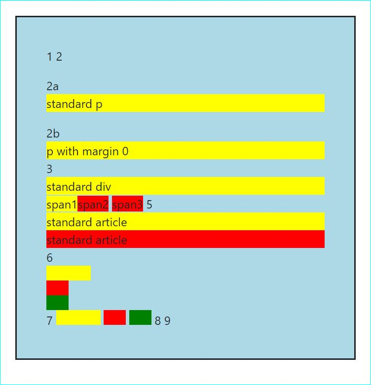

## ___WEB DEVELOPMENT___
---

By&nbsp;Martin&nbsp;Czerwinski [CMQ&nbsp;Nordic.](www.cmq.se)
&nbsp;March&nbsp;2020.

---

This is a _reference guide_, an _compact tutorial_ or a _cheat-sheet_ that explains basics of web development. Starting from tools to some of the solutions to most basic problems. Bookmark this page, share it and feel free to [__reach out to us__](www.cmq.se "Contact us!") with questions, comments or requests for assignments!

---

#### __TABLE OF CONTENT__

 ► __Technologies & Tools__  
 - [__Visual Studio Code__](#visual-studio-code)  
   _[Whats's built-in?](#what-is-vscode) ◦ [Terminal](#terminal-in-vscode) ◦ [C](#C)  
   [Shortcuts](#useful-shortcuts-in-vscode) ◦ [Extensions](#useful-extensions-in-vscode) ◦ [Customization](#recommended-customization-of-vscode) ◦ [Cloud settings](#default-vscode-cloud-settings)_
- [__Node.js & Npm & Npx__](#node-and-npm)  
  _[What's node, npm and npx?](#nodejs-&-npm) ◦ [Node.js](#install-node.js-and-execute-programs) ◦ [Node.js modules](#useful-node.js-modules) ◦ [Npm](#install-npm-packages) ◦ [Npm packages](#useful-npm-packages)_  
  [package.json file](#packagejson-file)
- [__Webpack__](#what-is-webpack)  
   [PostCSS](#bundling-with-postcss) ◦ [Webpack Dev Server](#webpack-dev-server-m)  
   [webpack.config.js](#webpackconfigjs-file) 
- [__Other frameworks & technologies__](#other-frameworks)  
  [Markdown](#markdown-syntax) ◦ [EMMET](#emmet-snippets)  
  
► __HTML, CSS and JS__
- [__CSS__](#css)  
    [How to structure CSS files](#css-structure) ◦ [CSS Specificity](#css-specificity) ◦ [BEM](#bem-in-css)  
    [Flexbox](#flexbox) ◦ [CSS Grid](#css-grid) ◦ [Floating](#floating)  
    [Bootstrap](#bootstrap) ◦  
    [Common tasks](#commonly-performed-tasks) -> [navigation](A) | [center stuff](B) | [C](C)
- [__HTML__](#html)  
    [Basics](#basics) ◦ [Page structure](#page-structure) ◦ [X](C)  
    [Components](#page-components) -> [form/input](#user-input-with-forms) | [B](B) | [C](C)  
- [__JS__](#javascript)  
    [B](B) ◦ [C](C)
  
► __Screens, resolution and content__
  - [Aspect ratios](#aspect-ratio) ◦ [Images](C)  

► __SEO__
- [__How it works__](#seo) ◦ [B](#b)

<br>

---

<p align=right><a id="visual-studio-code" align=right href="#table-of-content">↩ Back To Top</a></p>


## [__Visual Studio Code__]() 

VSCode ([Visual Studio Code](https://code.visualstudio.com/)) is a popular, lightweight and free code editor from Microsoft that comes with a variety of handy built-in features. Install VSCode from from [here](https://code.visualstudio.com/download). Some YouTube tutorials to watch [here](https://www.youtube.com/results?search_query=Building+WebApps+using+Visual+Studio+Code). 

 Launch VSCode from terminal window in the directory you are currently in by writing:
```
 code .
```
VsCode can also be launched by right-clicking in folder you want open and choose _Open with Code_.


<p align=right><a id="what-is-vscode" align=right href="#table-of-content">↩ Back To Top</a></p>


### __[What's built-in in?]()__

Some build-in features in VSCode:

 - __Node.js & Npm__: Build in runtime environment for JavaScript with corresponding package manager.
 - __JavaScript:__ Language used for web development.
 - __TypeScript__: Language that adds strict typing syntax to JavaScript.
 - __Emmet__: Short text snippets that auto-generate pieces of HTML or CSS code.
 - __IntelliSense__: Editing features including code completion, parameter info, code proposals and quick lookups.
 - __Extensions:__ Integrated marketplace for a large variety of extensions that expand functionality of VSCode.
- __GIT:__  Integrated support for Git with handy graphical interface for those most common functions.
- __Multi-Cursor editing:__ Allows you to edit multiple parts of the documents at once.
- __Debugging, Code navigation__: Possible to debug your code easily.


<p align=right><a id="terminal-in-vscode" align=right href="#table-of-content">↩ Back To Top</a></p>


### __[Terminal]()__

VSCode comes with an _integrated terminal window_ which is a very handy and time-saving. Terminal window opens pointing directly to your working directory. It is also possible to switch between _shells_ that power the terminal from a drop down in the right-' upper corner.

Changing to _default shell_ of your choice can be done by opening _Command Palette_ (`Ctrl+Shift+P`) -> `Terminal: Select Default Shell`. There you will get a list of available choices for you operating system where "Git Bash" (the default shell that we use) is one of the options.

<p align=right><a id="useful-shortcuts-in-vscode" align=right href="#table-of-content">↩ Back To Top</a></p>

### __[Shortcuts]()__

Shortcuts can be viewed and changed from `File > Preferences > Keyboard Shortcuts`. Behind the scenes there are two files:  
- Default setting as shipped with VSCode installation. In _command palette_ (`CTRL+Shift+P`) write "Keyboard Shortcuts (JSON)" which opens _keybinding.json_ file.
- User specific setting added for each modification the user do. In _command palette_ (`CTRL+Shift+P`) write "Default Keyboard Shortcuts (JSON)" which opens _default keybindings_ file.
  
> Our __customized keyboard shortcuts__ - _keybinding.json_ - can be downloaded to VSCode from our git cloud - see [here](#default-vscode-cloud-settings).  

List of default, out-of-the-box, popular shortcuts can be found at [@microsoft.com](https://docs.microsoft.com/en-us/visualstudio/ide/default-keyboard-shortcuts-for-frequently-used-commands-in-visual-studio?view=vs-2019).  

Below we list __our__ most frequently used shortcuts that make our life as developers easier and help perform most task without leaving fingers from the keyboard:

| &nbsp;&nbsp;&nbsp;&nbsp;&nbsp;&nbsp;&nbsp;&nbsp;&nbsp;&nbsp;&nbsp;&nbsp;&nbsp;&nbsp;&nbsp;&nbsp;&nbsp;&nbsp;&nbsp;&nbsp;&nbsp;&nbsp;&nbsp; |NAVIGATION|
|:--|:--|
|`Ctrl+Shift+P` | __Open Command Palette__ <br> Opens Command Palette where commands can be easily searched. Recently used shown on top. Use `ESC` to exit.
|`Ctrl+F` | __Search Current Doc__ <br> Rename all highlighted words in file
|`Ctrl+Tab` or<br> `Ctrl+P` | __Toggle Files__ <br> `Ctrl-P` opens _File Search_ window with recently used files on top. Subsequent presses scroll the list. Note, `P` pressed twice in row always toggles between 2 latest used files - very handy. Use `ESC` to exit. `Ctrl-Tab` is too handy to toggle 2 lately used files.
|`Ctrl+◄►`|__Jump: Whole words__ <br> Moves focused cursor whole words/expressions left/right.
|`Ctrl+▲▼`*|__Jump: Matching Brackets/Tags__ <br> Moves cursor selecting a Bracket/Tag to corresponding matching Bracket/Tag<br> _\*Install extension `Matchit` for both tags & brackets to work for same shortcut. In Keyboard Shortcuts set the shortcut for ` MatchIt: Jump Items` (duplicate the keybinding and use same for both up & down arrow)_
|`Ctrl+Alt+◄►`__\*__ | __Jump: Start/End of Line__ <br> Moves focused cursor to start/end of line.<br> _\*Must be set in Keyboard Shortcuts for `Cursor Line Start` & `Cursor Line End`_.
|`Ctrl+Alt+▲▼`__\*__ | __Jump: Start/End of Document__ <br> Moves focused cursor to start/end of document.<br> _\*Must be set in Keyboard Shortcuts for `cursorTpo` & `cursorBottom`_.
|`Alt+▲▼` | __Move Whole Line(s)__ <br> Moves whole focused line (or several selected lines) up or down.
|`Ctrl+Backspace` | __Delete Word__ <br> Deletes whole word.
|`Ctrl+Alt+Backspace`__\*__ | __Delete Line__ <br> Deletes whole line. <br> _\ *Must be set in Keyboard Shortcuts `Delete Line`_.
|`Ctrl+Shift+▼▲◄►`__\*__ | __Select block__ <br> Selects/Unselects blocks starting from the focused cursor. <br> _\*Must be set in Keyboard Shortcuts - `Ctrl+Shift+▲` for `Cursor Up Select`_.
|`Ctrl+Enter`__\*__ | __Select: word(s)__ <br> First press selects the focused word. Subsequent presses add multi-cursor on same words. Can be used for selecting matching HTML tag. Use `ESC` to abort. <br> _\*Can be set in Keyboard Shortcuts for `Add Selection To Next Find Match`_
|`Ctrl+Å`__\*__ | __Toggle Explorer Window & Focus__ <br> Toggles visibly of sidebar explorer window. Second press focuses it. When in focus use `⇔` to navigate into folders. __`Enter`__ to open selected file. __`Ctrl+W`__ to close focused file. <br> _\*Must  be set in Keyboard Shortcuts for `View: Toggle side Bar Visibility`_ and `Explorer: Focus On Folders View` with when set to `explorerViewletVisible && inputFocus` 
|`Ctrl-F2`| __Rename All: In file__ <br> First: multi-select focused word/selection. Edit text.  Use `ESC` to exit.
|`Ctrl+Shift+F` | __Search & Replace in proj__ <br> Find all focused/selected words in project. Replace from new window. Use `ESC` to exit.
|`Tab` <br> `Shift+Tab`__\*__ | __Indent Row Left/Right__ <br> `Shift+Tab` indents whole line left. <br> `Shift+BACK` indents whole line right. <br>  _\*Must be set in Keyboard Shortcuts for `Indent Line` as `Shift+Backspace`_.


<br>

| &nbsp;&nbsp;&nbsp;&nbsp;&nbsp;&nbsp;&nbsp;&nbsp;&nbsp;&nbsp;&nbsp;&nbsp;&nbsp;&nbsp;&nbsp;&nbsp;&nbsp;&nbsp;&nbsp;&nbsp;&nbsp;&nbsp;&nbsp;&nbsp;&nbsp;&nbsp;&nbsp;&nbsp;&nbsp;&nbsp;&nbsp;&nbsp; |CODING|
|:--|:--|
|`F12`| __Go to definition__
| `Ctrl+S`__\*__ | __Format on save__<br> When saving the file then automatically format it <br> _\*Must be enabled in Settings for `Editor: Format On Save`_
| __\*__ | __Format on paste__<br> When pasting in new code then automatically format it <br> _\*Must be enabled in settings for `Editor: Format On Paste`_
|`Ctrl+Alt+-` | __Toggle comment__ <br> Toggle the comment for whole focused line ores.
|`Ctrl+Ä`__\*__ | __Delete All Left__ <br> Deletes everything to left of focused cursor. Handy to use to "reverse" `Enter` - when want to remove newly inserted line. <br> _\*Must be set in Keyboard Shortcuts `Delete All Left`_.
|`Ctrl-I`__\*__ | __Wrap HTML in Tag__ <br> Wraps selected HTML code in new tag. <br> _\*Extension "Html tag wrapper" must be installed and then it works for html files and as well html parts in vue files._
|`Alt+<click>` | __Add Multi-Cursors__ <br> Adds extra cursor for every mouse click. Use `ESC` to exit.
| __`*`__  | __Rename Matching Tags__ <br> Auto-renaming of a matching HTML tag when a tag i selected can be enabled in _Settings_ by setting `renameOnType` (before, now deprecated, `mirrorCursorOnMatchingTag`). Problem is that it only works in .html files then. _\*To get it work with other file-types you need to install extension `Auto Rename Tag` and then by default it works in all kind of files including html and vue. In the extension settings you can define which file types you want this to be executed for._
| __`*`__  | __Auto Closing Tags__ <br> Auto-closing a HTML tag when (when <p> written then </p> automatically added). Can be enabled in _Settings_ by setting `autoClosingTags`. Problem is that it only works in .html files then. _\*To get it work with other file-types you need to install extension `Auto Close Tag` and then by default it works in all kind of files including html and vue. In the extension settings you can define which file types you want this to be executed for._
|`Ctrl+Space`  | __Open intellisense__ <br> Opens intellisense dialog for focused expression. Use `ESC` to close it.

<br>

| &nbsp;&nbsp;&nbsp;&nbsp;&nbsp;&nbsp;&nbsp;&nbsp;&nbsp;&nbsp;&nbsp;&nbsp;&nbsp;&nbsp;&nbsp;&nbsp;&nbsp;&nbsp;&nbsp;&nbsp;&nbsp;&nbsp;&nbsp;&nbsp;&nbsp;&nbsp;&nbsp;&nbsp;&nbsp;&nbsp;&nbsp;&nbsp; |TERMINAL|
|:--|:--|
|`Ctrl+Ö`__\*__ | __New/Toggle & Focus__ <br> Opens a new terminal & focuses it. If opened -focus it. Subsequent presses toggles terminal visibility. <br> _\*Must be set in Keyboard Shortcuts for `Focus Terminal (When: !terminalFocus)` & `View: Toggle Panel (When: terminalFocus)`._
|`Ctrl+L` | __Clear window__ <br> Clear focused terminal window 
|`Ctrl+K`__\*__ | __Kill terminal__ <br> Kills current terminal and if last hides the window. <br> _\*Must be set in Keyboard Shortcuts for `Kill Active Instance`_.
|`Ctrl+▲▼`__\*__ | __Enlarge/Shrink__ <br> Enlarges & shrinks focused terminal window. <br> _\*Must be set in Keyboard Shortcuts for `Terminal: Resize Pane Up` & `Terminal: Resize Pane Down`._


<p align=right><a id="useful-extensions-in-vscode" align=right href="#table-of-content">↩ Back To Top</a></p>


### __[Extensions]()__

More and more is getting integrated into VSCode with each release but here are some extensions that we (at the writing moment, May 2020) use for WEB development. We recommend those together with our default settings. You can also search for extensions directly at [VSCode Marketplace](https://marketplace.visualstudio.com/).

> Our __extension__ configuration can be downloaded into VSCode from our __git cloud__ - see [here](#default-vscode-cloud-settings). 

| Type&nbsp;&nbsp;&nbsp;&nbsp;|Name&nbsp;&nbsp;&nbsp;&nbsp;&nbsp;&nbsp;&nbsp;&nbsp;&nbsp;&nbsp;&nbsp;&nbsp;&nbsp;&nbsp;&nbsp;&nbsp;&nbsp;&nbsp;&nbsp;&nbsp;&nbsp;&nbsp;&nbsp;&nbsp;&nbsp;&nbsp;&nbsp;&nbsp;&nbsp;&nbsp;&nbsp;&nbsp;&nbsp;&nbsp;&nbsp;&nbsp;&nbsp;&nbsp;&nbsp;&nbsp;&nbsp;&nbsp;&nbsp; |Details|
|:--|:--|:--|
|Common | `Settings Sync` | Uploads/downloads settings to you Git Gisp account for cloud backup. |
|Common | `Code Spell Checker` | Auto-corrects spelling mistakes and proposes corrections. |
|Common | `VSCode-icons` | A set of small icons shown in explorer bar that makes navigating and finding of certain file types easier. |
|Common | `Bracket Pair Colorizer` | Provides different colors for brackets so those ar easier to distinguish. |
|Web Dev | `ESLint` | Analyzes your code, finds and fix problems in your project files. Needed for error highlighting etc together with installation of  needed development dependencies. How to configure for vue [here](https://medium.com/@gogl.alex/how-to-properly-set-up-eslint-with-prettier-for-vue-or-nuxt-in-vscode-e42532099a9c). Rules [here](https://eslint.org/docs/rules/). |
|Web Dev | `Auto Rename Tag`  | Renames matching tags. Works for all file types .html as well as .vue files. VSCode offers this feature by default (enabled in Setting by `renameOnType`) but then works only for html files (not vue). |
|Web Dev | `Auto Close Tag` | Automatically an close tag after entering <tag>. It is built-in in VSCode for HTML files but this extension enables this for other languages like Vue, XML, PHP, JavaScript. |
|Web Dev | `Auto import` | Automatically finds, parses and adds to IntelliSense code actions proposals with code completion with available import actions. |
|Web Dev | `Path Autocomplete` | Add to intellisense proposal path when starting writing `./` - `/` - `C:` - `~`. Works for all types of files out-of-the-box. 
|Web dev | `MatchIt`| Automatically navigates between focused, matching  brackets or tags.  By default shortcut `Ctrl Alt §` is added. |
|Web Dev | `IntelliSense for CSS class names` | Provides CSS class name completion for the HTML `class` attribute based on the definitions found in your workspace, or external stylesheets referenced through the `link` elements in HTML files elements. Supports a variety of files including vue (require Vetur) and django. |
|Web Dev | `HTML Tag Wrapper` | Wraps selected elements in HTML into a new tag. Default shortcut: `Ctrl+I`. |
|Web Dev - PostCSS/CSS | `Prettier` | Formatter that is used for mainly for auto-formatting CSS/SCSS/PostCSS as it seems not to be included by default in VSCode. Language "markdown" shall be disabled in extension settings. |
|Web Dev - PostCSS | `PostCSS Language Support` | Syntax check and highlighting of PostCSS type of files. |
| Web Dev - Vue | `Vetur` | For vue.js development with syntax-highlighting, formatting, EMMET, IntelliSense etc. Included auto-formatting might interfere with "Prettier" formatter. Suggested to install Prettier first, customize it for HTML and JS later install Vetur. Vetur uses Prettier internally as main formatter (no extension is needed)  for HTML and JS features within vue files. Disable html attribute wrapping by adding in Setting for `Default Formatter Options` following `"js-beautify-html": {"wrap_attributes": "auto"}` and use `js-beautify-html` formatter as `Vetur: Default Formatter: HTML`. Read more [here](#recommended-customization-of-vscode). Documentation [here](https://vuejs.github.io/vetur/). |
|Web Dev - Vue | `Vue VSCode Snippets`| Snippets to supercharge you workflow. Snippets like `vmethod` and `vdata` expands to data and method js-script code. |
|Web Dev - JS | `Quokka` | For Javascript. At runtime, as you type various calculated values are updated and displayed in editor next to your code. Documentation found [here](https://quokkajs.com/docs/index.html). |
|Web dev - Debug | `Browser Preview`| Open a real browser preview inside your VSCode editor so that you can edit code, debug an see your brawler as same time. Open it with click. Can be customizes UL to open in extension settings. |
|Web dev - Debug | `Live Server`| A lightweight local dev-server with hot (auto-reload) feature built-in when files are saved. A fast and easy alternative to webpack-dev-server that you can run by one-click on icon in the bottom ribbon. |
|Git | `Graph`| Visualizes branches history in separate window nicely. Shows handy "Git Graph" button on the status bar. |
|Git | `Lens`| Extensive Git insights with own sidebar in explorer. Good file history comparison.  |
|Git | `History` | This tool draws nice file history diagrams. |
|Markdown | `All in One`| Features like "export .md to .html", build tables of contents and more. |
|Markdown | `Shortcuts`| Add a list of shortcuts and clickable icons on top bar. Handy when working much with Markdown content and highlighting, adding images and styling text. |
|C#| `C#`| C# extension for Visual Studio Code. |


<p align=right><a id="recommended-customization-of-vscode" align=right href="#table-of-content">↩ Back To Top</a></p>

### __[Customization of VSCode]()__

VSCode is delivered with great bunch of features for Web development and can be used as it is. But for more heavy projects and personal preferences of coding style often some customization is needed. Customizing and getting all extensions, setting, formatters, linters to work together can be a time consuming task. Here we describe the most common task you need to perform and we also  provide out own customization that we prefer to use, for downloads into your VSCode version ([here](#default-vscode-cloud-settings))

__Setting files__  
Settings can from user UI be viewed and changed from `File > Preferences > Settings`. Behind the scene there are two files:  
- default settings as shipped with VSCode installation. In _command palette_ (`CTRL+Shift+P`) write "Settings (JSON)" which opens _settings.json_ file (possible to edit).
- user specific settings added for each modification the user do. In _command palette_ (`CTRL+Shift+P`) write "Default Settings (JSON)" which opens _defaultSettings.json_ file (read-only).

The same apply to Keyboard Shortcuts. There is a file named `keybindings.json` that we can edit and is usually modified though UI from `Preferences->Keyboard Shortcuts`. The default shortcut definitions for each combination can be found in file `DefaultKeybindings`. Both files can be opened from Command Palette (`Ctrl+Alt+P`) and searching for word "_keyboard shortcuts_".

__Formatting__  
Formatting of code can be done in order to always to make code always to look the same, be readable and and follow a predefined standard. For HTML and JavaScript there are default formatters preset in VSCode but at writing moment CSS do not have any preset formatter. A extension must be installed for that. One reason for that might be that often developers use CSS with "a twist" like postCSS or SCSS and then it is up to them to choose the formatter for the prefered CSS syntax of their choice. There are popular extensions like Prettier or Vetur (for vue) that can overwrite native VScode formatting shipped by default and add formatting (and syntax highlighting) functionality on their own. Here we describe shortly some configuration areas with the vocabulary used so you can further search for it on google. Default shortcut `Ctrl+K Ctrl+F` formats only the selection and `Ctrl+Alt+F` formats whole document.  

Our pre-configurated development environment can be downloaded to VSCode - see [here](#default-vscode-cloud-settings).

- How to __wrap HTML__ attributes?    
In _Settings_ search for `HTML> Format: Wrap Attributes` and `HTML> Format: Wrap Line Length` (use words "html wrap"). `Auto` is normally set and can be changed if you prefer different styles of how HTML attributes shall be wrapped. Our favorite is "preserve-aligned". This is how diffrent choices might look like:
  ```html
  none
  Do not format at all. 

  <div id="app" class="container" style="width:200px;">
      <p>hello</p>
  </div>

  auto (default)
  Wraps automatically to defined "Wrap Line Length", do not align.
  <div  id="app" class="container" 
      style="width:200px;">
      <p>hello</p>
  </div>

  force-aligned
  Wraps all attributes, except first, and align attributes.
  <div id="app" 
      class="container" 
      style="width:200px; background-color: white;">
      <p>hello</p>
  </div>

  aligned-multiple
  Wrap to set line length if needed, and align attributes.
  <div id="app" class="container" 
      style="width:200px;">
      <p>hello</p>
  </div>

  preserve-aligned
  Preserves user wraps but if too long text to line length. Aligns everything.
  <div id="app" 
      class="container" style="width:200px;">
      <p>hello</p>
  </div>
  ```
  At writing moment (May 2020) Vetur by default use prettier set default internal HTML formatter and unfortunately prettier does heavy attribute formatting in HTML templates. We do not like it. To simply disable it set `none` in settings for `Vetur › Format › Default Formatter: HTML`. But if you want to change formatting behavior, at writing moment only possible way we found is by setting `js-beautify-html` as default HTML formatter i Vetur. Do it by  adding `"vetur.format.defaultFormatter.html": "js-beautify-html"` in _setting.json_ file on choosing "js-beautify-html" in extensions settings.

- __Prettier__ formatter and syntax highlighter  
Popular extension used for formatting diffrent languages. For example if you want all your  double-quotes `""` be changed to single-quotes `''` and do not want prettier to format your markdown, javascript not html files (only css) - then eather search for those phrases in _UI Settings_ or add directly to _settings.json_ file.
  ```javascript
  ...
  "prettier.singleQuote": true,
  "prettier.jsxSingleQuote": true,
  "prettier.disableLanguages": ["markdown", "javascript", "html"],
  ...
  ```
- __Vetur__ (for Vue) formatter and syntax highlighter  
For Vue development you shall use the extension Vetur. Vetur's internally by default uses HTML formatter "prettier" but you can change this in extension settings to i.e. "prettyhtml" for HTML parts (as we prefer. This because by default prettier do hard-core wrapping on HTML attributes and we did not find any way to disable it. The formatters that Vetur uses internally are are build into Vetur extension and do not require seperate installations! Unfortunately Vetur at writing moment supports formatting of whole documents only. Formatting of a selected part of a .vue doc is not possible. Therefore the default key shortcut for formatting selection `Ctrl+K Ctrl+F` will not have any effect in .vue files, but shortcut `Ctrl+Alt+F` for formatting whole document works as expected. To set rules differing from those of the internal formatters default behavior set `vetur.format.defaultFormatterOptions`. Example:
  ```javascript
  ...
    "vetur.format.defaultFormatterOptions": {
      "js-beautify-html": {
        "wrap_attributes": "preserve-aligned", // preferred vue attribute wrapper method
        "preserve_newlines": true, // do not remove empty line added by user
        "max_preserve_newlines": 1  // let 1 line only be preserved when formatting (0 diable it)
      },
      "prettier": {
        "semi": true, // if true - add semicolon (;) at end of all js-statements
        "singleQuote": true, // false -> double quotes otherwise single
        "jsxSingleQuote": true, // false -> double quotes otherwise single
        "bracketSpacing": true, // if true -> { foo: bar }
        "proseWrap": "preserve" // do not wrap properties if used want then on new line
      }
      ...
    },
  ```
 

<p align=right><a id="default-vscode-cloud-settings" align=right href="#table-of-content">↩ Back To Top</a></p>


### __[Cloud settings]()__

__Our default settings on GistGitHub cloud__  
Our default VSCode settings are stored on github gist [HERE](https://gist.github.com/CMQNordic/afe5c2b9b7cb26e55c51d8625d21a44a). 


Use `Setting Sync` extension to update cloud and/or download the setting into VSCode. 

Bellow are settings that we used to use:  

```javascript
setting.json
```

```json
Keybindings.json
```

<p align=right><a id="node-and-npm" align=right href="#table-of-content">↩ Back To Top</a></p>


## [__Node.js & Npm & Npx__](#) 

### [__What is Node.js and npm used for?__](#)

Node.js is a lightweight runtime environment for JavaScript. Npm is a tool included in node.js that makes is possible to download and store packages that Node.ja later can run and use. Npm and Node.ja can automate lots of our work and speed up our development time significantly. Extensive node.js tutorial can be found [here](https://www.tutorialspoint.com/nodejs/nodejs_introduction.htm). Typescript tutorial can be found [here](https://medium.com/javascript-in-plain-english/typescript-with-node-and-express-js-why-when-and-how-eb6bc73edd5d). List of modules/packages build-in in node.js can be listed [here](https://www.w3schools.com/nodejs/ref_modules.asp).

### [__Node.js__](#)

There are two main usage areas for Node.js. One is as a backend server that execute javascript. Other one is as a development/automation tool used on our computers that we work with our development on. Server-side node is used for serving data and powering apps and sites. When using it as a development tool we can automate common tasks and speed up building of our apps and sites. 

Node.js can execute programs written in JavaScript. Originally JavaScript is a scripting language but Node.js "extends" JavaScript to be a "real" programming language. Note.js unfortunately do not understand TypeScript but there is a nmp package (called `typescript`) that can automatically transform our typescript (.ts) files to javascript (.js) files.


#### [Install Node.js and execute programs](#)

- Following command check if node is __installed__ on your machine.If not just google and install it. <br>
`node -v` 

- To __execute__ a javascript file with node.js use following cmd command: <br>
`node anyFileToRun.js` 

JavaScript programs that is run by node.js usually include (require) packages that are either downloaded though npm (and stored in root folder `node_modules`) or built-in in node.js. In order to use those packages those must be "required" in top of the .js file. import  can also be used but import do not search the npm_modules folder for installed package.  

For example:
```
var http = require('http');
import('vue');
```

#### [Useful node.js modules](#)

Following are some common packages and functions that are useful and good to memorize.

>	Note! Even though it is not required, it is a good practice to use ; at end of each statement. <br>
In node 'var' and 'const' are used when declaring variables. Var variables can be updated and re-declared within its scope, const variables can neither be updated nor re-declared. <br>

- __require([fs](https://nodejs.org/api/fs.html#fs_file_system))__ - Access filesystem
```javascript
writeFile(__dirname +"./[FileName]",
          [TextToAdd],
          function() {...})
```

- __require([http](https://nodejs.org/api/http.html#http_http))__ - Access http 
```javascript
get(url,
    function(resp) {
    response.pipe(fs.createWriteStream([FileName])) 
})
```

### [__Npm__](#)

NPM stands for Node Package Manager and comes by default with node.js installation. NPM is a tool used to search for, download and store packages that can later be run by Node.js. NPM packages are JavaScript programs written by others performing various tasks that usually automate various things us lots of  precious time. Packages that are downloaded through npm can automate development, but also contain code that project use when auto-creating code that we later send to browser. For example [lodash](https://lodash.com/) or [normalize](http://nicolasgallagher.com/about-normalize-css/) are such a packages. 

__Look for outdated packages.__  
There should be no output.
```
npm outdated 
npm outdated -g --depth=0
```

__Global packages.__  
A package should be installed globally when it provides an executable command that you run from the shell (CLI), and it’s reused across projects. Examples of popular global packages:
```
npm
create-react-app
vue-cli
grunt-cli
```
You probably have some packages installed globally already on your system. You can see them by running:
```
npm list -g --depth 0

```

To uninstall an unscoped global package, on the command line, use the uninstall command with the -g flag. Include the scope if the package is scoped:

```
npm uninstall -g <package_name>
npm uninstall -g <@scope/package_name>

```


__Update__ all the packages listed to the latest version.  
This will also install missing packages and dependencies.
```
npm update 
npm update -g
```
__Install Npm packages__

-	First always __initiate npm in the root__ of your local repo.<br>
`> npm init -y`  

>	Note! By using -y do not need to answer questions, we use predefined values. Running this command will auto-create a default __`package.json`__ file that is very important file for npm!

- Now keep on and install packages of two types. <br>
1) Those that contain js script or css that are part of our final file that is sent to browser (project dependant).<br>
2) Packages that are just used during development to automate tasks to enhance and speed up development. Those shall be installed with flag: `--save-dev` option or shorty `-D`:<br><br>
_For development only:_<br> 
`> npm install --save-dev [package_name]` &nbsp;&nbsp;&nbsp;&nbsp; or &nbsp;&nbsp;&nbsp;&nbsp; `npm i -D [package_name]`<br>
 _Project dependant:_<br>
 `> npm install [package_name]` &nbsp;&nbsp;&nbsp;&nbsp; or &nbsp;&nbsp;&nbsp;&nbsp;  `npm i [package_name]`

 > Note! Name and version of downloaded nmp package is save in `package.json` file as a 'dependency' or 'development dependency'. The package itself is stored in auto-created folder `node_modules` in project root. This folder is usually by default excluded from tracking by GIT. Only the file itself - `package.json` - that contain 'the list' of packages that our project use is under GIT source control. This because if `node_modules` folder would of some reason be deleted - then npm can from `package.json` file automatically restore all in it defined packages. 

 - All packaged defined in `package.json` can be downloaded to  `node_modules` with command:<br>
 `> npm install`


-	Instead of npm install, you can use a command to freshen already installed packages. Then npm checks if there exist newer versions in the online npm repository that satisfy specified semantic versioning ranges and installs them and updates package.json file with the new version. <br>
 `> npm update --save`

- Ask npm to list which packages have newer versions available: <br>
 `> npm outdated`
 

 - Ask npm to install the latest version of a package and update oackage.json file with that version: <br>
 `> npm install lodash@latest --save`


#### [Useful NPM Packages](#)

| Name&nbsp;&nbsp;&nbsp;&nbsp;&nbsp;&nbsp;&nbsp;&nbsp;&nbsp;&nbsp;&nbsp;&nbsp;&nbsp;&nbsp;&nbsp;&nbsp;&nbsp;&nbsp;&nbsp;&nbsp;&nbsp;&nbsp;&nbsp;&nbsp;&nbsp;&nbsp;&nbsp;&nbsp;&nbsp;&nbsp;| flag | Usage|
|:--|:--|:--|
|[normalize.css](http://nicolasgallagher.com/about-normalize-css/)<br>[loadash](https://lodash.com/) | | CSS package for resetting all browsers to same state. <br> Lodash is an JavaScript library to work with arrays, numbers, objects, strings, etc.
|<br>[webpack](https://www.npmjs.com/package/webpack)<br>[webpack-cli](https://www.npmjs.com/package/webpack-cli)<br>[webpack-dev-server](https://www.npmjs.com/package/webpack-dev-server)| -D | _Common Webpack functionality_<br>For bundling & automation.<br>For command line functionality<br>Dev server that auto-injects JS into chrome at runtime.
|<br>[postcss-loader](https://www.npmjs.com/package/postcss-loader)<br>[css-loader](https://www.npmjs.com/package/css-loader)<br>[style-loader](https://www.npmjs.com/package/style-loader)| -D | _Webpack loaders (CSS)_<br>For loading postCSS modules.<br>For importing css to js files.<br>Get browser to read CSS from JS files.
|<br>[postcss-import](https://www.npmjs.com/package/postcss-import)<br>[postcss-simple-vars](https://www.npmjs.com/package/postcss-simple-vars)<br>[postcss-nested](https://www.npmjs.com/package/postcss-nested)<br>[autoprefixer](https://www.npmjs.com/package/autoprefixer) | -D | _PostCSS modules:_<br>For importing code to CSS & NPM-modules files <br> For variables in CSS <br> For nesting in CSS<br>For adding autoprefixes

<br>

#### [Package.json file](#)

This is an important file in the root of the repo. It is auto-generated when we initiate npm. This is an important project file. The 'scripts' property is a dictionary containing script commands that can be run from command line. Dependencies are the packages that are used in within the project.

_Example of an package.json file:_
```
{
  "name": "travel-site",
  "version": "1.0.0",
  "description" : "Travel site for SunTravel company.",
  "author" : "CMQ Nordic AB",
  "license" : "ICS",
  "scripts": {
    "build": "webpack",
    "dev": "webpack-dev-server"
  },
  "dependencies": {
    "loadash": "^1.0.0",
    "normalize.css": "^8.0.1"
  },
  "devDependencies": {
    "webpack": "^4.41.5",
    "webpack-cli": "^3.3.10",
    "webpack-dev-server": "^3.10.1",
    "postcss-loader": "^3.0.0",
    "css-loader": "^3.4.1",
    "style-loader": "^1.1.2",
    "postcss-import": "^12.0.1",
    "postcss-simple-vars": "^5.0.2",
    "postcss-nested": "^4.2.1",
    "autoprefixer": "^9.7.3"
  }
}
```


---
---
<br>


<br>

<p align=right><a id="what-is-webpack" align=right href="#table-of-content">↩ Back To Top</a></p>

## [__Webpack__](#)


Webpack is a bundler, dependencies manager and general automation tool that is used widely in web development. Good YouTube tutorial can be found [here](https://www.youtube.com/watch?v=lziuNMk_8eQ)

> Webpack consumes files that are written in a way easy for humans to understand but that are not understandable by the browser, and generates new minimal files html/css/js files that browser can understand. It can also convert pictures, combine and transform files and execute scripts at the moment we press a save button. 

Webpack can be instructed in its _webpack.config.js_ to start with a entry file consisting of syntax of your choice and build one single js-file compliant with ECMAScript 5 (ES5) syntax that most browses understand. Thanks to its many packages it can perform a variety of task and you can add packages for the prefered syntax you want to write you code in. Webpack will transform it to files browser understand and in the end in fles you can deploy to server when your project is redo.


__Simples possible setup of webpack:__  
When running webpack with the simple setup below (run `> npm run dev` in terminal) the file our _App.js_ is processed by webpack and a __new__ js file _app.js_ __created__ in new folder named `dist` 
```javascript
./assets/scripts/App.js

alert("Hello world");
```  
```javascript
Terminal

// Add Webpack package to your project

> npm i -D webpack webpack-cli
// or
> npm install webpack webpack-cli --save-dev
```  
```javascript
webpack.config.js

//  Create configuration in root

module.exports = {
  // entry point for webpack to start with it bundleing
  entry: path.join(__dirname, './assets/scripts/App.js')
}
```  
```javascript

//  Add script to run webpack 

...
"scripts": {
  "dev": "webpack"
},
...
```  
> To make sense you need to download more webpack related packages and add instruction in webpack.config.js and package.json files telling webpack what to do. But the main procedure is same: webpack starts in entry point of our choice, processes it as we have told it to do with use of other packages and spits out result in new file where we instruct it to do.


<p align=right><a id="bundling-with-postcss" align=right href="#table-of-content">↩ Back To Top</a></p>

### [__PostCSS__](#)

PostCSS is an npm package widely used with webpack when styling your code with CSS. PostCSS by itself is an empty shell on its own doing anything but it uses "loaders" (other npm packages), that can load and execute various PostCSS packages for non standard CSS variable, nesting etc. Non browser-standard CSS can be used by developers and though Webpack bundler  transformed to valid CSS whn a edited file is saved. 

In order for webpack to understand to use PostCSS loaders with additional PostCSS packages it must instructed in _webpack.config.js_ file in the root of the project.

Add __PostCSS__ functionality to your project:
```
> npm i -D postcss-loader style-loader css-loader
> npm i -D postcss-import postcss-simple-vars postcss-nested autoprefixer
```
_Instructing webpack that all files with ending .css shall be handled by installed PostCSS loaders:_ 
```javascript
webpack.config.js
-----------------

const postCSSPlugins = [
	require('postcss-import'), /* Set first. To work. Replaces @import with code. */
	require('postcss-simple-vars'),
	require('postcss-nested'),
	require('autoprefixer')
]

...
module: {
  rules: [
    {
      test: /\.css$/i,
      use: ['style-loader', 'css-loader?url=false', 
            { loader: 'postcss-loader', 
              options: { plugins: postCSSPlugins } 
            }]
    }
  ]
},
...
```

<p align=right><a id="webpack-dev-server-m" align=right href="#table-of-content">↩ Back To Top</a></p>

### [__Webpack Dev Server__](#)

Webpack Dev Server is a npm package (named _webpack-dev-server_) that powers up a local server and serves compiled files from your project to it. It can automatically when a file withing a project is saved inject code to running browsers. This injection is done is such a way that browser do not need to perform any 'hard refresh' and keeps its state which is very convenient when CSS styling as we keep the state of the UI. Content can also be reached from several browsers on the same wify network at the same time. See a change on big computer screens at same time as on several mobile devices. In order to get it work some lines need to be adde in _package.json_ and _webpack.config.js_ files and some npm packages need to be installed. 

Add __Webpack-dev-server__ to project:  

```javascript
> npm install -D webpack-dev-server
// or
> npm install webpack-dev-server --save-dev

```

In projects __package.json__  add new script to run it:  
```
"dev": "webpack-dev-server"
"build": "webpack"
```
Configuration for web __webpack.config.js__:
```javascript
...
DevServer: {
    before: (app, server) => { server._watch('./**/*.html') },
    contentBase: path.join(__dirname, 'app'),	
    hot: true, 
    stats: 'errors-only',
    noInfo: false, 
    port: 3000,
    host: '0.0.0.0'
},
...
```

### [__Webpack.config.js file__](#)

Here comes a full version of the webpack configuration file together with corresponding project.json plugins that runs well and is used by us in projects. you can use it as basic configuration for new projects:

_webpack.config.js_
```javascript
const path = require("path");

/****************************************/
/*** Project specific configuration *****/
/****************************************/

// Main entry point for webpack.
// Js file for start of the bundling process.
// ...........................................
const JSToBundle = "./app/assets/scripts/App.js";

// Root of our main index.html file
// "" if main index.html is in project root
//.........................................
const indexRoot = "./app/";

// Mode: development or production.
//................................
const modeType = "development";

// Filename/Folder autogenerated bundled file
// Note, running webpack-dev-server do not written to outputDir.
// Webpack-dev-server injects this file to browser from RAM.
// ............................................................
const outputFilename = "bundled.js";
const outputDir = "./dist/";

// Port to listen when running webpack-dev-server
// ...............................................
const devServerPort = "8080";

// Installed PostCSS plugins.
// Served by postcss-loader for all .css files
// ...........................................
const postCSSPlugins = [
  require("postcss-import") /* Must be set first. To work. Replaces @import with code. */,
  require("postcss-mixins"),
  require("postcss-simple-vars"),
  require("postcss-nested"),
  require("autoprefixer"),
];

/****************************************/
/******* Webpack configuration **********/
/****************************************/

module.exports = {
  mode: modeType,
  stats: "normal",
  /* Logs in console. Def: 'errors-warnings' (none/normal/minimal/errors-only) */
  entry: path.join(__dirname, JSToBundle),
  /* starting point js */
  output: {
    filename: outputFilename,
    path: path.join(__dirname, outputDir),
  },
  module: {
    rules: [
      {
        /* Rule for .css to use necessary loaders to handle postCSS syntax
         * By default css-loader will handle images we reference in our CSS (e.g.background images, etc).
         * To disable this add 'css-loader?url=false' instead of 'css-loader' in rules. */
        test: /\.css$/i,
        use: [
          "style-loader",
          "css-loader?url=false",
          {
            loader: "postcss-loader",
            options: {
              plugins: postCSSPlugins,
            },
          },
        ],
      },
    ],
  },
  devServer: {
    contentBase: path.join(__dirname, indexRoot),
    /* Where to track changes */
    before: (app, server) => {
      server._watch("./**/*.html");
    },
    /* Auto-reloading when any html file is saved */
    after: PrintLogs(),
    hot: true,
    /* Auto-inject bundled file at save. Note! Entry point js-file must contain: if (module.hot) module.hot.accept() */
    stats: "errors-only",
    /* def: 'errors-only' (none/normal/minimal/) */
    noInfo: false,
    /* true -> no prints at all in console. */
    port: devServerPort,
    host:
      "0.0.0.0" /* Reach devServer from other devices on same wi-fi. Use local IP address*/,
  },
};

/*****************************************/
/********** helper functions *************/
/*****************************************/

// Function printing useful console logs when staring up
function PrintLogs() {
  console.group("  Webpack started:");
  console.log("______________________________________________");
  console.log("> Running in mode:      " + modeType);
  console.log("> Project root:         " + __dirname);
  console.log("> Server ContendBase:   " + path.join(__dirname, indexRoot));
  console.log("> Entry → js file      " + path.join(" .", JSToBundle));
  console.log(
    "> Output → bundled file" + path.join(" .", outputDir) + outputFilename
  );
  {
    ("use strict");
    var os = require("os");
    var fs = require("fs");
    var ifaces = os.networkInterfaces();
    var externalAddress = "";

    Object.keys(ifaces).forEach(function (ifname) {
      var alias = 0;

      ifaces[ifname].forEach(function (iface) {
        if ("IPv4" !== iface.family || iface.internal !== false) {
          // skip over internal (i.e. 127.0.0.1) and non-ipv4 addresses
          return;
        }

        if (alias >= 1) {
          // this single interface has multiple ipv4 addresses
          externalAddress = ifname + ":" + alias + " " + iface.address;
        } else {
          // this interface has only one ipv4 address
          externalAddress =
            "http://" + iface.address.trim() + ":" + devServerPort;
        }
        ++alias;
      });
    });
  }
  console.log(
    "> Runs locally:         " +
      "\u001b[34m" +
      "http://localhost:" +
      devServerPort +
      "\u001b[0m"
  );
  console.log(
    "> index.html   →        " +
      "\u001b[34m" +
      "http://localhost:" +
      devServerPort +
      "/" +
      outputFilename +
      "\u001b[0m"
  );
  console.log(
    "> Runs externally:      " + "\u001b[34m" + externalAddress + "\u001b[0m"
  );
  console.log("______________________________________________");
  console.assert(
    fs.existsSync(JSToBundle),
    "\u001b[31m" + JSToBundle + " not found!" + "\u001b[0m"
  );
  console.log(
    "Running webpack-dev-server... \r\n" +
      "\u001b[33m" +
      "(press CTRL-C to exit)" +
      "\u001b[0m"
  );
  console.log(" ");
  console.groupEnd();
  console.log();
}
```

_package.json_
```
TODO
```
<p align=right><a id="other-frameworks" align=right href="#table-of-content">↩ Back To Top</a></p>


## [__Other framewors & technologies__]() 

<p align=right><a id="markdown-syntax" align=right href="#table-of-content">↩ Back To Top</a></p>

### [__Markdown__](#)

Markdown is a lightweight markup language to style text on the web. The syntax is much simpler than HTML and originally was created for non-programmers to write easy-to-read format that could be converted directly into HTML. Markdown files are saved with extension .md and only special readers can view them i.e. GitHub readme-file-viewer or Chrome with a special plug-in. Using markdown for styling text makes it possible to view text in a nicer than simple text. VSCode have Markdown with preview build in. GitHub uses Markup to style th README.md files.

> Note! Each heading starting with `#` i.e. `## Node.js & Npm-files`, in background creates a class based on name. In case here "`nodejs-npm`". In order to internally navigate to this heading use `[Pres HERE to go to Node.js](#nodejs-npm.files)` and an internal link will be created.

>Note! When emty line is used then texts in between are part of same paragraph. But if 2+ empty lines exist then is means a new paragraph.


__Recommended VSCode Extensions__

[Markdown Shortcuts](https://marketplace.visualstudio.com/items?itemName=yzhang.markdown-all-in-one)<br>
Adds a list of toggle commands/shortcuts shown in drop-down list when right-clicking in .md file. Very convenient to toggle a selection by choosing from a list. In settings __ or _ can be chosen to use instead of  ** and *. Also on title bas GUI icons are shown for .md files, can be customized in options.

[Markdown All in One](https://marketplace.visualstudio.com/items?itemName=yzhang.markdown-all-in-one)<br>
Exports to HTML. Export HTML to PDF with browser (e.g. Chrome) if you want.<br>
Creates Table Of Content. Use <!-- omit in toc --> beside/above heading to ignore it.<br>
Paste (CTRL-V) a link on selected text to create a markdown link.<br>
Autocompletion of available assets with ./<br>


### [__Markdown syntax__](#)

__`GENERAL`__  

Line spacing:
```
Hello<-- no space
World

Result:
Hello World
```

```
Hello  <-- two spaces
World

Result:
Hello
World
```

<br>
Horizontal line:

```
---

Result:
___________________________________________
```

<br>
Special characters

```
\\      backslash
\`      backtick
\*      asterisk
\_      underscore
\{ \}   curly braces
\[ \]   square brackets
\( \)   parentheses
\#      hash 
\+      plus
\-      minus
\.      dot
\!      exclamation 
&nbsp;  space
```
__`MARKDOWN LISTS`__ 

  1. Chapter one
  2. Chapter two
     1. Subchapter one
     2. Subchapter two
  3. Chapter three
  4. Chapter four

  <br>

  - \- Chapter One
  - \- Chapter two
    - \- Subchapter one
    - \- Subchapter  two
  - \- Chapter three
  - \- Chapter four

<br>

__`MARKDOWN TEXTS`__

|||
|---|---|
| normal text      |   normal text
|`_italic text_`   |  _italic text_  
`__bold text__`    |  __bold text__  
`~~striken text~~` |  ~~striken text~~  
`$f(x)=x/5*2y$`    |  $f(x)=x/5*2y$

```
#H1

##H2

###H3

####H4

#####H5
```
<br>

__`MARKDOWN LINKS`__

External link: [HERE](http://www.di.se) &nbsp;&nbsp;&nbsp;  code=> &nbsp;&nbsp;&nbsp;  \[HERE\]\(http://.www.di.se\)

Internal link: [HERE](#table-of-contents) &nbsp;&nbsp;&nbsp;  code=> &nbsp;&nbsp;&nbsp; \[HERE\]\(#table-of-contents\)

<br>

__`MARKDOWN IMAGES`__

A nice picture: 

_Code:_ &nbsp;&nbsp; A nice picture: \!\[Forest\]\(./app/CSS/assets/nature_251x201.jpg\)

<br>

__`MARKDOWN TEXT BLOCKS`__

This text highlighted as surrounded by ' and not formatted:<br>  `` `Unformatted highlighted <br> text <p>tHello!</p><br>` ``

```
.``` 
- Unformatted lines <br> of text ending with [Enter]
	[TAB] __Unformatted lines of text ending with__ [Enter]
- Unformatted lines of text ending with [Enter]
.```

```

```html 
```html <or javascript> <or python>

Code block - HTML formatted, autocolored [Enter]
[Enter]
<div> [Enter]
	[TAB] <h1>Header</h1> [Enter]
	[TAB] <p>formatted as HTML - code with colors</p> [Enter]
</div> [Enter]
```    .
```

<br>

__`MARKDOWN TABLES`__

```
| Sex                 | City                  | Name/Surname                                               |
| ------------------- | --------------------- | ---------------------------------------------------------- |
| Man                 | Dallas                | Martin <br> Linn <br> [link](http://www.di.se)             |
| <br> Woman <br> Man | <br> Lund <br> London | ___Anna__ \<b>test\</b> <br> `Carming <br>`_ <br> 59 years |
| Man                 | York                  | Adam                                                       |
```

<br>
Result->  
<br><br>

| Sex                 | City                  | Name/Surname                                               |
| ------------------- | --------------------- | ---------------------------------------------------------- |
| Man                 | Dallas                | Martin <br> Linn <br> [link](http://www.di.se)             |
| <br> Woman <br> Man | <br> Lund <br> London | ___Anna__ \<b>test\</b> <br> `Carming <br>`_ <br> 59 years |
| Man                 | York                  | Adam                                                       |


<p align=right><a id="emmet-snippets" align=right href="#table-of-content">↩ Back To Top</a></p>

### __[EMMET Snippets in VSCode]()__


EMMET snippets auto-generate full code blocks code from short text snippets.  [Here](https://docs.emmet.io/cheat-sheet/) is a handy cheat-sheet with all EMMET commands. Read more about EMMET [here](https://docs.emmet.io/).

| HTML&nbsp;CODE | &nbsp;&nbsp;&nbsp;&nbsp;&nbsp;&nbsp;&nbsp;&nbsp;&nbsp;&nbsp;&nbsp;&nbsp;&nbsp;&nbsp;&nbsp;&nbsp;&nbsp;&nbsp;&nbsp;&nbsp;&nbsp;&nbsp;&nbsp;&nbsp;&nbsp;&nbsp;&nbsp;&nbsp;&nbsp;&nbsp;&nbsp;&nbsp;&nbsp;&nbsp;&nbsp;&nbsp;&nbsp;&nbsp;&nbsp;&nbsp;&nbsp;&nbsp;&nbsp;&nbsp;&nbsp;&nbsp;&nbsp;&nbsp;&nbsp;&nbsp;&nbsp;&nbsp;&nbsp;&nbsp;&nbsp;&nbsp;&nbsp;&nbsp;&nbsp;&nbsp;&nbsp;&nbsp;&nbsp;&nbsp;&nbsp;&nbsp;&nbsp;&nbsp;&nbsp;&nbsp;&nbsp;&nbsp;&nbsp;&nbsp;&nbsp;&nbsp;&nbsp;&nbsp;&nbsp;&nbsp;&nbsp;&nbsp;&nbsp;&nbsp;&nbsp;&nbsp;&nbsp;&nbsp;&nbsp;&nbsp;&nbsp;&nbsp;&nbsp;&nbsp;&nbsp;&nbsp;&nbsp;&nbsp;&nbsp; |
|:--|:--|
| __New doc__<br>__`!`__ | _`New HTML doc structure`_
| __Comment__<br>__`c`__ | `<!-- -->`
| __CSS from file__<br>__`link:css`__ | `<link rel="stylesheet" href="./style.css">`
| __JS from file__<br>__`script:src`__ | `<script src="./app.js"></script>`
| __Dummy texts__<br>__`lorem4`__ | _`Four random lorem words`_ 
| __Paragraph__<br>__`p.hero__title--orange{Hi}`__| `<p class="hero__title--orange">Hi</p>`
| __Div__<br>__`.nav__item#nav_item-1{Hi}`__ | `<div class="nav__item" id="nav_item-1">Hi</div>`
| __Menu__<br>__`ul.nav>(li.nav_row>a#nav_item-\${I\$})*2`__ | `<ul class="nav">`<br>&nbsp;&nbsp;&nbsp;`<li class="nav__row"><a href="" id="nav_item-1">I1</a></li>`<br>&nbsp;&nbsp;&nbsp;`<li class="nav__row"><a href="" id="nav_item-2">I2</a></li>`<br>`</ul>`
| __Form__<br>__`div>p+form:post>input:text+input:email+input:submit`__ | `<div>`<br>&nbsp;&nbsp;&nbsp;&nbsp;`<p></p>`<br>&nbsp;&nbsp;&nbsp;&nbsp;`<form action="" method="post">`<br>&nbsp;&nbsp;&nbsp;&nbsp;&nbsp;&nbsp;&nbsp;&nbsp;`<input type="text" id="" id="">`<br>&nbsp;&nbsp;&nbsp;&nbsp;&nbsp;&nbsp;&nbsp;&nbsp;`<input type="email" id="" id="">`<br>&nbsp;&nbsp;&nbsp;&nbsp;&nbsp;&nbsp;&nbsp;&nbsp;`<input type="submit" value="">`<br>&nbsp;&nbsp;&nbsp;&nbsp;`</form>`<br>`</div>`
| __Article__<br>__`section.sect>(article.wrap>h1.s_t+p.s_d+button.s_b)*1`__ | `<section class="sect">`<br>&nbsp;&nbsp;&nbsp;&nbsp;`<article class="wrap">`<br>&nbsp;&nbsp;&nbsp;&nbsp;&nbsp;&nbsp;&nbsp;&nbsp;`<h1 class="s_t"></h1>`<br>&nbsp;&nbsp;&nbsp;&nbsp;&nbsp;&nbsp;&nbsp;&nbsp;`<p class="s_d"></p>`<br>&nbsp;&nbsp;&nbsp;&nbsp;&nbsp;&nbsp;&nbsp;&nbsp;`<button class="s_b"></button>`<br>&nbsp;&nbsp;&nbsp;&nbsp;`</article>`<br>`</section>`
| <br>__CSS&nbsp;CODE__<br><br>||
| __`w100p`__ | `width: 100%;`
| __`h100e`__ | `height: 100em;`
| __`m10p20px10e20p`__ | `margin: 10% 20px 10em 20%;`
| __`p10-20-10-20`__ | `padding: 10px 20px 10px 20px;`
| __`pos`__ | `position: relative;`
| __`bg`__ | `background: #000;`
| __`bc`__ | `background-color: #fff;`
| __`bd`__ | `border: 1px solid #000;`
| __`bdrs8`__ | `border-radius: 8px;`
| __`ff+fw400+fs20`__ | `font-family: serif;`<br>`font-weight: 400;`<br>`font-style: 20px;`


<br>

# [__CSS__](#)

<p align=right><a id="css-structure" align=right href="#table-of-content">↩ Back To Top</a></p>

#### [How to structure css files](#)

In programming languages the word __container__ is generally used for structures that can contain more than one objects. Bootstrap used container class in the root to center all content of the page for example. A __wrapper__ instead is something that wraps around a single object to provide more functionalities and interfaces to it. __

```javascript
<div class="app-container">
  // Surrounds all objects in the whole app
  // Used for example to center everything
  ...

  <div class="main-hero-wrapper">
  // Surrounds main-hero object
  // Used for example to apply css rules for main-here object only
  ...
  </div>

</div>
```

<p align=right><a id="css-specificity" align=right href="#table-of-content">↩ Back To Top</a></p>

#### [CSS Specificity](#)
CSS specificity is a set of rules used by browsers in determining which of the developer-defined styles will be applied to a specific element.

Types of elements and selector
```html
<!-- Element selector -->
<p>This is an element selector</p>
<!-- p { color: red } -->

<!-- Id selector -->
<p id="main-title">This is an element selector</p>
<!-- #main-title { color: black } -->

<!-- Class selector -->
<h3 class="hello-header">Hello World!</h3>
<!-- .hello-header { color: blue } -->
 
<!-- Attribute selector -->
<a href="https://webdesign.tutsplus.com">Web Design Tutorial</a>
<!-- a[href="http://webdesign.tutsplus.com"] { color: green } -->
 
<!-- Pseudo-class selector. -->
<!--Aapplied as a result of user interaction with the document: :hover, :active, :visited  -->
<button>Delete</button>
<!-- button:hover { background-color: blue } -->

<!-- Recommended order of pseudo selectors to awoid specificity problems. LVHA-order:  -->
:link —> :visited —> :hover —> :active.
 
<!-- Pseudo-element selector. Match virtual elements. -->
<!-- Way to refer to content that may not by default exist in the source document e.g. :after, :first-letter -->
<p>This is a paragraph</p>
<!-- p:first-letter { color: green } -->


```
Followin table list the importance of the rules in decreasing order:
| Prio | Rule | Example | Internal Prio value |
|:--|:--|:--|:--|
#1 | Important | `a { color: cyan !important; }` | Overwrites all others
#2 | Inline style | `<a style="color: yellow">text</a>` | 1000
#3 | Id | `#green { color: green; }` | 0100
#4 | Class Class | `.wrapper .red { color: red; }` | 0020
#5 | Element:Accessor | `a:link { color: aqua; }}` | 0011 (last wins)
#6 | Element:Accessor | `a:hover { color: yellow; }}` | 0011 (last wins)
#7 | Element Class | ` div .blue { color: blue; } }` | 0011 (last wins)
#8 | Class | `.orange { color: orange; }` | 0010
#9 | Element Element | `div a { color: aqua; }` | 0002
#10 | Element | `a { color: black; }` | 0001

Consider following example. It might not be vey obvious which color will be applied to the h1 text.
```java
<div class="wrapper">
  <a id="green" class="red blue orange" style="color: yellow" href="#">text</a>
</div>

<style>

  /* Important -> 1111 */
  a {
    color: aqua !important;
  }

  /* Inline selector -> 1000 */
  <a style="color: yellow" />

  /* Id -> 0100 */
  #green {
    color: green;
  }

  /* Class Class -> 0020 */
  .wrapper .red {
    color: red;
  }

  /* Element Accessor -> 0011 (order, last same highest) */
  a:link { color: aqua; }

  /* Element Accessor -> 0011 (order, last same highest) */
  a:hover {
    color: yellow;
  }

  /* Element Class -> 0011 (order, last same highest)*/
  div .blue { color: blue; }

  /* Class -> 0010 */
  .orange {
    color: orange;
  }

  /* Element Element -> 0002 */
  div a {
    color: aqua;
  }

  /* Element -> 0001 */
  a {
    color: black;
  }
```

<br>
<p align=right><a id="bem-in-css" align=right href="#table-of-content">↩ Back To Top</a></p>

#### [BEM](#)

Structured your CSS and UI in an organized way. Benefits are: 
- __modularity__ -  ability to transfer blocks from your finished projects to new ones as blocs are independent standalone objects.
- __Reusability__ - With a set of style guidelines in place, you can build a library of blocks, making your CSS super effective and reusable.
- __Structure__ - BEM methodology gives your CSS code a solid structure that remains simple and easy to understand.


	-	__block__ represents the higher level of an abstraction or component.
	-	__.block__element__ represents a descendent of .block that helps form .block as a whole.
	-	__.block--modifier__ represents a different state or version of .block.


```
	.block {}							
	.block__element {} 
	.block--modifier {}

	.person {}
	.person__hand {}
	.person--female {}
	.person--female__hand {}
	.person__hand--left {}
```


#### [Commonly performed tasks](#)

---
<p align=right><a id="visual-studio-code" align=right href="#table-of-content">↩ Back To Top</a></p>

__Styling__
```css
TODO

font-family: 'roboto', sans-serif; /* some common nice fonts */
img {
	max-width: 100%;
	height: auto;
} /*images larger than screen are scaled down to fit screen width and keep aspect ratio*/
```

__Centering of elements__
A common task for CSS is to center text or images. In fact, there are three kinds of centering:

-	Centering lines of text
parent-container -> text-align: center
-	Centering a block of text or an image
-	Centering a block or an image vertically
- Two (&more) elements in a container:
- Ono text element in a container:
- One box element in a container:
- On parent set: position:relative
- On element we center set: position:absolute, _(this will take the element out of normal flow)_
<br>Horizontal center: width:100% & text-align:center
<br>Vertical center: top:0 & left:0 & transform: translateY(-50%) - _(moves up 50% of its own height)_ 
- Style a box with frame and nice text ?? called title???
-	Center a div within div
-	Center texts within a image

#### [Floating](#)

---
<p align=right><a id="visual-studio-code" align=right href="#table-of-content">↩ Back To Top</a></p>

	TODO

#### [Flexbox](#)

---
<p align=right><a id="visual-studio-code" align=right href="#table-of-content">↩ Back To Top</a></p>

	TODO

#### [CSS Grid](#)

---
<p align=right><a id="visual-studio-code" align=right href="#table-of-content">↩ Back To Top</a></p>

	TODO

#### [Bootstrap](#)

---
<p align=right><a id="visual-studio-code" align=right href="#table-of-content">↩ Back To Top</a></p>

	TODO

<br>
<br>

# [__HTML__](#)

<p align=right><a id="visual-studio-code" align=right href="#table-of-content">↩ Back To Top</a></p>

#### [Basics](#)

 ---

__Box-sizing__
When defining width and height the size can take margin and padding into account or not. Default is `box-sizing="content-box"` and the margin is then outside the set size. Bootstrap is changing the global box-sizing value from content-box to border-box.   

__Display types__
Most elements in HTML are of _display type_:

`display="inline"`, `display="block"` or `display=inline-block`

Generally a _block element_ fills the entire line of its parent - everything placed next to it is displayed on next line. An inline element on the other hand has no line breaks before or after it - following element is displayed next to it. Read more about display types [here](https://stackoverflow.com/questions/9189810/css-display-inline-vs-inline-block).

By default element of block type has its width and height defined by its content, but it can of course overwritten by styles. If there is no content inside a block an element then it usually do not take any any space. Empty div is an example of that - `<div></div>`. It is invisible. Empty paragraph `<p></p>` on the other hand  behaves differently as is has a margin set by default and even if amty is takes up a whole line! Setting margin to 0 makes it disappear though.

- Some block elements: ```<header>, <section>, <article>,<p>, <div>```
_Block elements fill the entire line of its parent and next element is always placed below. Height is determined depending on content inside such a element. By default nothing can be displayed on its left or right side._

- Some inline elements: ```<a>, <span>, <code>, <button>```
 _Inline elements take the width (and hight) corresponding to the content. If there is space beside, another inline element is placed in that space. When it comes to margins and padding, browsers treat inline elements differently. Any height and width properties will have for most cases no effect (except button).You can add space to the left and right on an inline element, but you cannot add height to the top/bottom padding/margin._

```html
  <div style="border:solid; margin: 20px; padding: 40px;  background-color: lightblue;">
    1
    2
    <p style="background-color: yellow;"></p>
    2a
    <p style="background-color: yellow">standard p</p>
    2b
    <p style="background-color: yellow; margin:0px">p with margin 0</p>
    <p style="background-color: red; margin:0px"></p>
    3
    <div style=" background-color: yellow;">standard div</div>
    <span style="background-color: yellow;">span1</span><span style="background-color: red;">span2</span>
    <span style="background-color: red; width: 200px;">span3</span>
    5
    <article style="background-color: red;"></article>
    <article style="background-color: yellow;">standard article</article>
    <article style="background-color: red;">standard article</article>
    6
    <div style="width: 60px; height: 20px; background-color: yellow;"></div>
    <div style="width:30px; height: 20px; background-color: red;"></div>
    <div style="width:30px; height: 20px; background-color: green;"></div>
    7
    <div style="display:inline-block; width: 60px; height: 20px; background-color: yellow;"></div>
    <div style="display:inline-block; width:30px; height: 20px; background-color: red;"></div>
    <div style="display:inline-block; width:30px; height: 20px; background-color: green;"></div>
    8
    9
  </div>
```



#### [Page structure](#)

 ---
<p align=right><a id="visual-studio-code" align=right href="#table-of-content">↩ Back To Top</a></p>

The `article` tag is used for wrapping self-containing content on a page (can be removed from the page and put on some another page). It can contain several `section` tags inside it, that are similar to the `div` tag, but it is more meaningful since it wraps logical groups of related content (e.g. a chapter of an article).

```html
<main>
    <article>
        <h1>JavaScript</h1>
        <p>JavaScript is...</p>
        <section>
            <h2>Syntax</h2>
            <p>Syntax of JS is ...</p>
        </section>
        <section>
            <h2>Purpose</h2>
            <p>Purpose of JA is ...</p>
        </section>
        <section>
            <h2>Examples</h2>
            <p>Some JS examples ...</p>
        </section>
    </article>
</main>
```

#### [Page Components](#)

 ---
<p align=right><a id="visual-studio-code" align=right href="#table-of-content">↩ Back To Top</a></p>

- __Container__
  Usually most basic layout component, usually directly under body tag, wrapping the content of the page.
	Bootstrap: `class="container"` or `class="container-fluid"`

- __Row__

- __Column__

- __Panel__

- __Form__
  Element used to collect user input. Gathers different types of input elements like: text fields, checkboxes, radio buttons, submit buttons, and more.

```html
<form action="/action_page.php">
  <label for="fname">First name:</label><br>
  <input type="text" id="fname" name="fname" value="John"><br>
  <label for="lname">Last name:</label><br>
  <input type="text" id="lname" name="lname" value="Doe"><br><br>
  <input type="submit" value="Submit">
</form>

```


#### [User Input with Forms](#)

 ---
<p align=right><a id="visual-studio-code" align=right href="#table-of-content">↩ Back To Top</a></p>

```html
<form>
	<div class="row">
		<h1>User Form</h1>
		<hr>
		<div class="form-group">
			<label for="email">Mail</label>
			<input type="text" id="email" class="form-control">
		</div>
		<div class="form-group">
			<label for="password">Password</label>
			<input type="password" id="password" class="form-control">
		</div>
		<div class="form-group">
			<label for="age">Age</label>
			<input type="number" id="age" class="form-control">
		</div>
	</div>

	<div class="row">
		<div class="form-group">
			<label for="sendmail">
				<input type="checkbox" id="sendmail" value="SendMail"> Send Mail
			</label>
			<label for="sendSMS">
				<input type="checkbox" id="sendSM" value="SendInfoMail"> Send SMS
			</label>
		</div>

		<div class="form-group">
			<label for="male">
				<input type="radio" id="male" value="Male"> Male
			</label>
			<label for="female">
				<input type="radio" id="female" value="Female"> Female
			</label>
		</div>

		<div class="form-group">
			<label for="priority">Priority</label>
			<select id="priority" class="form-control">
				<option></option>
			</select>
		</div>
	</div>

	<div class="row">
		<br>
		<label for="message">Message</label><br>
		<textarea id="message" rows="5" class="form-control"></textarea>
	</div>

	<hr>

	<div class="row">
		<button class="btn btn-primary">Submit!</button>
	</div>

</form>
```

<br>
<br>

# [__Screens and Content__](#)

<p align=right><a id="visual-studio-code" align=right href="#table-of-content">↩ Back To Top</a></p>

This setion is about screen sizes,  images, backgrounds and icons.

#### [Screen Resolution]()

Resolution refers to number of pixels that make up the image on a screen. A higher pixel count means that sharper picture and possibility to show big sharp images with good quality. Resolution is expressed using horizontal and vertical pixel counts.<br> 
1366x768

Smartphone 360x640 (#1 popular)
Smartphone 375xX (#2 popular)

`Notebooks/Pads - Wildly used, HD, 1366x768. (aka 720) (#3 popular)` <br>
`Notebooks/Pads - FULL HD (aka 1080) is 1920x1080 (#4 popular)` <br>
`Monitors/TVs - 3K is 3200×1800.`<br>
`Monitors/TVs - 4K (UHD = ultra HD) is 3840×2160.`
`TV's - 7680x4320`


#### [Aspect ratio]()

 ---
<p align=right><a id="visual-studio-code" align=right href="#table-of-content">↩ Back To Top</a></p>

The predominant display aspect ratio on 2020s PC market, including laptops,tablets, and monitors, is 16:9. Also referred to as widescreen aspect ratio. I.e FULL HD 1920x1080 have 16:9 aspect ratio.


br>
<br>

# [__SEO__](#)

<p align=right><a id="visual-studio-code" align=right href="#table-of-content">↩ Back To Top</a></p>

When a ord that someone search for is in H1 and then later in desrtiptio h2 and then many times in text in same article then google might show prio it in SEO. H1 text is then shown in google search description 

One of the most important features of HTML5 is its semantics. Semantic HTML refers to syntax that makes the HTML more comprehensible by better defining the different sections and layout of web pages. It makes web pages more informative and adaptable, allowing browsers and search engines to better interpret content. For example, instead of using div id="header" you can use a header tag.

Example.
article
h1 - what is babajaga?
h2 - Many peapople wonder what babajaga is - here comes the answer.abs
P - babajag is ... Often babajaga do... We se many babajagas in..

