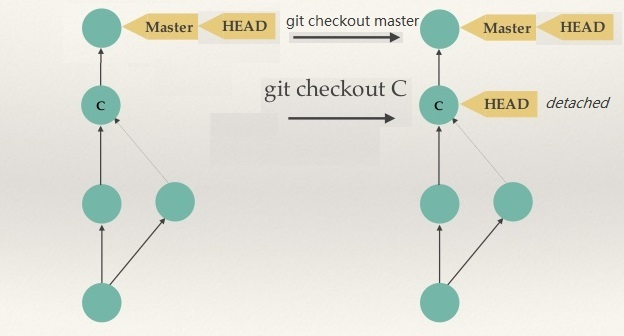

# __Cheat Sheets and Guide for Web Designers and Web Developers__

## Web designers or web developers must constantly search google for information as well as consult various cheat sheets as it is impossible to remember everything. Our experienced developer team have here compiled useful web development cheat sheets, guides and links that help you to quickly look up things or gest started with a project or task fast and efficient. The targeted audience for this article are developers that need quickly get started, look up or fresh up some knowledge. We strongly recommend to bookmark this page.


## __[TABLE OF CONTENTS](#)__

>- __WEB DEVELOPMENT ENVIRONMENT & TOOLS__
>	- 	[__VSCode__](#vscode) - _Configuration of your code editor, intellisense and emmet commands._
>   	- [Terminal in VSCode](#terminal-in-vscode)
>   	- [VSCode Extensions](#useful-VSCode-extensions)
>   	- [VSCode Shortcuts](#useful-vscode-shortcuts)
>   	- [EMMET snippets](#useful-emmet-snippets)
>	- [__GIT & Cmd__](#git-&-cmd) - _Source control, github and some useful git/cmd commands._
>		- [Git commands](#useful-git-commands:) 
>		- [Cmd commands](#useful-cmd-commands:) 
>		- [.Gitignore file](#.gitignore-file)
>	- [___Node.js & Npm___](#nodejs-&-npm) - _How to download packages to automate your work._
>   	- [Install Node.js](#install-node.js-and-execute-programs)
>   	- [Node.js modules](#useful-node.js-modules)
>   	- [Npm packages](#useful-npm-packages)
 >   	- [Install Nmp packages](#install-npm-packages)
>   	- [Package.json file](#packagejson-file)
>	- [__Webpack__](#webpack) - _Bundling and auto-building your source files._
>   	- [Bundling with PostCSS](#bundling-with-postcss)
>   	- [Webpack Dev Server](#webpack-dev-server)
>   	- [Webpack.config.js file](#webpackconfigjs-file) 
>	- [__Markdown__ ](#markdown) - _Text styling markup for creating a nice 'readme' files._
>   	- [Markdown syntax](#markdown-syntax) 
>- __CODE EFFECTIVELY__
>	- [__CSS__](#css) - _How to style pages with CSS._
> 		- [PostCSS](#PostCSS) - _Nesting, variables, mixins_
> 		- [Organize your code](#file-structure) - _How to split and organize your files._
> 		- [Commonly performed tasks](#commonly-performed-tasks)
> 			- [Float](#floating)
> 			- [Flexbox](#flexbox)
> 			- [CSS Grid](#css-grid)
> 			- [Centering of elements](#centering-of-elements)
> 			- [Working with texts and fonts](#working-with-texts-fonts)
>	- [__HTML__](#HTML) - _How to design and code a page._
> 		- xxx
>	- [__JS__](#js) - _Things to know to produce good JS._
> 		- xxx
>	- [__Content for web__](#content-for-web) - _All aboout using images, backgrounds and icons._
> 		- Resolution and DPI
> 		- Responsive images
>- __LEARN FROM EXAMPLES__
>	- [__TODO__](#xxx) - _TODO._


# __[WEB DEVELOPMENT ENVIRONMENT & TOOLS](#)__ 

## [__VSCode__](#)

### [__What is VSCode and what is build in?__](#)

### [VSCode](https://code.visualstudio.com/) is a popular, free and lightweight code editor that comes with built-in support for a variety of useful features. Open new VSCode window with your last project by writing command `"code"` in terminal window. To open new project from a directory that you are currently in then write `"code ."` in command window. Good educational videos can be found [HERE.](https://www.youtube.com/results?search_query=Building+WebApps+using+Visual+Studio+Code) Below are listed some features that you get out-of-the-box when installing VSCode.

 - __Node.js & Nmp__: Runtime environment for JavaScript and corresponding world’s largest free JavaScript online package registry.
 - __JavaScript:__ Programming language for the web that can update and change both HTML and CSS.
 - __TypeScript__: Strict syntactical superset of JavaScript that adds optional static typing to the language.
 - __Emmet__: Usage of [EMMET](https://docs.emmet.io/) code shortenings when writing HTML and css that are expanded into full pieces of code.
 - __IntelliSense__: Code editing features including code completion, parameter info and quick info.

 - __Extensions:__ Search marketplace for a larg variety of extensions directly from VSCode GUI.
- __GIT:__ Integration toward Git with simple graphical interface and usage of most frequent git functions straight from VSCode GUI.
- __Multi-Cursor editing:__ Allows you to edit multiple parts of the document at once.
 - __Debugging, Code navigation__ and much more.

### [__Terminal in VSCode__](#)

__Integrated Terminal window__ in VSCode is very handy feature and a time saver. When right-clicking a folder in explorer window you can easily open `VScode Terminal` directly in corresponding working location. You can also create multiple terminals open to different locations and easily navigate between them. In VSCode Terminal it is also possible to switch between shells that power the terminal from a drop down in the upper right corner. In user settings you can, if you wish, configure that instead of integrated VSCode Terminal open an external terminal of your choice. Just go to `Settings` and search for "terminal".

Depending on you operating system `VSCode Terminal` uses different default shell. If you are used to certain shell and commands it can be a bit of annoying not getting them to work i.e. writing "ls -a" instead of "ls -force" might fail. Changing or adding default shell of your choice can be done as follows. Open control palette and search for command `Terminal: Select Default Shell`. Then you will get a list of available choices for you operating system i.e. Git Bash might be available. Then you can just choose one you prefer and will be added and set as default.

>Note! You can open same location with different shells and easily toggle between them from a drop down list in right corner in the terminal window.

>Note! Not sure that CSCode comes with a default Keyboard Shortcut for focusing Terminal window. We need to ba able to easily switch focus to terminal window. We recommend to set it to `ctrl+ö` in Settings > Keyboard Shortcuts > Terminal: Focus Terminal (search by "Focus+Terminal" string). then same command toggles the terminal window and focuses is if it is open.


### [__Useful VSCode Extensions__](#)

 VSCode has many extensions available for download from[ Visual Studio Marketplace](https://marketplace.visualstudio.com/). Despite those build-in features in VSCode we recommended to extend its functionality by installing some useful extensions. Some we use frequently are listed below:<br> 

|VSCode&nbsp;extension&nbsp;name&nbsp;&nbsp;&nbsp;&nbsp;&nbsp;&nbsp;&nbsp;&nbsp;&nbsp;&nbsp;|Description|
|---|---|
|Vscode-icons|A set of nice icons for different file types shown in VSCode UI that makes navigating and finding a special file type easier.|
|Color Highlight|Highlight colors as defined with # char in files and makes it easier to see what color is used directly in the editor.Note! VSCode have a similar build-in feature but only for CSS files. This plugin extends it to other file types.|____
|Rainbow Brackets|Provides different colors for the round brackets, the square brackets and the squiggly brackets so it is easier to distinguish|
|Code Spell Checker|Checking for spelling mistakes and proposes corrections.|
|Live Server|A lightweight local dev server with live reload for saved HTML & CSS changes. Easy to install and start with one click to run preview of a file in browser.  Note! To compare with Webpack Dev Server having a key feature - hot module replacement - auto-injects changes without refreshing browser window from in-memory. Fast.|
|Git Graph|Visualize commits to git repository in a graph to easily view which commits and branches are where relative to one another. It doesn’t have nearly the features that a full GUI git client like GitKraken has, but it does a nice job of being a lightweight free tool for visualizing the state of your repository’s commits.|
|Git Lens|Extensive valuable insights via powerful comparison commands and other git functions.|
|Markdown All in One|All you need for Markdown: export to HTML, keyboard shortcuts, table of contents, preview on sidebar and more).|
|Markdown Shortcuts|Right clicking on .md file brings a list with markdown commands to. Speeds up a lot.|


### [__Useful VSCode Shortcuts__](#)

We recommend to memorize some of the useful [VSCode shortcut commands](https://docs.microsoft.com/en-us/visualstudio/ide/default-keyboard-shortcuts-for-frequently-used-commands-in-visual-studio?view=vs-2019). Those we use frequently are listed below:

|Task|VSCode&nbsp;Shortcut&nbsp;&nbsp;&nbsp;&nbsp;&nbsp;&nbsp;&nbsp;&nbsp;&nbsp;&nbsp;&nbsp;&nbsp;|Description|
|:---|:---|:---|
|Show/Hide/Focus/Cursor&nbsp;in&nbsp;Terminal| `Ctrl+ö`  |Toggles VSCode terminal window. Focus unfocused terminal window and cursor (add Keyboard Shortcut `ctrl+ö` for "Terminal: Focus Terminal" and "Terminal: Scroll to Bottom" though settings). |
|Show/Hide&nbsp;sidebar| `Ctrl+b` | Toggles VSCode sidebar window. |
|Select block of text| `Shift+Alt [Select]` |  Select rectangular block of text. |
|Open&nbsp;intellisense&nbsp;dialog| `Ctrl-Space` |  Open intelliSense dialog with proposals. Use `ESC` to close it. |
|Search&nbsp;project| `Ctrl-P` | Opens search window to search for files and functions. Use `ESC` to close it. |
|Search&nbsp;commands| `Ctrl-Shift-P` | Opens search window to search for available commands. Use `ESC` to close it. |
|Mirror&nbsp;cursor&nbsp;start/end&nbsp;tags| `Ctrl-D` | Highlights and mirrors cursor to matching start/end tags so we can edit those simultaneously. This can be enabled in settings by checking "mirrorCursorOnMatchingTag" in settings. By default it seems to be turned off.|
|Select multiple cursors| `Alt-[Select]` |  Adds extra cursor for every selected (clicked) position while holding ALT. Then we can "group edit". |
|Format&nbsp;document| `Shift-Alt-F` |  Formats code in current document |
|Move cursor forward/back| `Ctrl-[⇒] or [⇐]` |  Moves cursor forward or back to next statement |
|Move selection up or down| `Alt-[⇩] or [⇧]` |  Moves current selection up or down a line. |


### [__Useful EMMET Snippets__](#)

 [EMMET](https://docs.emmet.io/) can autogenerate HTML and CSS code from short text snippets that are faster to write thn whole code expressions. Memorize some EMMET snippets to speed up your coding. [HERE](https://docs.emmet.io/cheat-sheet/) you can also find a handy cheat-sheet with all EMMET commands. Below we list some useful examples:

|Type|Functionality&nbsp;&nbsp;&nbsp;&nbsp;||EMMET snippet|Generated|
|---|---|---|---|---|
|HTML|New doc| `!` |   | `New HTML doc structure` |
|HTML|Comment| `c `|   | `<!-- -->` |
|HTML|CSS from file| `link:css` |   | `<link rel="stylesheet" href="style.css">`|
|HTML|Script from file| `script:src` |   | `<script src=""></script>` |
|HTML|Dummy text| `lorem23` |   | `Random text with 23 words`  |
|HTML|Paragraph| _p_ | `p.hero__title--orange{Hello}`|`<p class="hero__title--orange">Hello</p>`|
|HTML|Div| _div_ | `.text-area#title{Hello}` |`<div class="text-area" id="title">Hello</div>`|
|HTML|Menu| _ul>(li>a)*2_ | `ul.nav>(li.nav__row>a.nav__item#nav-item-${I$})*2` |`<ul class="nav">`<br>&nbsp;&nbsp;&nbsp;&nbsp;`<li class="nav__row"><a href="" class="nav__item" id="nav-item-1">Item1</a></li>`<br>&nbsp;&nbsp;&nbsp;&nbsp;`<li class="nav__row"><a href="" class="nav__item" id="nav-item-2">Item2</a></li>`<br>`</ul>`|
|HTML|Menu| _ul>(li>a)*2_ | `ul.nav>(li.nav__row>a.nav__item#nav-item-${Item$})*2` |`<ul class="nav">`<br>&nbsp;&nbsp;&nbsp;&nbsp;`<li class="nav__row"><a href="" class="nav__item" id="nav-item-1">I1</a></li>`<br>&nbsp;&nbsp;&nbsp;&nbsp;`<li class="nav__row"><a href="" class="nav__item" id="nav-item-2">I2</a></li>`<br>`</ul>`|
|HTML|Form| _form>input*2_ | `div>p+form:post>input:text+input:email+input:submit`  | `<div>`<br>&nbsp;&nbsp;&nbsp;&nbsp;`<p></p>`<br>&nbsp;&nbsp;&nbsp;&nbsp;`<form action="" method="post">`<br>&nbsp;&nbsp;&nbsp;&nbsp;&nbsp;&nbsp;&nbsp;&nbsp;`<input type="text" name="" id="">`<br>&nbsp;&nbsp;&nbsp;&nbsp;&nbsp;&nbsp;&nbsp;&nbsp;`<input type="email" name="" id="">`<br>&nbsp;&nbsp;&nbsp;&nbsp;&nbsp;&nbsp;&nbsp;&nbsp;`<input type="submit" value="">`<br>&nbsp;&nbsp;&nbsp;&nbsp;`</form>`<br>`</div>` |
|HTML|Article| _section>article_  | `section.s>(article.wrap>h1.s_t+p.s_d+button.s_b)*1` |`<section class="s">`<br>&nbsp;&nbsp;&nbsp;&nbsp;`<article class="wrap">`<br>&nbsp;&nbsp;&nbsp;&nbsp;&nbsp;&nbsp;&nbsp;&nbsp;`<h1 class="s_t"></h1>`<br>&nbsp;&nbsp;&nbsp;&nbsp;&nbsp;&nbsp;&nbsp;&nbsp;`<p class="s_d"></p>`<br>&nbsp;&nbsp;&nbsp;&nbsp;&nbsp;&nbsp;&nbsp;&nbsp;`<button class="s_b b"></button>`<br>&nbsp;&nbsp;&nbsp;&nbsp;`</article>`<br>`</section>` |
|CSS| |`w100p+m10p20px10e20p`|   |`width: 100%; `<br>` margin: 10% 20px 10em 20%;`|
|CSS| |`h100e+m10-10-10-10`|   |` height: 100em; `<br>` margin: 10px 10px 10px 10px; ` |
|CSS| |`fw:400+bc+m10-10-10-10`|   |`font-weight: 400; `<br>` background-color: #fff; `<br>` margin: 10px 10px 10px 10px; ` |
|CSS|_bdrs9_|`-bdrs9`|   |`border-radius: 9px; `<br>` -webkit-border-radius: 9px; `<br>` -moz-border-radius: 9px;`|
|CSS| |`fs20+bc+bd+bdrs5`|   |`font-style: 20px; `<br>` background-color: #fff;`<br>` border: 1px solid #000;`<br>`border-radius: 5px;`|


<br><br>[- BACK TO TOP -](#table-of-contents)

---
---
<br><br>


## [__GIT & Cmd__](#)

### [__What is GIT and why use it from command line?__](#)

### [Git](https://git-scm.com/) is the most popular version control system for tracking changes in source code during software development. Even though VCCode and Visual Studio has GUI for Git commands we recommend to get familiar with and memorize  commonly used expressions and main commands as it is often required to run git commands from a command line window. Good Git tutorial can be found [HERE](https://www.youtube.com/watch?v=HVsySz-h9r4) and [HERE](https://www.youtube.com/watch?v=FdZecVxzJbk).

|GIT&nbsp;&nbsp;Expression | Description |
|:---|:---|
|Repository&nbsp;&nbsp;(repo)|What is a repository? It is a folder location where all historical versions of project files files are stored and tracked by git. Can exist on our local machine or remotely on i.e. GitHub. A repository (shorter repo) have always a hidden folder named `.git` in the root. By deleting this hidden .git folder all historical versions are deleted and git tracking is disabled. Do not use space or tab in name of your repo. Name of remote and local and repositories can differ. |
|Working&nbsp;&nbsp;directory| Working directory is the area where a single checkout (one version of the project) is stored. It is an "umbrella" term for all your files and folders that you can view and edit that git trace. |
|Working&nbsp;&nbsp;tree|Term "working directory" refers to an area where all changes to files in your working directory are saved. Git traces changes to files in working directory. When those changes are saved then git automatically add those changes to `working tree` (simply in some index file down in .git folder). This is the "first level" of tracing of made. Subsequently changes in a working tree should be staged - meaning those are added to `index`. Finally changes in index can be committed then those are added to a `local repo`. From there we can push the changes to a `remote repo` which is the last "destination" of our changes (and safest). |
|Index| Index is another git term used for `staging area`, witch is is a location where staged changes to files and folders are saved before a commit. Internally it is some index file down in .git folder saving the changes. |
|Check out| Checking out is simply switching between different versions of code that we can view and edit in our working directory. When we `check out` a branch, or a specific commit or tag, then all files in our working directory will be updated to new versions, git simply overwrites ALL files and folders in our working directory. Additionally HEAD is then moved to point to tip of this new checked out branch.<br>A good question here is what happens to saved but not committed changes in working tree and index when we check out?<br>If we in our current working tree or index have uncommitted changes to files or folders, whose "parent" differ in any way from those we trying to check out, then git aborts the checkout. For example; if we are on Branch-A and have file s1 staged. Assume same file was meanwhile changed and committed on branch-B. If we in this situation want to check out branch B from Branch-A then it fails. But if file s1 have not be changed on branch-B then git proceeds and checks out Branch-B and keeps working tree and index as they were with our changes untouched.|
|Clone|Cloning is making a copy of whole repository and saving in on another location. Usually a clone command automatically checks out the branch that is marked as active HEAD in parent, after it cas copied the repo. Usally it is "master" branch that is checked out in working directory by default after cloning.|
|Branch|Branch is a movable "pointer" to latest commit (version) of the code. Every time you commit something to a branch then branch pointer moves forward automatically to point to this commit. Usually when you add a new feature you spawn a new branch i.e feature-x-branch to encapsulate the changes, check it out, work on on this branch with your feature and when finished with testing you merge back your changes from your feature branch to parent branch you originated from. In more complex projects we can for example have have dev-, release- or feature- branches. Note that the first by git automatically created branch when new repo is created is called by default `"master"`. |
|HEAD| HEAD is a movable "pointer" to a commit that we currently have checked out in our working directory. In normal cases it always point to a branch therefore when branch moves to point to the latest commit then the HEAD do as well. But when a HEAD pointer directly to specific commit it is called a `detached HEAD` because it is not attached to a branch anymore. Note that when checkout a branch then HEAD pointer always changes to point to the tip of the branch we check out.|
|Detached HEAD| Means the HEAD do not point to a branch but points to a specific fix commit. This happens when we check out a specific commit instead of a branch but sometimes this also might happens when a rebase fail. On a "detached checkout" you can look around, edit files and commit your changes BUT you will not be able to push from this "detached commit" and this commit will be lost when you change branch.   |
|Stage|Staging can be described as saving of changes to local repos index|
|Commit|When we commit we permanently save changes to local repo with an hash-label and description|
|Commit Hash|An unique 40 char long SHA-1 hash that is created as unique ID for each commit. It can not be changed. Example: 4c511f16ef2644854d04cabebfcecc82be0eb04f|
|Tag|A git tag is simply a label/stamp for commit that can be manually added to a special commit. Tags need to be manually added with a tag command and can look like this: rel-v.1.8.5 |
|Merge & Rebase|In git there are two main ways to integrate changes from one branch into another: merge or rebase. Merge adds the changes to the tip of the branch we merge to in one single commit. Rebase moves the originating (starting) point of the branch to the tip of the branch we rebase to. Both have its advantages and disadvantages. Usually you can rebase on your own feature branch that you are in full control of, but you merge your changes to master or dev branch where many other work toward. |
|Git Remote|Git remote is broader git system which is responsible for connecting to remote repositories and syncing changes. Remote servers i.e GitHub or Bitbucket have unique URL for each of its repos. In git - a connection to a remote server need to have a name, usually "origin", and the store correct url. |
|Push/Fetch|Pushing nad Fetching is uploading and downloading of files and history from/to a remote repo. Note we do not checkout our working directory when executing this commands. Even if Fetch downloaded some newer changed files to pir machine we stay on the same code versions in working directory until we check out.|
|Pull| Download all files and history from remote repo, locally merge our changes to it and finally check out latest code so that our working directory updates to with new file versions. |
|Merge Conflict| Arise when two people have changed the same lines in a file, or if one developer deleted a file while another developer was modifying it. In these cases, Git cannot automatically determine what is correct. Git will mark the file as being conflicted and halt the merging process with test "Automatic merge failed; fix conflicts and then commit the result". It is then the developers' responsibility to resolve the conflict. |
|Unrelated histories error| Somehow the local .git directory got deleted or corrupted. This leads Git to be unaware of your local history and will cause throwing this error when you try to push to or pull from the remote repository. To solve this use `--allow-unrelated-histories` option on pull/merge command. |
|Upstream branch| Upstream branches are closely associated with remote branches and define the branch tracked on the remote repository by your local remote branch. When this is set on a branch then no need to write local branch name when merge/pull/push as it then choses the default set one. Set it for example with by `git push --set-upstream (or -u) origin master` to set default upstream origin/master. Check with `git branch -vv` that is is set. Later you just need to write `git push origin` to push from master when on master. Handy! |

 





### [__Useful Git commands__](#)
It is recommended to understand and memorize basic git command that are often used. Good article explaining merging and rebasing can be found [HERE.](https://www.atlassian.com/git/tutorials/merging-vs-rebasing). Download a complete [git cheat sheet](https://github.github.com/training-kit/downloads/github-git-cheat-sheet.pdf) with all git commands. Additionally in VSCode you can open 'Command palette' (`CTRL-SHIFT-P`) where you can run git commands by choosing those from a list instead of writing the terminal window. Below we list most used git commands:


- __Get Started and Help__<br>
	Initially make sure to install git on your computer and check its version when installed.
<br> `> git --version`  &nbsp;&nbsp;&nbsp; _shows installed git version_
<br> `> git --help`  &nbsp;&nbsp;&nbsp; _prints a list of available git commands with short descriptions_ 
<br> `> git [command] -h`  &nbsp;&nbsp;&nbsp; _prints out short help about a specific command_ 
<br> `> git [command] --help`  &nbsp;&nbsp;&nbsp; _opens online help about a specific command (new window)_ 

- __Configuration.__ <br>
  	To look up configuration and information:

	`> git status` &nbsp;&nbsp; _prints out useful info: current branch, changes to stage/commit, errors, conflicts and tips._ <br>
	`> git config --list` &nbsp;&nbsp; _shows current configuration i.e. remote url, current user name/email and default editor_ <br>
	`> git remote -v` &nbsp;&nbsp; _prints out Remote Name and Url. Usually an "origin" url to push/pull toward remote repo_ <br>
	`> git branch -vv` &nbsp;&nbsp;  _prints out all existing branches in local repo, currently checked-out one marked with *, default upstream brach, how much localy ahead and the remote url _ <br>

	Important! Initially make sure to __set your user credentials__ as those are needed to commit code:

 	`> git config --global user.name [your name]` <br>
 	`> git config --global user.email [your@email.com]` <br>

- __Create a Local Repo.__ <br>
  	Creating a local repo can be done in two ways depending on if we start from fresh locally or copy existing repo.<br><br> 
	__`1.`__ One way is to create __new empty local repo__:

	`> git init` &nbsp;&nbsp; _turns current directory folder to an new local repo. A hidden .git folder is created in the root._ <br>
	`> git init [LocalFolderName]` &nbsp;&nbsp; _creates new folder in current location & turns this new folder into an empty repo_ 
	
	>	Note! In case above the remote url (origin) is undefined and must be set it we want to connect this new repo to a remote repo. A new default branch is created and named "master", and automatically checked out.

    __`2.`__ Another way is is to __copy already existing repo from remote__:

	`> git clone [RemoteRepoURL]` &nbsp;&nbsp; _copies a repo (with full history of all files and all branches) to your into new directory that is created in directory where you execute the command and named same as the remote repo._  <br>
	`> git clone [RemoteRepoURL] [LocalFolderName]` &nbsp;&nbsp; _creates new folder in current location & copies whole remote repo into it. Also checks out aversion of files and set connection to our remote repo (sets remote url)_

	> Note! Cloning also checks out a version of files and creates a remote connection called "origin" pointing back to the original repository. What is git clone checking out? The commit that HEAD is pointing to on the remote witch is usally "master". ???
	<br>

- __Set Remote URL.__<br> 
  	In order to synch changes with a remote repo on i.e GitHub an address must be set. <br>

	`> git remote -v`  &nbsp;&nbsp; _first print your current remote repo url and its name_ <br>
	`> git remote remove origin` &nbsp;&nbsp; _removes existing connection to a remote repo (if any)_<br>
	`> git remote add origin [RemoteRepoURL]`  &nbsp;&nbsp; _Adds new connection to remote repo named 'origin' and set url_<br>
	`> git remote set-url origin [RemoteRepoURL]`  &nbsp;&nbsp; _change url  remote connection named 'origin' to push/pull from it._

- __Stage & Commit.__<br>
  	After editing existing files or adding new files in working tree we need to stage the changes, and later commit those to our local repo:

	`> git status` &nbsp;&nbsp; _lists info such as all changes to stage/commit as well as errors/conflicts if any_ <br>
	`> git add [.] or [fileName]` &nbsp;&nbsp; _stages all or specific files by adding those to index_ <br>
	`> git commit [.] or [fileName] -m 'commitDescription'` _commits all changes to repo with a description_

-   __Undo Changes__<br>
  	There are different ways to undo or revert made changes or commits:<br>

	`> git restore [.] or [fileName])` &nbsp;&nbsp; _permanently deletes changes in working tree but do nothing to staged ones._ <br>
	`> git restore --staged [.] or [fileName])` &nbsp;&nbsp; _unstage changes by moving staged to working tree. Note! If same file changed in working tree then the staged change will be permanently deleted!_ <br>
	`> git checkout -- [.] or [fileName]` &nbsp;&nbsp; _permanently deletes changes in working tree and replaces with staged ones or one committed to repo._ <br>
	`> git rm [filename]` &nbsp;&nbsp; _ this permanently deletes the file in working tree and automatically stages this change. Need to be commited in order to remove the file in repo too._ <br>

	In order to ___permanently remove both___ staged files and the unstaged changes:<br>
	`> git restore --staged .`<br>
	`> git checkout -- .`

-   __Merge, Diffs and Logs__. <br>
  	
	`> git log -- [.] or [fileName]` &nbsp;&nbsp; _shows all commits labels for file(s)_ <br>
	`> git diff [.] or [fileName]` &nbsp;&nbsp; _shows changes between file(s) in working tree vs staged area or committed to repo._ <br>
	`> git diff --staged [.] or [fileName]` &nbsp;&nbsp; _(shows changes between file(s)) in staged area vs committed in repo._

-   __Conflicts__<br>
  	When pulling sometimes a background merge can fail. Then the merge is aborted conflicted files are added to local working tree and must be resolve to commit and fullfil the merge. <br>	
   
	`> Fix the conflict:`  &nbsp;&nbsp; First show files and diff. Then then most direct way to resolve a merge conflict is to edit the conflicted file in your favorite editor, i.e. open in VScode with `>code [filename]`, remove unwanted code and save the filet. Afterwards stage and commit with `git commit -m "merged and resolved the conflict."`

	>Note!  The ======= line is the "center" of the conflict. Above is the code we merge from. Below is the code we merge to. 

- __Fetch, Pull & Push.__<br>
  	When time to push changes in your local repo to remote then first fetch from from remote and merge  or rebase locally. This because there might be changes on remote conflicting with your changes. Solve all those conflicts and test locally before finally uploading (pushing) the result to remote repo. 

	`> git push origin master` &nbsp;&nbsp; _upload changes to remote repo, here origin, from #todo check here if we have 2 branches with changes how to push both?_<br> 
	`> git pull origin master` &nbsp;&nbsp; _fetches & merges changes from remote repo, here "origin", to our local branch here "master"')_ <br>
	

	`> git push -u (or --set-upstream) origin master` &nbsp;&nbsp; _`-u` or `--set-upstream` set the upstream branch for local master to `origin/master`. After this we can use command like `git push origin or` `git pull origin` without defining the second parameter (local branch) as we have a default upstream set for brunch we are working on (view it with `git branch -vv` command)_ <br>

	>Note! "Git pull" run two different git commands for you. You're better off, until you are 		well-experienced with Git, using separate "git fetch" and "git merge" commands. But this may 	Cause Conflicts to occur, so it’s recommended to use Git Pull with a clean copy. Note that "git pull --rebase" switches the second command to git rebase, but we won't get into details here.<br>

	`> git fetch origin --allow-unrelated-histories` &nbsp;&nbsp; _fetches changes from remote to local repo_ <br>
	`> git merge origin/foo` &nbsp;&nbsp; merges changes from foo to your checked out local repo_ <br>

	-- equals -->

	`> git checkout foo` &nbsp;&nbsp; _Makes us to look at foo branch localy_ <br>	
	`> git pull --allow-unrelated-histories` &nbsp;&nbsp; _fetches & merges changes to local checked out repo_ <br>
	or <br>
	`> git rebase origin --rebase --allow-unrelated-histories` &nbsp;&nbsp; fetches & rebases changes to local repo foo. The command tries to find out which commits are really your local ones, and which had come from upstream in an earlier fetch. <br>

		Note! `--allow-unrelated-histories` forces to accept files that are not related to the project i.e. when merging 2 different projects.

		Note! Both of these commands are designed to integrate changes from one branch into another branch—they just do it in very different ways. When rebasing you move the base of the change ending point. Merging adds a new commit to your history. Merge preserves history whereas rebase rewrites it. Rebase will present conflicts one commit at a time whereas merge will present them all at once. It is better and much easier to handle the conflicts but you shouldn’t forget that reverting a rebase is much more difficult than reverting a merge if there are many conflicts. The golden rule of git rebase is to never use it on public branches. The first step in any workflow that leverages git rebase is to create a dedicated branch for each feature. This gives you the necessary branch structure to safely utilize rebasing.  If you would prefer a clean, linear history free of unnecessary merge commits, you should reach for git rebase instead of git merge when integrating changes from another branch.

On the other hand, if you want to preserve the complete history of your project and avoid the risk of re-writing public commits, you can stick with git merge. Either option is perfectly valid, but at least now you have the option of leveraging the benefits of git rebase.

   - __Branch__<br>
	For new feature new branch...:

	`> git branch [newBranchName]`  &nbsp;&nbsp; _(creates a new branch but __stays__ on the checked out oue_ <br>
	`> git checkout -b [newBranchName]`  &nbsp;&nbsp; _(creates a new branch and checks it out)_

- __Clone someones remote repo__<br> 
  	When you want to copy a public remote repo to your own.

	- Create own empty remote repo i.e. A
	- Clone a remote public repo to a local repo
	- Change remote origin URL for the newly created repo to your own remote repo.
	- Push changes to your remote URL. This will upload all copied files to your own remote repo.
	#todo

### [__Useful Cmd Commands:__](#)

It is good to know and memorize those basic command that are often used:

|Cmd&nbsp;command|Description|
|:---|:---|
|`pwd`| Print Working Directory. Writes out full path of currently executing folder. |
|`ls -force` \| `dir -force` <br> `ls -a` \| `dir -a`|List all content (including hidden files) in current working directory. <br> "- force" for VSCode terminal /powershell) and "-a". for Git Bash. |
|`cd [path]` <br> `cd ..`|Change location to path or back|
|`mkdir [dirName]`|Creates a new directory in current location|
|`rm [dirName]`|Deletes a directory|
|touch [fileName]|Creates a new file in current location|
|cat [fileName]|Prints content of a file in terminal window|
|ipconfig|detailed information about your current network adapter connection including current IP address|
|copy [soure] [dest]|Copies a source file to destination|
|`cls` or `clear`|Clear the command screen|


### [__.gitignore file__](#)

Gitignore file is a file in root of your project which tells Git witch files not to track. #todo who creates it?.<br> 
A gitignore file may look like following:

```
# Numerous always-ignore extensions
*.diff
*.err
*.orig
*.log
*~
*.sass-cache
node_modules/
.tmp/

# OS or Editor folders
.DS_Store
Thumbs.db
.cache
.__project__
.settings

...
```

<br><br>[- BACK TO TOP -](#table-of-contents)

---
---
<br>
<br>


## [__Node.js & Npm__](#)

### [__What is Node.js and npm used for?__](#)

### Node.js is a lightweight runtime environment for JavaScript. Npm is a tool included in node.js that makes is possible to download and store packages that Node.ja later can run and use. Npm and Node.ja can automate lots of our work and speed up our development time significantly. Extensive node.js tutorial can be found [HERE](https://www.tutorialspoint.com/nodejs/nodejs_introduction.htm). Typescript tutorial can be found [HERE](https://medium.com/javascript-in-plain-english/typescript-with-node-and-express-js-why-when-and-how-eb6bc73edd5d). List of modules/packages build-in in node.js can be listed [HERE](https://www.w3schools.com/nodejs/ref_modules.asp).

### [__Node.js__](#)

There are two main usage areas for Node.js. One is as a backend server that execute javascript. Other one is as a development/automation tool used on our computers that we work with our development on. Server-side node is used for serving data and powering apps and sites. When using it as a development tool we can automate common tasks and speed up building of our apps and sites. 

Node.js can execute programs written in JavaScript. Originally JavaScript is a scripting language but Node.js "extends" JavaScript to be a "real" programming language. Note.js unfortunately do not understand TypeScript but there is a nmp package (called `typescript`) that can automatically transform our typescript (.ts) files to javascript (.js) files.


#### [Install Node.js and execute programs](#)

- Following command check if node is __installed__ on your machine.If not just google and install it. <br>
`node -v` 

- To __execute__ a java script file with node use following cmd command: <br>
`node anyFileToRun.js` 

>	JavaScript programs that is run by node.js usually include (require) packages that are either downloaded though npm (and stored in root folder `node_modules`) or built-in in node.js. In order to use those packages those must be "required" in top of the .js file. For example:
`var http = require('http');`.


#### [Useful Node.js modules](#)

Following are some common packages and functions that are useful and good to memorize.

|||||
|:--|:--|:--|:--|
|require(__[fs](https://nodejs.org/api/fs.html#fs_file_system)__)|access filesystem|__[writeFile](https://nodejs.org/api/all.html#fs_fs_writefile_file_data_options_callback)__(__dirname +"./[FileName]",<br> [TextToAdd],<br> function() {...})|YES|
|require(__[http](https://nodejs.org/api/http.html#http_http)__)|Access www|__[get](https://nodejs.org/api/http.html#http_http_get_url_options_callback)__(url,<br>function(resp) {<br> response.__[pipe](https://nodejs.org/api/stream.html#stream_readable_pipe_destination_options)__(fs.__[createWriteStream](https://nodejs.org/api/fs.html#fs_fs_createwritestream_path_options)__([FileName])) <br>})|YES|
|require(__http__)|...|...|YES|

>	Note! Even though it is not required, it is a good practice to use ; at end of each statement. <br>
In node 'var' and 'const' are used when declaring variables. Var variables can be updated and re-declared within its scope, const variables can neither be updated nor re-declared. <br>


### [__Npm__](#)

NPM stands for Node Package Manager and comes by default with Node.js installation. NPM is a tool used to search for, download and store packages that can later be run by Node.js. NPM packages are JavaScript programs written by others performing various tasks that usually automate various things us lots of  precious time. Packages that are downloaded through npm can automate development, but also contain code that project use when auto-creating code that we later send to browser. For example [lodash](https://lodash.com/) or [normalize](http://nicolasgallagher.com/about-normalize-css/) are such a packages. 


#### [Useful NPM Packages](#)

|Name&nbsp;&nbsp;&nbsp;&nbsp;&nbsp;&nbsp;&nbsp;&nbsp;&nbsp;&nbsp;&nbsp;&nbsp;&nbsp;&nbsp;&nbsp;&nbsp;&nbsp;&nbsp;&nbsp;&nbsp;&nbsp;&nbsp;&nbsp;&nbsp;&nbsp;&nbsp;&nbsp;&nbsp;&nbsp;&nbsp;|flag|Usage|
|:---|:---|:---|
|[normalize.css](http://nicolasgallagher.com/about-normalize-css/)<br>[loadash](https://lodash.com/)||CSS package for resetting all browsers to same state. <br> Lodash is an JavaScript library to work with arrays, numbers, objects, strings, etc.|
|<br>[webpack](https://www.npmjs.com/package/webpack)<br>[webpack-cli](https://www.npmjs.com/package/webpack-cli)<br>[webpack-dev-server](https://www.npmjs.com/package/webpack-dev-server)|-D|_Common Webpack functionality_<br>For bundling & automation.<br>For command line functionality<br>Dev server that auto-injects JS into chrome at runtime.|
|<br>[postcss-loader](https://www.npmjs.com/package/postcss-loader)<br>[css-loader](https://www.npmjs.com/package/css-loader)<br>[style-loader](https://www.npmjs.com/package/style-loader)|-D|_Webpack loaders (CSS)_<br>For loading postCSS modules.<br>For importing css to js files.<br>Get browser to read CSS from JS files.|
|<br>[postcss-import](https://www.npmjs.com/package/postcss-import)<br>[postcss-simple-vars](https://www.npmjs.com/package/postcss-simple-vars)<br>[postcss-nested](https://www.npmjs.com/package/postcss-nested)<br>[autoprefixer](https://www.npmjs.com/package/autoprefixer)  |-D|_PostCSS modules:_<br>For importing code to CSS & NPM-modules files <br> For variables in CSS <br> For nesting in CSS<br>For adding autoprefixes|
|xxx|||
|yyy|||


#### [Install Npm packages](#)

-	First always __initiate npm in the root__ of your local repo.<br>
`> npm init -y`  

>	Note! By using -y do not need to answer questions, we use predefined values. Running this command will auto-create a default __`package.json`__ file that is very important file for npm!

- Now keep on and install packages of two types. <br>
1) Those that contain js script or css that are part of our final file that is sent to browser (project dependant).<br>
2) Packages that are just used during development to automate tasks to enhance and speed up development. Those shall be installed with flag: `--save-dev` option or shorty `-D`:<br><br>
_For development only:_<br> 
`> npm install --save-dev [package_name]` &nbsp;&nbsp;&nbsp;&nbsp; or &nbsp;&nbsp;&nbsp;&nbsp; `npm i -D [package_name]`<br>
 _Project dependant:_<br>
 `> npm install [package_name]` &nbsp;&nbsp;&nbsp;&nbsp; or &nbsp;&nbsp;&nbsp;&nbsp;  `npm i [package_name]`

 > Note! Name and version of downloaded nmp package is save in `package.json` file as a 'dependency' or 'development dependency'. The package itself is stored in auto-created folder `node_modules` in project root. This folder is usually by default excluded from tracking by GIT. Only the file itself - `package.json` - that contain 'the list' of packages that our project use is under GIT source control. This because if `node_modules` folder would of some reason be deleted - then npm can from `package.json` file automatically restore all in it defined packages. 

 - All packaged defined in `package.json` can be downloaded to  `node_modules` with command:<br>
 `> npm install`


-	Instead of npm install, you can use a command to freshen already installed packages. Then npm checks if there exist newer versions in the online npm repository that satisfy specified semantic versioning ranges and installs them and updates package.json file with the new version. <br>
 `> npm update --save`

- Ask npm to list which packages have newer versions available: <br>
 `> npm outdated`
 

 - Ask npm to install the latest version of a package and update oackage.json file with that version: <br>
 `> npm install lodash@latest --save`
 

### [Package.json file](#)

This is an important file in the root of the repo. It is auto-generated when we initiate npm. This is an important project file. The 'scripts' property is a dictionary containing script commands that can be run from command line. Dependencies are the packages that are used in within the project.

_Example of an package.json file:_
```
{
  "name": "travel-site",
  "version": "1.0.0",
  "description" : "Travel site for SunTravel company.",
  "author" : "CMQ Nordic AB",
  "license" : "ICS",
  "scripts": {
    "build": "webpack",
    "dev": "webpack-dev-server"
  },
  "dependencies": {
    "loadash": "^1.0.0",
    "normalize.css": "^8.0.1"
  },
  "devDependencies": {
    "webpack": "^4.41.5",
    "webpack-cli": "^3.3.10",
    "webpack-dev-server": "^3.10.1",
    "postcss-loader": "^3.0.0",
    "css-loader": "^3.4.1",
    "style-loader": "^1.1.2",
    "postcss-import": "^12.0.1",
    "postcss-simple-vars": "^5.0.2",
    "postcss-nested": "^4.2.1",
    "autoprefixer": "^9.7.3"
  }
}
```

<br><br>[- BACK TO TOP -](#table-of-contents)

---
---
<br><br>


## [Webpack](#)

__This section is about:__<br>
 _Bundling and auto-building your source files._

_Some good tutorial [HERE](https://www.youtube.com/watch?v=lziuNMk_8eQ)_

<br>
Webpack is a bundler and dependencies manager and our "building" tool. Simply described:


  `Webpack consumes many files that are not written in a way that browser understands (but we understand very well), and generates few minimal files (i.e. .HTML, .css and .js) that the browser can understand (but we have hard to read).`

Webpack can for example (when instructed in webpack.config.js file) build one single .js file from several files  (i.e JS ES6, CSS and JS). Thanks to its many  packages it can perform a variety of tasks. Webpack is popular to use in big web projects as it streamlines ans simplifies the development. Without it would be very hard to import and add all script dependencies manually.

During development you run webpack in development mode as then it bundles faster faster than in production mode. The files are usually minified for performance only in production mode. In development mode we do things a bit differently to speed up development. For example we load CSS though a javascript file (for simple auto-injection and hot-refresh of browser).

-	Initiate Webpack in the root of your working directory:<br>
	`npm i -D webpack webpack-cli  webpack-dev-server`<br>
	`npm i -D postcss-loader css-loader style-loader`<br>
	`npm i -D postcss-import postcss-simple-vars postcss-nested autoprefixer`

<br>

### [Bundling with PostCSS](#)

PostCSS is an npm package widely used with webpack. It is like an empty shell that on its own do not do anything. It uses "loaders" (other npm packages), that can load and execute various PostCSS packages (other npm packages). Webpack, when bundling, uses PostCSS packages to execute and understand different file formats we that we chose to use for our development. For example non standard stuff like CSS variable, nesting in CSS can be used by developer and though Webpack bundler be transformed to valid CSS that browser understands thanks to PostCSS packages. 

In order for webpack to understand and know what PostCSS loaders and what PostCSS packages to use for various files it must be instructed in webpack.config.js file

You can check our our example of webpack.config.ja file but follwing comes description on some settings in more details way if you want to know what-is-what.

<br>

_Instructing webpack that all files with ending .css shall be handled by following PostCSS loaders:_ 

```
module: {
		rules: [
			{
				test: /\.css$/i, /* Only if file ends in .css */
				use: ['style-loader','css-loader']
			}
		]
	},
```


/* Telling webpack that that all files ending with .css shall be handled by following loaders*/ 

module: {
		rules: [
			{
				test: /\.css$/i, /* Only if file ends in .css */
				use: ['style-loader','css-loader']
			}
		]
	},


### [Webpack Dev Server](#)

__Webpack devServer__ (webpack-dev-server) is a webpack npm package that is started from command line, usually by running a NPM-script. When running it can automatically inject code to running browser(s) instantly when tracked project files (i.e HTML, CSS and JS) are saved. The injection is done is such a way that browser do not perform 'hard refresh' and keeps its state. This is VERY convenient when developing and CSS styling.The server can also be reached from several browsers on the same wi-fy network. It is very popular dev server to use when building and styling your web app. In order to get it work some configurations need to be done and some npm packaged downloaded. Following is described what need to be done to gest started with webpack DevServer

- Make sure webpack is installed

- Install npm packages:<br>
`npm install -D webpack-dev-server css-loader style-loader postcss-loader`


- In projects [package.json](#packagejson-file) add new script to run from command line. Add in script section: <br>
`"devServer": "webpack-dev-server",`

- Create [webpack.config.js](#webpackconfigjs-file) file in the root of your repo:<br>
`mkdir webpack.config.js`

```
const postCSSPlugins = [
    `list here all downloaded postCSS plugins you use `
]


/* Telling webpack that that all files ending with .css shall be handled by following loaders*/ 

module: {
		rules: [
			{
				test: /\.css$/i, /* Only if file ends in .css */
				use: ['style-loader','css-loader']
			}
		]
	},


/* Telling webpack to watch for changes in a directory and inject those to the running browser(s) at localhost:3000 */

DevServer: {
		contentBase: path.join(__dirname, 'app'),	/* Base folder where our index.HTML file lives */
		hot: true, /* Auto inject at save. The main entry point .js file must contain following: if (module.hot) module.hot.accept(); */
		port: 3000
	},
```

- In our main entry point js file `App.js` add this in order to get css into js and hot auto injection of .js file to browser to work.
```
import '../styles/styles.css'

if (module.hot)
{
	module.hot.accept();
}

```


- In VSCode file `settings.json` (open from settings) add following line in order to avoid error in editor in CSS files when using scss syntax.
```
"files.associations": {"*.css": "scss"}
```

### [Webpack.config.js file](#)

This is an important file in the repo root that you must create and add manually in order to give instruction to webpack how to run. Webpack when run, the first thing it does is to looks in running folder for this file.

_Example of an webpack.config.js file:_
```
var path = require('path');

/* */
const modeType = "development";
/* */
const entry_JSToBundle = "./app/assets/scripts/App.js";

/* Settings related to where the build bundled file shall be served on hard drive. */
/* Note! WebServer serves this file from RAM, do not write to hard drive! */
const output_BundledDir = path.join(__dirname, '/app'); 
const output_BundledFilename = "bundeld.js";

/* Setting related to webpack-dev-server */
const devServer_ContentBase = path.join(__dirname, '/app'); /* Root of our index.HTML that devServer runs */
const devServer_HtmlFilesLocation = './app'; /* Location where HTML that shall be tracked when saved changes */
const devServer_Port = '3000'; /* The port to serve the page on -> localhost:3000 */

/* PostCSS plugins that are served to "postCSS-loader" */
const postCSS_Plugins = [	
	require('postcss-import'), /* Must be first. Replaces the @import with code. */
	require('postcss-simple-vars'),
	require('postcss-nested'),
	require('autoprefixer')
];

module.exports = {
	mode: modeType,
	entry: entry_JSToBundle,	
	output: { path: output_BundledDir, filename: output_BundledFilename },
	devServer: { 
		contentBase: devServer_ContentBase, /* Location of index.HTML file */
		before: (app, server) => { server._watch(devServer_HtmlFilesLocation + '/**/*.HTML') }, /* For auto-reloading when a HTML file is saved */
		hot: true, /* For auto-inject of bundled file at save. Note! The .js that is entry point file must contain: if (module.hot) module.hot.accept() */
		port: 3000, /* The port to run the site on -> localhost:3000 */
		host: '0.0.0.0' /* Reach devServer from other devices on same wi-fi. Address: [IPv4 Address 192.168.X.X]:3000 (look up XXX  cmd>ipconfig)*/
	},
	module: {
		rules: [
			{
				test: /\.css$/i, /* This rule only for files ending with .css due to this*/
				use: ['style-loader','css-loader', {loader: 'postcss-loader', options: {plugins: postCSS_Plugins}}]
			}
		]
	}
}
```


<br><br>[- BACK TO TOP -](#table-of-contents)

---
---
<br>
<br>

## [__Markdown__](#)

Markdown is a lightweight markup language to style text on the web. The syntax is much simpler than HTML and originally was created for non-programmers to write easy-to-read format that could be converted directly into HTML. Markdown files are saved with extension .md and only special readers can view them i.e. GitHub readme-file-viewer or Chrome with a special plug-in. Using markdown for styling text makes it possible to view text in a nicer than simple text. VSCode have Markdown with preview build in. GitHub uses Markup to style th README.md files.

> Note! Each heading starting with `#` i.e. `## Node.js & Npm-files`, in background creates a class based on name. In case here "`nodejs-npm`". In order to internally navigate to this heading use `[Pres HERE to go to Node.js](#nodejs-npm.files)` and an internal link will be created.

>Note! When emty line is used then texts in between are part of same paragraph. But if 2+ empty lines exist then is means a new paragraph.


__Recommended VSCode Extensions__

[Markdown Shortcuts](https://marketplace.visualstudio.com/items?itemName=yzhang.markdown-all-in-one)<br>
Adds a list of toggle commands/shortcuts shown in drop-down list when right-clicking in .md file. Very convenient to toggle a selection by choosing from a list. In settings __ or _ can be chosen to use instead of  ** and *. Also on title bas GUI icons are shown for .md files, can be customized in options.

[Markdown All in One](https://marketplace.visualstudio.com/items?itemName=yzhang.markdown-all-in-one)<br>
Exports to HTML. Export HTML to PDF with browser (e.g. Chrome) if you want.<br>
Creates Table Of Content. Use <!-- omit in toc --> beside/above heading to ignore it.<br>
Paste (CTRL-V) a link on selected text to create a markdown link.<br>
Autocompletion of available assets with ./<br>


### [__Markdown syntax__](#)

Below we presen some Markdown syntax for most used tags. Copy it to you markdown file as it is.

__`MARKDOWN LISTS`__ 

  1. Chapter one
  2. Chapter two
     1. Subchapter one
     2. Subchapter two
  3. Chapter three
  4. Chapter four

  <br>

  - \- Chapter One
  - \- Chapter two
    - \- Subchapter one
    - \- Subchapter  two
  - \- Chapter three
  - \- Chapter four

<br>

__`MARKDOWN TEXTS`__

## \#\# H2 text
### \#\#\# H3 text
#### \#\#\#\# H4 text
##### \#\#\#\#\# H5 text

Normal text

_\_Italic text\__

__\_\_Bold text\_\___ 

~\~~~s'Striken text~~\~\~ 

$
\$
f(x)=x/5*2y
\$
$

<br>

__`MARKDOWN LINKS`__

External link: [HERE](http://www.di.se) &nbsp;&nbsp;&nbsp;  code=> &nbsp;&nbsp;&nbsp;  \[HERE\]\(http://.www.di.se\)

Internal link: [HERE](#table-of-contents) &nbsp;&nbsp;&nbsp;  code=> &nbsp;&nbsp;&nbsp; \[HERE\]\(#table-of-contents\)

<br>

__`MARKDOWN IMAGES`__

A nice picture: 

Code => &nbsp;&nbsp; A nice picture: \!\[Forest\]\(./app/CSS/assets/nature_251x201.jpg\)

<br>

__`MARKDOWN TEXT BLOCKS`__

This text highlighted as surrounded by ' and not formatted:<br>  `` `Unformatted highlighted <br> text <p>tHello!</p><br>` ``


```
.``` 
- Unformatted lines <br> of text ending with [Enter]
	[TAB] __Unformatted lines of text ending with__ [Enter]
- Unformatted lines of text ending with [Enter]
.```

```

```HTML 
```HTML [or javascript] [or python]

Code block - HTML formatted, autocolored [Enter]
[Enter]
<div> [Enter]
	[TAB] <h1>Header</h1> [Enter]
	[TAB] <p>formatted as HTML - code with colors</p> [Enter]
</div> [Enter]
```    .
```

<br>

__`MARKDOWN TABLES`__

|Sex|City|Name/Surname|
|---|---|---|
| Man | Dallas | Martin <br> Linn <br> [link](http://www.di.se) |
|<br> Woman <br> Man | <br> Lund <br> London|___Anna__ \<b>test\</b> <br> `Carming <br>`_ <br> 59 years|
| Man | York | Adam |

<br>

_And the code =>
```
|Sex|City|Name/Surname|
|---|---|---|
| Man | Dallas | Martin <br> Linn <br> [link](http://www.di.se) |
|<br> Woman <br> Man | <br> Lund <br> London|___Anna__ \<b>test\</b> <br> `Carming <br>`_ <br> 59 years|
| Man | York | Adam |
```

```
Note! you can fill Title lables with &nbsp; in order to make the line not auto jump to new row

```
__`MARKDOWN ELEMENTS`__

Line =>  ***


<br><br>[- BACK TO TOP -](#table-of-contents)

---
---
<br><br>


# __CODE EFFECTIVELY__

## [__CSS__](#)

__This section is about:__<br>
 _How to style pages with CSS._

_Some good tutorial [HERE](xxx)_


In programming languages the word __container__ is generally used for structures that can contain more than one element. A __wrapper__ instead is something that wraps around a single object to provide more functionalities and interfaces to it. DIV tag is a very common to use for this purpose with class name container/wrapper.

[Structure](#)

TODO

### [Commonly performed tasks](#)

__This section is about:__<br>
_Source control, github and some useful git/cmd commands._

- ### [Common expressions](#)

Eample of styling for body:

`font-family: 'roboto', sans-serif;`  - some common styles <br>
`img {
	max-width: 100%;
	height: auto;
}` - images larger than screen are scaled down to fit screen width and keep aspect ratio.

- ### [__Float__](#)

	TODO

- ### [Flexbox](#)

	TODO

- ### [CSS GRID](#)

	TODO

- ### [Centering of elements](#)

### Center a text on a div-box/img

- Two (&more) elements in a container:
	- csdfsd


- Ono text element in a container:

- One box element in a container:


- On parent set: position:relative
- On element we center set: position:absolute, _(this will take the element out of normal flow)_
<br>Horizontal center: width:100% & text-align:center
<br>Vertical center: top:0 & left:0 & transform: translateY(-50%) - _(moves up 50% of its own height)_ 


- Style a box with frame and nice text ?? called title???

-	Center a div within div

-	Center texts within a image


### [__BEM__](#)
Structured your CSS and UI in an organized way. Benefits are: 
- __modularity__ -  ability to transfer blocks from your finished projects to new ones as blocs are independent standalone objects.
- __Reusability__ - With a set of style guidelines in place, you can build a library of blocks, making your CSS super effective and reusable.
- __Structure__ - BEM methodology gives your CSS code a solid structure that remains simple and easy to understand.


	-	__block__ represents the higher level of an abstraction or component.
	-	__.block__element__ represents a descendent of .block that helps form .block as a whole.
	-	__.block--modifier__ represents a different state or version of .block.


```
	.block {}							
	.block__element {} 
	.block--modifier {}

	.person {}
	.person__hand {}
	.person--female {}
	.person--female__hand {}
	.person__hand--left {}
```


<br>

[- BACK TO TOP -](#contents)

---
---
<br>

## [HTML](#)

__This section is about:__<br>
 _How to style pages with CSS._

_Some good tutorial [HERE](xxx)_


Elements in HTML are mostly "inline" or "block" elements. there are many other display types to use. Read here 
https://www.w3schools.com/cssref/pr_class_display.asp

- Block elements:```<p>, <div>, <header>, <section>, <article>...```<br>
"Display: block" means that element fills the entire line of its parent and next element is always placed below. Height is determined depending on content inside such a element. Nothing can be displayed on its left or right side. Width and Height apply.

- Inline elements: ```<a> <span> <code> <button>...```<br>
"Display: inline" means that the element just take the width (and hight) corresponding to the content of such an element. If there is space beside, onother inline element is placed in that sppace. When it comes to margins and padding, browsers treat inline elements differently. Any height and width properties will have for most cases no effect (except button).You can add space to the left and right on an inline element, but you cannot add height to the top/bottom padding/margin. 


"Display: inline-block" allows to set a width and height on the element. Also, with display: inline-block , the top and bottom margins/paddings are respected, but with display: inline they are not.

# CENTERING THINGS

A common task for CSS is to center text or images. In fact, there are three kinds of centering:

-	Centering lines of text
parent-container -> text-align: center

-	Centering a block of text or an image
-	Centering a block or an image vertically


# Screens and IMAGES

__Screen Resolution__
Resolution refers to number of pixels that make up the image on a screen. A higher pixel count means that sharper picture and possibility to show big sharp images with good quality. Resolution is expressed using horizontal and vertical pixel counts.<br> 
1366x768

Smartphone 360x640 (#1 popular)
Smartphone 375xX (#2 popular)

`Notebooks/Pads - Wildly used, HD, 1366x768. (aka 720) (#3 popular)` <br>
`Notebooks/Pads - FULL HD (aka 1080) is 1920x1080 (#4 popular)` <br>
`Monitors/TVs - 3K is 3200×1800.`<br>
`Monitors/TVs - 4K (UHD = ultra HD) is 3840×2160.`
`TV's - 7680x4320`

__Aspect ratio__
The predominant display aspect ratio on 2020s PC market, including laptops,tablets, and monitors, is 16:9. Also referred to as widescreen aspect ratio. I.e FULL HD 1920x1080 have 16:9 aspect ratio.


<br><br>[- __BACK TO TOP__ -](#contents)

---
---
<br><br>

## [Content for web](#)

__This section is about:__<br>
_All about using images, backgrounds and icons._

_Introduction videos - [here](xxx)_

## SEO

When a ord that someone search for is in H1 and then later in desrtiptio h2 and then many times in text in same article then google might show prio it in SEO. H1 text is then shown in google search description 

Example.
article
h1 - what is babajaga?
h2 - Many peapople wonder what babajaga is - here comes the answer.abs
P - babajag is ... Often babajaga do... We se many babajagas in..

