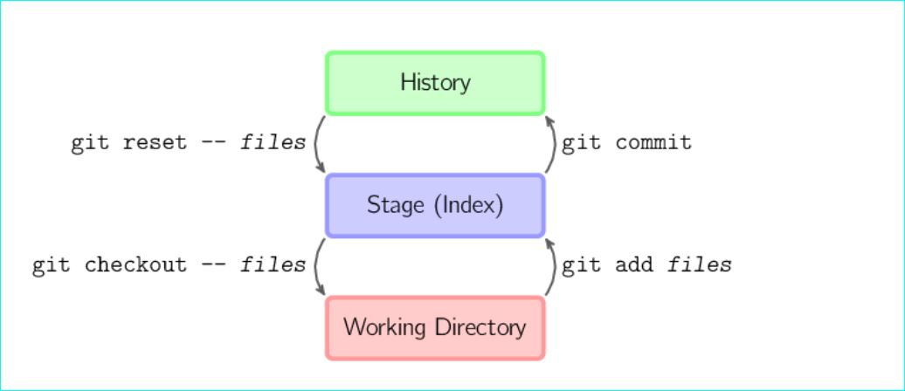
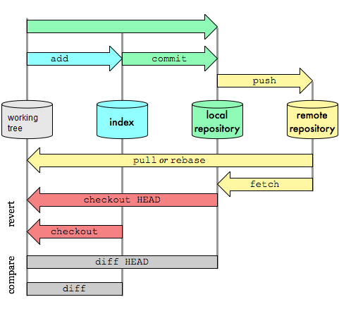

## ___Web&nbsp;Development -&nbsp;Ultimate&nbsp;Reference&nbsp;Guide&nbsp;-___
---
By&nbsp;Martin&nbsp;Czerwinski [CMQ&nbsp;Nordic&nbsp;AB](www.cmq.se "www.cmq.se (Martin Czerwinski @ CMQ Nordic AB)")®&nbsp;March&nbsp;2020&nbsp;

---

This is a __reference guide__,an __compact tutorial__ or a __cheat-sheet__ that explains basics of web development. Starting from tools to some of the solutions to most basic problems.

Bookmark this page, share it and feel free to [__reach out to us__](www.cmq.se "Contact us!") with questions, comments or requests for assignments!

_Prerequisites: Some HTML & CSS skills._

---

#### __TABLE OF CONTENT__

 ► __Technologies & Tools__
  - Visual Studio Code 
    - [What is VSCode and what is built-in?](#what-is-vscode)
    - [Terminal](#terminal-in-vscode) ◦ [Shortcuts](#vscode-shortcuts) ◦ [Extensions](#vscode-useful-extensions) ◦ [EMMET snippets](#emmet-snippets-in-vscode)
  - GIT
    - [What is GIT and why from command line?](#what-is-git) 
    - [__Git expressions__](#common-git-expressions):<br> 
    - [Repository](#repository)
    -  ◦ [Type of files in Git](#files-in-git) ◦ [Cloning](#cloning-in-git) ◦ [Check-out & change branches](#check-out-change-branches) ◦ [Working directory](#working-directory) ◦ [Clean working directory](#clean-working-directory) ◦ [Stage](#stage) ◦ [Commit](#commit) ◦ [Commit Hash & Tag](#commit-hash-tag) ◦ [Stashing files](#stashing-files) ◦ [Working tree](#working-tree) ◦ [Stage or Index](#stage-or-index) ◦ [Repo history](#repo-history) ◦ [Remote](#remote) ◦ [Git Branch](#git-branch) ◦ [Tracking relationship](#tracking-relationship) ◦ [Local&nbsp;branch&nbsp;& Tracking&nbsp;branch&nbsp;& Remote&#8209;tracking&nbsp;branch](#local-branch) ◦ [Remote & Upstream branch](#remote-branch) ◦ [HEAD](#head) ◦ [Detached HEAD](#detached-head) ◦ [Merge & Rebase](#merge-rebase) ◦ [Fetch & Pull](#fetch-pull) ◦ [Push](#push) ◦ [Merge Conflicts](#merge-conflict) ◦ [Unrelated Histories errors](#unrelated-histories-error)
    - [__Useful Git commands__](#useful-git-commands-m):<br> 
  	  [HELP COMMANDS](#help-commands) ◦ [INFO & STATUS COMMANDS](#info-status-commands) ◦ [CONFIGURATION COMMANDS](#configuration-commands) ◦ [CREATE NEW REPOSITORY](#create-new-repo-commands) ◦ [CREATE NEW BRANCH](#create-new-branch-commands) ◦ [CHECK OUT BRANCH](#check-out-branch-commands) ◦ [SYNCHRONIZE WITH REMOTE](#synchronize-with-remote-command) ◦ [STAGE & COMMIT](#stage-commit-commands) ◦ [MERGE & REBASE](#merge-rebase-commands) ◦ [DIFF & LOGS](#diff-logs-commands) ◦ [UNDO & CORRECT](#undo-correct-commands) ◦ [CONFLICTS](#conflicts-commands)
    - [__Useful Cmd commands__](#useful-cmd-commands-m)
    - [_.Gitignore_ file](#git-ignore-file-m)
  - Node.js & Npm
    - [What is Node.js and Npm used for?](#nodejs-&-npm)
  	- [Node.js](#install-node.js-and-execute-programs) ◦ [Node.js modules](#useful-node.js-modules)
	- [Npm](#install-npm-packages) ◦ [Npm packages](#useful-npm-packages)
	- [_"package.json"_ file](#packagejson-file)
  - Webpack
    - [What is Webpack and what is it used for?](#webpack)
	- [Bundling with PostCSS](#bundling-with-postcss) ◦ [Webpack Dev Server](#webpack-dev-server)
	- [_"webpack.config.js"_ file](#webpackconfigjs-file) 
  - Markdown
    - [Why markdown?](#markdown) 
	- [Markdown syntax](#markdown-syntax) 
  
► __Coding__
- [__CODE EFFECTIVELY__](#code-effectively)
	- [__CSS__](#css)
		- [Commonly performed tasks](#commonly-performed-tasks)
		- [Center a text on a div-box/img](#center-a-text-on-a-div-boximg)
		- [__BEM__](#bem)
	- [HTML](#html)
- [CENTERING THINGS](#centering-things)
- [Screens and IMAGES](#screens-and-images)
	- [__Article & Section__](#article--section)
	- [Content for web](#content-for-web)
	- [SEO](#seo)

<br>

---

<p align=right><a id="what-is-vscode" align=right href="#table-of-content">↩ Back To Top</a></p>

## [__Visual Studio Code__]()


__What is VSCode and what is built-in?__

[VSCode](https://code.visualstudio.com/) is a popular, free and lightweight code editor from Microsoft that comes with built-in support for a variety of features. Open new project from command line in directory you currently are in by writing:

 __`code .`__

 Good educational videos can be found [here](https://www.youtube.com/results?search_query=Building+WebApps+using+Visual+Studio+Code). 

__Out of the box features in VSCode:__

 - __Node.js & Nmp__: Build in runtime environment for JavaScript with corresponding JavaScript package register.
 - __JavaScript:__ Programming language used for web development.
 - __TypeScript__: Set of JavaScript that adds optional strict typing syntax to JavaScript language.
 - __Emmet__: Short text snippets that expanded into full pieces of HTML or CSS code.
 - __IntelliSense__: Code editing features including code completion, parameter info and other quick lookups.
 - __Extensions:__ Search VSCode marketplace for a large variety of extensions to expand functionality of VSCode.
- __GIT:__  Integrated Git with graphical interface for most frequent git functions.
- __Multi-Cursor editing:__ Allows you to edit multiple parts of the document at once.
 - __Debugging, Code navigation__ and much more.

<br>

__Recommended customization:__

_We also recommend to manually customize some shortcuts related to the terminal so that you can easily open focused terminal window, scroll and resize without lifting your fingers from keyboard._

Search for following string in Keyboard Shortcuts and set:
|||
|---|:---|
|"Terminal: Scroll To Bottom",<br> "Toggle Integrated Terminal",<br> "Focus Terminal"|`Ctrl+Ö`|
|"Kill Active Instance"|`Ctrl+K`|
|"Terminal: Scroll Up (Line)"|`Ctrl+UpArrow`&nbsp;and<br>set "When" to `terminalFocus`|
|"Terminal: Scroll Down (Line)"|`Ctrl+DownArrow`&nbsp;and<br>set "When" to `terminalFocus`|
|"Terminal: Resize Pane Left"|`Ctrl+LeftArrow`&nbsp;and<br>set "When" to `terminalFocus`|
|"Terminal: Resize Pane Right"|`Ctrl+RightArrow`&nbsp;and<br>set "When" to `terminalFocus`|


<br>
<p align=right><a id="terminal-in-vscode" align=right href="#table-of-content">↩ Back To Top</a></p>

### __[Integrated terminal in VSCode]()__

VSCode comes with an integrated _terminal window_ - which is a very handy and time-saving feature. Terminal window opens pointing directly to your working directory. In VSCode it is also possible to switch between shells that power the terminal from a drop down in the upper right corner.

Changing to default shell of your choice can be done by opening `Terminal: Select Default Shell` from `Control Palette`. There you will get a list of available choices for you operating system where "Git Bash" (that we use) might be one of options.

When running git commands from command line we recommend you to move the terminal window to the __right of your screen__. Do this by right-clicking the top bar in terminal window and choosing `Move Panel Right`. This is very handy to have it to the right because often output is spread on many vertical lines and we can see the results without need of scrolling.

<br>
<p align=right><a id="vscode-shortcuts" align=right href="#table-of-content">↩ Back To Top</a></p>

### __[Useful shortcuts in VScode]()__


Shortcut settings can be viewed and edited in `Settings` -> `Keyboard Shortcuts`. Online list of shortcuts can be found [here](https://docs.microsoft.com/en-us/visualstudio/ide/default-keyboard-shortcuts-for-frequently-used-commands-in-visual-studio?view=vs-2019). Below we list our most frequently used ones:

|__NAVIGATION__&nbsp;&nbsp;&nbsp;&nbsp;&nbsp;&nbsp;&nbsp;||
|:---|---|
|`Ctrl+P`| __Search & Go to file...__<br>Opens file search window. Recently used on top. Use `ESC` to close it |
|`Ctrl+Shift+P`| __Search & Run command...__<br>Opens command palette. Recently used on top. Use `ESC` to close it |
|`Ctrl+B`| __Toggle sidebar__<br>Toggles visibly of sidebar window |
|`Ctrl+⇔`| __Jump whole words__<br>Move cursor whole words right/left|
|`Ctrl+Shift+⇔⇕` |__Mass selection__<br>First press selects focused word. Next presses select sections to right/left/up/down|
| `Ctrl+D` |__Select word & multi__<br>First press selects focused word. Next presses add multi-cursor on all same words. |
| `Alt+▲▼` |__Move line up/down__<br>Moves whole focused/selected row up or down |
| `Alt+<mouse-click>` |__Add multi-cursors__<br>Adds extra cursor for every click |

|__CODING__&nbsp;&nbsp;&nbsp;&nbsp;&nbsp;&nbsp;&nbsp;&nbsp;&nbsp;||
|:---|---|
| `Ctrl+Space` | __Open intellisense__<br> Opens intellisense dialog for focused expression. Use `ESC` to close it. |
| `Alt+Shift+F`* | __Format selection__<br> ___*__ Note! Must be set in "Keyboard Shortcuts". Search for "Format selection"_ |
| `Ctrl+F` | __Find & Replace (file)__<br> Find all focused/selected words in file. Replace from new window. Use `ESC` to close it. |
| `Ctrl+Shift+F` | __Find & Replace (proj)__<br> Find all focused/selected words in project. Replace from new window. Use `ESC` to close it. |
| `Alt+Shift+[Sel]`&nbsp; | __Group edit block__<br> Multi-cursors. Select a block of text to edit. |

|__CODING&nbsp;HTML__&nbsp;&nbsp;||
|:---|---|
| * |__Select matching tags__<br> * Enable by enabling `mirrorCursorOnMatchingTag` in Settings. |

|__TERMINAL__&nbsp;&nbsp;&nbsp;&nbsp;&nbsp;&nbsp;&nbsp;&nbsp;&nbsp;&nbsp;&nbsp;&nbsp;||
|:---|---|
| `Ctrl+Ö`*  | __Open & Focus__<br> Creates new terminal or focuses cursor when run in terminal window. * Must be set in "Keyboard Shortcuts" [here](#recommended-customization) |
| `Ctrl+L` |__Clear window__<br> Clear focused terminal window |
| `Ctrl+K`* |__Kill & Hide__<br> Kills current terminal and if last hides the window. * Must be set in "Keyboard Shortcuts" [here](#recommended-customization)|
|||
| `Ctrl+J`  |__Hide__<br> Hides terminal window without killing terminal(s) |
|||
| `Ctrl+▲▼`*   |__Scroll Up or Down__<br> Scroll up od down in focused terminal window. * Must be set in "Keyboard Shortcuts" [here](#recommended-customization) |
|||
| `Ctrl+◀▶`* |__Enlarge or Shrink__<br> Enlarge or shrinks focused terminal window. * Must be set in "Keyboard Shortcuts" [here](#recommended-customization) |

<br>
<p align=right><a id="vscode-useful-extensions" align=right href="#table-of-content">↩ Back To Top</a></p>

### __[Useful Extensions]()__

More and more is getting integrated into VSCode for each release but at the moment here are some good [VSCode Extensions](https://marketplace.visualstudio.com/) that we recommend:

|Extension&nbsp;&nbsp;&nbsp;&nbsp;&nbsp;&nbsp;&nbsp;&nbsp;&nbsp;&nbsp;||
|:---|:---|
| `VSCode Icons` | A set of nice icons shown in explorer bar in VSCode UI that makes navigating and finding a special file type easier. |
| `Rainbow Brackets` |Provides different colors for round, square and the squiggly brackets so those ar easier to distinguish |
| `Code Spell Checker` | Check for spelling mistakes and proposes corrections |
| `Live Server` | A lightweight local dev server with live auto-reload when HTML & CSS files are saved. Easy one-click to run |
| `Git Graph` | Visualizes branches history in separate window nicely. Shows launching "Git Graph" button on the status bar  |
| `Git Lens` | Extensive Git insights with own sidebar. Good file history comparison |
| `Git History` | This tool draws nice file history diagrams |
| `Markdown All in One` | Enable this when working with Markdown. Export to HTML, table of contents. |
| `Markdown Shortcuts` | Enable this when working with Markdown. Icons in nav bar and right on .md file brings a list with markdown commands to |
| `IntelliSense for CSS class names in HTML` | Autocompletion for CSS class definitions. CSS referenced through link in HTML |

<br>
<p align=right><a id="emmet-snippets-in-vscode" align=right href="#table-of-content">↩ Back To Top</a></p>

### __[Useful EMMET Snippets]()__


 [EMMET](https://docs.emmet.io/)  autogenerate full code blocks code from short text snippets.  [Here](https://docs.emmet.io/cheat-sheet/) is a handy cheat-sheet with all EMMET commands.

|EMMET&nbsp;snippets|HTML&nbsp;code&nbsp;&nbsp;&nbsp;&nbsp;&nbsp;&nbsp;&nbsp;&nbsp;&nbsp;&nbsp;&nbsp;&nbsp;&nbsp;&nbsp;&nbsp;&nbsp;&nbsp;&nbsp;&nbsp;&nbsp;&nbsp;&nbsp;&nbsp;&nbsp;&nbsp;&nbsp;&nbsp;&nbsp;&nbsp;&nbsp;&nbsp;&nbsp;&nbsp;&nbsp;&nbsp;&nbsp;&nbsp;&nbsp;&nbsp;&nbsp;&nbsp;&nbsp;&nbsp;&nbsp;&nbsp;&nbsp;&nbsp;&nbsp;&nbsp;&nbsp;&nbsp;&nbsp;&nbsp;&nbsp;&nbsp;&nbsp;&nbsp;&nbsp;&nbsp;&nbsp;&nbsp;&nbsp;&nbsp;&nbsp;&nbsp;&nbsp;&nbsp;&nbsp;&nbsp;&nbsp;&nbsp;&nbsp;&nbsp;&nbsp;&nbsp;&nbsp;&nbsp;&nbsp;&nbsp;&nbsp;&nbsp;&nbsp;&nbsp;&nbsp;&nbsp;&nbsp;&nbsp;&nbsp;&nbsp;&nbsp;&nbsp;&nbsp;&nbsp;&nbsp;&nbsp;&nbsp;&nbsp;&nbsp;&nbsp;&nbsp;&nbsp;&nbsp;&nbsp;|
|:---|:---|
|__New doc__<br>__`!`__|_`New HTML doc structure`_|
|__Comment__<br>__`c`__|`<!-- -->`|
|__CSS from file__<br>__`link:css`__|`<link rel="stylesheet" href="style.css">`|
|__Script from file__<br>__`script:src`__|`<script src="app.js"></script>`|
|__Dummy text__<br>__`lorem4`__|_`Four random lorem words`_|
|__Paragraph__<br>__`p.hero__title--orange{Hi}`__|`<p class="hero__title--orange">Hi</p>`|
|__Div__<br>__`.nav__item#nav_item-1{Hi}`__|`<div class="nav__item" id="nav_item-1">Hi</div>`|
|__Menu__<br>__`ul.nav>(li.nav_row>a#nav_item-\${I\$})*2`__|`<ul class="nav">`<br>&nbsp;&nbsp;&nbsp;`<li class="nav__row"><a href="" id="nav_item-1">I1</a></li>`<br>&nbsp;&nbsp;&nbsp;`<li class="nav__row"><a href="" id="nav_item-2">I2</a></li>`<br>`</ul>`|
|__Form__<br>__`div>p+`<br>`form:post>input:text+input:email+input:submit`__|`<div>`<br>&nbsp;&nbsp;&nbsp;&nbsp;`<p></p>`<br>&nbsp;&nbsp;&nbsp;&nbsp;`<form action="" method="post">`<br>&nbsp;&nbsp;&nbsp;&nbsp;&nbsp;&nbsp;&nbsp;&nbsp;`<input type="text" id="" id="">`<br>&nbsp;&nbsp;&nbsp;&nbsp;&nbsp;&nbsp;&nbsp;&nbsp;`<input type="email" id="" id="">`<br>&nbsp;&nbsp;&nbsp;&nbsp;&nbsp;&nbsp;&nbsp;&nbsp;`<input type="submit" value="">`<br>&nbsp;&nbsp;&nbsp;&nbsp;`</form>`<br>`</div>`|
|__Article__<br>__`section.sect>(article.wrap>h1.s_t+p.s_d+button.s_b)*1`__|`<section class="sect">`<br>&nbsp;&nbsp;&nbsp;&nbsp;`<article class="wrap">`<br>&nbsp;&nbsp;&nbsp;&nbsp;&nbsp;&nbsp;&nbsp;&nbsp;`<h1 class="s_t"></h1>`<br>&nbsp;&nbsp;&nbsp;&nbsp;&nbsp;&nbsp;&nbsp;&nbsp;`<p class="s_d"></p>`<br>&nbsp;&nbsp;&nbsp;&nbsp;&nbsp;&nbsp;&nbsp;&nbsp;`<button class="s_b"></button>`<br>&nbsp;&nbsp;&nbsp;&nbsp;`</article>`<br>`</section>`|

|EMMET&nbsp;snippets&nbsp;&nbsp;|CSS code|
|:---|:---|
| __`w100p`__ |`width: 100%;`|
| __`h100e`__ |`height: 100em;`|
| __`m10p20px10e20p`__ |`margin: 10% 20px 10em 20%;`|
| __`p10-20-10-20`__ |`padding: 10px 20px 10px 20px;`|
| __`pos`__ |`position: relative;`|
| __`bg`__ |`background: #000;`|
| __`bc`__ |`background-color: #fff;`|
| __`bd`__ | `border: 1px solid #000;` |
| __`bdrs8`__ | `border-radius: 8px;` |
| __`ff+fw400+fs20`__ |`font-family: serif;`<br>`font-weight: 400;`<br>`font-style: 20px;` |

</section>
</article>
<br>

<p align=right><a id="what-is-git" align=right href="#table-of-content">↩ Back To Top</a></p>

## [__Git and Command line__]()

__What is Git and why use it from command line?__

[__Git__](https://git-scm.com/) is the most popular version control system (VCS) for tracking changes in source code during software development. It is a distributed system - meaning that our local repository have exactly the same features as the central repository. You can work with your own repo on your local machine even without internet access. When you have a connection again, you can push your changes to any other git repository (i.e. central repository). VSCode has integrated graphical interface for GIT but we still recommend to get familiar with and memorize most commonly used expressions and commands. At workplaces around the world you will be often forced to run git commands directly from a command line window. 

_Good Git tutorials can be found [here](https://www.youtube.com/watch?v=uR6G2v_WsRA "30 min, Core concepts"), [here](https://www.youtube.com/watch?v=FyAAIHHClqI&t=1233s "30 min, Branch & merges") and [here](https://www.youtube.com/watch?v=Gg4bLk8cGNo&t=7s "30 min , Remotes"). Good article explaining merging and rebasing can be found [here](https://www.atlassian.com/git/tutorials/merging-vs-rebasing "Merging And Rebasing explained")._

<p align=right><a id="what-is-git" align=right href="#table-of-content">↩ Back To Top</a></p>

### [__Common Git expressions__]()
    
  [Repository](#repository) ◦ [Cloning](#cloning-in-git) ◦ [Working directory](#working-directory) ◦ [Check-out a branch](#check-out-change-branches) ◦ [Filetypes](#files-in-git) ◦ [Stage](#stage) ◦ [Commit](#commit) ◦ [Commit Hash & Tag](#commit-hash-tag) ◦ [Stashing files](#stashing-files) ◦ [Working tree](#working-tree) ◦ [Stage or Index](#stage-or-index) ◦ [Repo history](#repo-history) ◦ [Remote](#remote) ◦ [Git Branch](#git-branch) ◦ [Tracking relationship](#tracking-relationship) ◦ [Local&nbsp;branch&nbsp;& Tracking&nbsp;branch&nbsp;& Remote&#8209;tracking&nbsp;branch](#local-branch) ◦ [Remote & Upstream branch](#remote-branch) ◦ [HEAD](#head) ◦ [Detached HEAD](#detached-head) ◦ [Merge & Rebase](#merge-rebase) ◦ [Fetch & Pull](#fetch-pull) ◦ [Push](#push) ◦ [Merge Conflicts](#merge-conflict) ◦ [Unrelated Histories errors](#unrelated-histories-error)


|<a id="repository">Repository</a><a align=left href="#common-git-expressions">&nbsp;&nbsp;&nbsp;&nbsp;↩&nbsp;&nbsp;&nbsp;</a>|
|:---|
|A Git repository, or just simply _a repo_, is a folder location in which Git tracks changes to files and folders. Git stores historical versions of all tracked files there. It's folder named ".git" in its root directory. By deleting this folder all historical versions are lost and Git stops tracking changes to content in that directory. We have access to a remote repo and can clone it from a hosting services like [GitHub](https://github.com/) or [Bitbucket](https://bitbucket.org/) to our local machine. You can change the name of a local repo simply by renaming the folder on your hard drive. But when changing name of a remote repo on i.e. GitHub may affect persons who already use the old name as part of the URL in their configurations.<br><br>|

|<a id="working-directory">Working directory</a><a align=left href="#common-git-expressions">&nbsp;&nbsp;&nbsp;&nbsp;↩&nbsp;&nbsp;&nbsp;</a>| 
|:---|
|In Git world expression "working directory" refers to a folder location where our local repo exists and where a single version of the project is checked out - the files are stored in it. It is an "umbrella" term for all files and folders that git traces and that we can currently view and edit.<br><br>Clean Working Directory<br>Expression "clean working directory" is widely used in Git documentation. A working directory is clean when there are not any uncommitted changes in the working tree nor index. If you are in progress of working and do not feel ready to [stage](#stage) nor [commit](#commit) your modifications before checking out something else, then you can also [_stash_](#stash-files) the changes to temporally clean up your working directory.<br><br>|

|<a id="commit">Commit</a><a align=left href="#common-git-expressions">&nbsp;&nbsp;&nbsp;&nbsp;↩&nbsp;&nbsp;&nbsp;</a>|
|:---|
|When we commit a changes in Git we permanently save modified file(s) to local repo´s history and label all the committed files with an unique hash-id, description and name of the committer. The word "commit" also often refers to a unique labeled "snapshot" of files and directories at a certain moment. A commit operation can be manually triggered with a `git commit` command but can also be a background job as part of a `git merge` operation.<br><br>|

|<a id="head">HEAD</a><a href="#common-git-expressions">&nbsp;&nbsp;&nbsp;&nbsp;↩&nbsp;&nbsp;&nbsp;</a>| 
|:---|
|HEAD in Git is a movable pointer always pointing to a commit that we currently have checked out in our working directory. In normal cases it always point to a branch and therefore when branch moves to point to the latest commit then automatically our HEAD does as well. Branch and HEAD pointers are in such a case "attached". When we check out a branch then Git always automatically let HEAD pointer to point to branch and as it always checks out latest commit. But note that there are cases when we need to check out a specific commit ot tag and not a branch! Then the HEAD points directly to this specific commit/tag and not the branch. This scenario is called [detached HEAD](#detached-head).<br><br>|

|<a id="check-out-change-branches">Check-out a branch</a><a align=left href="#common-git-expressions">&nbsp;&nbsp;&nbsp;&nbsp;↩&nbsp;&nbsp;&nbsp;</a>|
|:---|
|Checking out a branch (also called _changing branch_) is loading of a new specific group of files and folders into our working directory. Git overwrites all current files and folders in our working directory with the ones that we are checking out. By doing this we can view and edit those new versions of the checked-out files. We can check out a _branch_, a specific a _commit hash_ or a _tag_. See check-out commands [here](#check-out-branch-commands). Additionally our local HEAD pointer is moved to point toward the [_commit_](#commit) that is checked out. It is recommended to have a [_clean_](clean-working-director) working directory when checking out.<br><br> What happens to [_uncommitted_](#files-in-git) changes?<br> If we try to check out our current working directory having uncommitted changes in index or working directory, then sometimes the checkout will fail. Git never overwrites your modification if there is risk to lose the modification. Therefore if "parent" of any modified file differs in any way from same file in the commit we aim to check out from, then Git abort the check out process. To perform a check out in such a case you must either [_commit_](#commit), restore or [_stash_](#stash-files) your changes.<br><br>Note that if we check out a specific commit instead of a branch then we check out the working directory in [_detached HEAD_](#detached-head) state.<br><br>|

|<a id="cloning-in-git">Clone a branch</a><a align=left href="#common-git-expressions">&nbsp;&nbsp;&nbsp;&nbsp;↩&nbsp;&nbsp;&nbsp;</a>|
|:---|
|Cloning is simply making a copy of a whole repo and saving it to another location. It is done with a `git clone` command that automatically checks out that branch that is in remote marked with HEAD. Usually it is a _"master"_ branch and therefore when we clone a remote repo then locally a branch called "`master`" is automatically created and checked out in our working directory.<br><br>|

|<a id="files-in-git">Filetypes</a><a align=left href="#common-git-expressions">&nbsp;&nbsp;&nbsp;&nbsp;↩&nbsp;&nbsp;&nbsp;</a>|
|:---|
|There exist 4 types of files in Git:<br><br> ⋅ __Untracked:__ Newly added files.<br> ⋅ __Modified:__ Existing files changed and saved in working tree.<br> ⋅ __Staged:__ Added to our staging area.<br> ⋅ __Committed:__ Saved in the repo history.<br><br>_Untracked files_ are basically files that Git do not have any previous version of in its history. Files that are newly added to your project get the status _untracked_. Those are added to the working tree but in order to become tracked and get a first initial version they must be either [_staged_](#stage) or [_committed_](#commit). Many Git commands like `git reset` or `git revert `do not affect untracked files and there is a special `git clear` command to remove those files from the project.<br><br>|

|<a id="working-tree">Working tree</a><a align=left href="#common-git-expressions">&nbsp;&nbsp;&nbsp;&nbsp;↩&nbsp;&nbsp;&nbsp;</a>|
|:---|
|Term working tree refers to an "area" where changes to files in your working directory are stored. At same moment a change in your working directory is saved - the is added to working tree. This is the "first level" of tracking of our change, but notice that changes saved here can not be restored if accidentally deleted.<br><br>|

|<a id="stage-or-index">Stage or Index</a><a align=left href="#common-git-expressions">&nbsp;&nbsp;&nbsp;&nbsp;↩&nbsp;&nbsp;&nbsp;</a>| 
|:---|
|Staging area is in Git documentation shortly called "index" and refers to an area within Git where modifications are saved before a _commit_. From here a change can for example be restored if it for example have been accidentally changed in your working directory. Here we do inspect the files and from here we usually commit if we are satisfied with the changes.<br><br>Note that there is a possibility in Git to commit directly from working three and omit the staging area, with help of `-a` flag.<br><br>|



|<a id="stage">Stage</a><a align=left href="#common-git-expressions">&nbsp;&nbsp;&nbsp;&nbsp;↩&nbsp;&nbsp;&nbsp;</a>|
|:---|
|Staging is saving changes to the staging area in your local repo. The staging are is also often called _index_. From there we can can take decision if file shall be _restored_ or finally _committed_ to repo history.<br><br>|

|<a id="commit-hash-tag">Commit Hash & Tag</a><a align=left href="#common-git-expressions">&nbsp;&nbsp;&nbsp;&nbsp;↩&nbsp;&nbsp;&nbsp;</a>|
|:---|
|A commit _hash_ is an unique unchangeable 40 characters long SHA-1 hash that is created as unique identification for each commit of files to a repo. Example of a commit hash is `4c511f16ef2644854d04cabebfcecc82be0eb04f`. Normally only 7 first characters are enough to identify a commit within a normal project and therefore short "7-chars-version" can be used to refer to a commit.<br><br>A commit _tag_ is a label/stamp that can be manually added to a commit to mark a particular commit with a human readable label. Example: rel-v.1.8.5.<br><br>|

|<a id="stashing-files">Stashing files</a><a align=left href="#common-git-expressions">&nbsp;&nbsp;&nbsp;&nbsp;↩&nbsp;&nbsp;&nbsp;</a>| 
|:---|
|Stashing takes the "dirty" state of your working directory — your modified files in working tree and index - and save those on a "stash-stack" of unfinished changes that you can reapply at any time later. Note! By default Git do not stash [untracked](#files-in-git) files therefore to handle those use "-u" flag.<br><br> The command `git stash -u` will add all changes as an object on top of the stash stack.<br><br> Later to get back to stashed changes simply run `git stash pop` command and your latest stashed changes will be reverted to current working directory and the stashed object removed from stash-stack. To list all stashed objects in stack run `git stash list` command.<br><br>|

|<a id="repo-history">Repo history</a><a align=left href="#common-git-expressions">&nbsp;&nbsp;&nbsp;&nbsp;↩&nbsp;&nbsp;&nbsp;</a>| 
|:---|
|When we commit a change then it is automatically added to our repo history, also called shortly "history". All commits with their hashes, descriptions and tags are stored in our local repo history.<br><br>|

|<a id="remote">Remote</a><a align=left href="#common-git-expressions">&nbsp;&nbsp;&nbsp;&nbsp;↩&nbsp;&nbsp;&nbsp;</a>| 
|:---|
|Expression "remote" is widely used in Git documentation and it usually refers to a remote repository or a remote branch, depending on the context.<br><br> A `remote` command in Git provides functionality for connecting of a local repo to with a remote repo. Such a  __remote connection__ can be created in any local repo and given a name (alias) and a remote URL. In Git we refer to a connection to remote by its name.<br><br> Git automatically creates a remote connection when cloning a remote repo to a local destination and names it "origin". A widely used expression "fetching data from remote" means we download data from remote repo, usually for a single branch, from url that our remote connection has saved.<br><br>|

|<a id="git-branch">Git Branch</a><a align=left href="#common-git-expressions">&nbsp;&nbsp;&nbsp;&nbsp;↩&nbsp;&nbsp;&nbsp;</a>| 
|:---|
|Consider a chain of objects connected to each other. Each object (blob) contains a version of code labeled with an unique id. There is a start and end of this chain. The latest object is on the end, the tip of the chain. Such a chain with connected commits is a "git branch". A branch  start from a certain commit from another branch. Then it branches out from it and defines it starting point. Using expression branch we often mean a movable pointer that points to latest object in this chain of commits. Every time you commit something to a branch then this branch pointer moves automatically forward to point this latest commit.<br><br> Usually when we work on a new feature we "branch out" - spawn a new branch - from the latest commit of "parent" branch, and give that new branch a special name i.e. "feat-x-branch". This because we want to encapsulate our changes while working and committing without affecting the parent branch. Finally when we are satisfied with work on our isolated feature branch we can update the "parent" branch. This can be done by pushing to or [pulling](#fetch-&-pull) from parent with help of merge/rebase commands - see [Merge & Rebase](#merge-&-rebase)<br><br> In more complex projects we can have hundreds of commits on dozen of branches i.e. dev-, release- or feature- branches of all kinds. Note that the first by git automatically created branch when new repo is created is by default called `master`.<br><br>|

|<a id="tracking-relationship">Tracking relationship</a><a align=left href="#common-git-expressions">&nbsp;&nbsp;&nbsp;&nbsp;↩&nbsp;&nbsp;&nbsp;</a>| 
|:---|
|Understanding and making use of tracking relationships in Git makes version control a whole lot easier. Very often we work on a local copy of a project that is hosted in a central remote repo. This means that our local branch have a "sibling" branch, a copy of itself, with the same name in the remote repo. This remote branch can be updated by others independently as we commit to our corresponding local branch.<br><br> Very often we want to know how our local branch differ from its "_remote sibling_". We want to know if any commits were made to same branch in remote by other developers while we were working on a local copy. Here is where "tracking" and "upstream" branches described in detail below help us. When a local branch is turned into a [_tracking branch_](#local-branch) then it automatically tracks its [_upstream branch_](#remote-branch) (its "sibling" in remote) through a [_remote-tracking branch_](#local-branch). <br><br>__Local branch__ (local, _i.e. master_) __-->__ __Remote-tracking branch__ (local, _i.e. origin/master_) __-->__ __Upstream branch__ (remote, _i.e. master_)<br><br>|

|<a id="local-branch">Local&nbsp;branch&nbsp;& Tracking&nbsp;branch&nbsp;& Remote&#8209;tracking&nbsp;branch</a><a align=left href="#common-git-expressions">&nbsp;&nbsp;&nbsp;&nbsp;↩&nbsp;&nbsp;&nbsp;</a>| 
|:---|
|There are several types of _local branches_ and it's important to get familiar with the terminology used in order to follow Git documentations.<br><br>__Local branch__ is simply a branch that exists on your local machine, in your local repo and can be named as "master", "dev" or "feature-x-branch".<br><br>__Tracking branch__ is a type of local branch that is connected to and "tracks" its counterpart "_sibling_" in remote. It tracks the other branches updates and compares difference in number of commits between them. Usually connecting a local branch to track its remote "sibling" is called "[_setting upstream_](#upstream) _for a local branch_" and is what makes a simple local branch to become a tracking branch.<br><br> __Remote-tracking branch__ is a special local branch that is in some cases created automatically in the background by Git. Its name always consists of two parts - `<remote-alias>/<remote-connection-name>` for example "origin/master" och "origin-repo-x/feat-x-branch". Its only purpose is to mirror corresponding remote branch that has same name in remote. This local branch is always automatically created or updated in the background whenever any network communication toward corresponding remote branch is made. For example when a push/pull/fetch is performed to a remote branch then corresponding remote-tracking branch is created locally in the background. All existing _remote-tracking branches_ in our local repo can be listed with a `git branch -r` command.<br><br>To list all local "non-tracking branches", "tracking branches" and "remote-tracking branches" run `git branch -a -vv` command. The result can look something like this:<br><br> _* master&nbsp;&nbsp;&nbsp;&nbsp;&nbsp;&nbsp;&nbsp;&nbsp;&nbsp;&nbsp;&nbsp;&nbsp;&nbsp;&nbsp;&nbsp;&nbsp;&nbsp;&nbsp;&nbsp;&nbsp;&nbsp;&nbsp;&nbsp;&nbsp;&nbsp;&nbsp;&nbsp;33f45fe&nbsp;&nbsp;[origin/master: ahead 1, behind 2]&nbsp;&nbsp;Added print.<br>&nbsp;&nbsp;feature-x-branch&nbsp;&nbsp;&nbsp;&nbsp;&nbsp;&nbsp;&nbsp;&nbsp;&nbsp;&nbsp;&nbsp;09c51c6&nbsp;&nbsp;Merge from master branch.<br>&nbsp;&nbsp;remotes/origin/master&nbsp;&nbsp;&nbsp;a9a5bfc&nbsp;&nbsp;Added special character._<br><br>What does above mean?<br>▸ Branch _* master_ - as marked with "*" is our currently checked out branch. It tracks an upstream branch in remote named "master" through its connection to a local "remote-tracking branch" named "origin/master". Due to this we know it is also a tracking branch and simple pull/push without parameters will work here (read more [here](#upstream)). When this "remote-tracking branch" "origin/master" was synched last time then "master" in remote had 1 new commit not included in our local "master" branch, and our local "master" had 2 new commits not included in "remote master".<br>▸ Branch _feature-x-branch_ - is a normal non-tracking local branch with its last commit labeled 09c51c6.<br>▸ Branch _origin/master_ - is a remote-tracking branch that refers and mirrors corresponding upstream branch named "master" in remote.<br><br> |

|<a id="remote-branch">Remote&nbsp;&&nbsp;Upstream&nbsp;branch</a><a align=left href="#common-git-expressions">&nbsp;&nbsp;&nbsp;&nbsp;↩&nbsp;&nbsp;&nbsp;</a>| 
|:---|
|__Remote branch__ is a branch that exists in a remote repository, usually on an online git-hosting service like GitHub. A remote branch that is connected/referenced from a local system is in this context also called being an "upstream branch". You can often see expression that a "local branch tracks its upstream". It means the local version is somehow connected to its "sibling in remote" and tries to know everything that happens to him. Procedure of connecting a local branch with its corresponding branch in remote is in Git documentation often called as "setting [upstream](#upstream) for a local branch".<br><br> __How to set upstream for a local branch?__ It can be done in two ways:<br><br>▸ Manually: Only if there already exists a "remote-tracking branch" on the local system then any local branches upstream can be set with command `git branch --set-upstream-to [name of "remote-tracking branch"]`.<br><br>▸ Automatic: Whenever you run any first push/pull/fetch command to corresponding remote branch add `-u` flag like `git fetch -u [remote-connection][local-branch]`. This will not only create a remote-tracking branch (named <remote-connection>/<local-branch>) but also connect it (set as upstream) for our local branch.<br><br>Note! When cloning a repo from a remote then Git automatically checks out a default local branch and automatically make it a "tracking branch" by setting its upstream in the background. Therefore in most common cases after cloning from a remote we end up with two local branches, "master" and "origin/master", and we can run git `Git pull & push` commands without any additional parameter straight out of the box for this checkout branch.<br><br>|

|<a id="detached-head">Detached HEAD</a><a align=left href="#common-git-expressions">&nbsp;&nbsp;&nbsp;&nbsp;↩&nbsp;&nbsp;&nbsp;</a>| 
|:---|
|Detached HEAD means that our [HEAD](#head) pointer do not point to a branch pointer but points to a specific commit hash or tag. This happens when we check out a specific commit, check out a [_remote-tracking branch_](#local-branch) or sometimes this also might happen when a rebase fails and leave us "hanging" in an unfinished state. Simple `git status` command will inform you that you are in this special state. In this state you can look around at code, edit files and even commit your changes as usual but be aware that you will not be able to push/pull from/to this "detached workspace" and your precious work with commits or staged changes will eventually be lost when you check out something else. This because internally in detached state Git creates a branch without any starting point (unreferenced branch) and after a week or so Git garbage collector will deletes unreferenced branches from the memory!<br><br> Usual procedure to save you staged changes and commits that you have done in a "detached mode" is simply to create new branch when in a detached working directory and commit you changes to this new branch. Following will do the trick:<br><br> `git checkout -b temp-branch-from-detached`<br> `git commit -am "Committing changes done in detached HEAD state."` <br><br>|


|<a id="merge-rebase">Merge & Rebase</a><a align=left href="#common-git-expressions">&nbsp;&nbsp;&nbsp;&nbsp;↩&nbsp;&nbsp;&nbsp;</a>|
|:---|
|There are two ways in Git to integrate changes from one branch into another one - merge or rebase. Both have their advantages and disadvantages.<br><br> __MERGE:__ Can be performed in two ways and it is important to understand how both work, specially if you want to merge your feature into a branch that many other persons work on.<br> __1. Fast-forward merge:__ Is possible only if the point where the both branches diverge from has not forked, meaning only the branch that we merge from received any new commits. When we run `git merge` command this type of merge is performed if possible by default. In a case when Git has possibility to do a fast-forward merge then the branch pointer of the branch we merge into (here called parent) is simply moved to point to same commit/branch that we merge from. This results in that ALL commits in our "feature-branch" are now "added" to the tip of the parent me merged to. It this desirable? Sometimes yes but consider a situation when feature you worked on contains of many many minor commits on your "feature-branch". In case of a fast-forward merge ALL the commits with with their descriptions and hashes will be visible as part of parent branch. This can often be a disadvantage as it is much clearer from the point of reviewer to be able to see only one single commit telling when "feature-x" was delivered instead of "15 commits" with comments you made originally working on your privater feature branch. Also in case of reverting the feature it is impossible to see from Git history which of the commit objects in parent really implement the feature. You would have to manually read all the log messages making reverting such a feature added in this way a true headache.<br> __2. Non fast-forward merge:__ Sometimes done by git automatically when commits do not fullfil criteria for fast-forward merge - but it can be forced by adding `--no-ff` flag to the git merge command. Then git will never do fast-forward merge and add our committed feature in ONE new commit on the parent. Note, merge do not rewrite any history of already existing commits on the destination branch witch is regarded as more safe than rebase.<br><br>__REBASE:__ This is changing the base of your "feature-branch" to tip of the branch making appear as if you'd created your "feature" branch from latest commit. As a result we get a linear succession of commits. It differs from merge by rewriting the commit history of already existing commits on the destination (parent) branch. Usage: If you want to get the latest updates from parent (= the branch you branched from) into your "feature-branch", but you want to keep your branch's history clean so it appears as if you've been working off the latest commit. This gives you also later the benefit of a clean merge of your feature branch back into parent! Usually you rebase toward your own "feature" branch that you are in full control of and can afford messing up and take time to solve if something goes wrong, and you do a merge back to master or dev-branch or whatever you branched from.<br><br> |

|<a id="fetch-pull">Fetch & Pull</a><a align=left href="#common-git-expressions">&nbsp;&nbsp;&nbsp;&nbsp;↩&nbsp;&nbsp;&nbsp;</a>| 
|:---|
|Synchronizing data between your local machine and remote is an essential step in our daily work as the data we locally look at is just a "snapshot" and up-to-date only as the last time we explicitly downloaded fresh data from the remote with a fetch or pull command.<br><br>▸ __Fetch__ downloads commits on all branches in a remote repository and stores all in local repo's  corresponding [_remote-tracking branches_](#local-branch) but DO NOT integrate any of this new data into files in our currently working directory. To integrate the any commits into currently checked out branch we have to run a `git merge` command toward the corresponding the [_remote-tracking branch_](#local-branch). <br><br>▸ __Pull__ on the other hand not only downloads all remote branches but also updates our files current working directory (=checked out branch) with the downloaded changes by making a merge. Since "pull" in background always by default tries perform to merge changes from remote into our local ones, a so-called [_merge conflict_](#merge-conflict) can occur. `Git pull` can also be flagged to do a [rebase](#merge-&-rebase) instead of a background merge with help of `--rebase` flag. There are many opinions on whether or not preferably use pull with rebase option but as long as you pull to your private feature branch that only you work on, then this is our recommendation. Like for many other actions it's highly recommended to start a pull only with a [_clean working directory_](#clean-working-director).<br><br> |

|<a id="push">Push</a><a align=left href="#common-git-expressions">&nbsp;&nbsp;&nbsp;&nbsp;↩&nbsp;&nbsp;&nbsp;</a>| 
|:---|
|With `git push` we upload commits from our local branch to corresponding remote branch. When we execute the command while having checked out a local branch that is a [_tracking branch_](#local-branch), then a simple `git push` command will instruct Git to take changes only from the branch we currently are on and update corresponding "upstream branch" in remote. On the other hand if the current local branches not a "tracking branch" then we must give `git push` command additional instructions in order for Git to know the destination. Then the same command looks like `git push <remote-connection>`. Git will then connect to remote repo´s url specified in "remote connection" i.e. "origin", take changes in the branch we are on and copy those commits to remote branch that is named same. <br><br> |

|<a id="merge-conflict">Merge Conflicts</a><a align=left href="#common-git-expressions">&nbsp;&nbsp;&nbsp;&nbsp;↩&nbsp;&nbsp;&nbsp;</a>| 
|:---|
|A merge conflicts arise when two commits that we are merging together have changed in the same parts of code and Git do not know how to solve this. For example when one developer deleted a file in master while another developer on his feature-branch was modifying same file. In such cases Git will mark the file as being conflicted and halt the merging process with terminal output "Automatic merge failed - fix conflicts and then commit the result" and it is developers' responsibility to resolve the conflict. Code from both files are then checked out in the working directory and separated with string "`=============`". The files must be manually edit and saved and manually committed in order for the merge to finalize.<br><br> |

|<a id="unrelated-histories-error">Unrelated Histories errors</a><a align=left href="#common-git-expressions">&nbsp;&nbsp;&nbsp;&nbsp;↩&nbsp;&nbsp;&nbsp;</a>| 
|:---|
|Sometimes our local .git directory with its history get deleted or corrupted. This leads Git to be unaware of the local history and will throw this error when you try to clone/fetch/push from remote. This will also happen when a new remote repo is created (i.e. on GitHub) with README file as initial commit. Then this repo will get its own history due to the first commit. If you simultaneously create new local repo and commit a single change then your local repo also gets a history created. In this case trying to clone one to another will fail with this error as both already got their own histories on their own. This can be solved using `--allow-unrelated-histories` flag on the command that fails. |

<br>
<p align=right><a id="useful-git-commands-m" align=right href="#table-of-content">↩ Back To Top</a></p>

<br>

## [__Useful Git commands__](#) 

---

Some common and very useful git commands tp know. Note that in VSCode you can open 'Command palette' (`CTRL-SHIFT-P`) where you can run git commands by choosing from a list instead of typing them into the terminal window.

 - [Help commands](#help-commands) - _get information about commands_
 - [Initial configuration](#configuration-commands) - _configure your git first of all_
 - [Info & Status commands](#info-status-commands) - _get status and information_
 - [Copy external repo](#clone-external-repo) - _copy remote repo as our own_
 - [Create a new repo](#create-new-repo-commands) - _create a local repo_
 - [Create a new branch](#create-new-branch-commands) - _create a new branch_
 - [Check-out a branch or filename](#check-out-branch-commands) _checking out a branch or file_
 - [SYNCHRONIZE WITH REMOTE](#synchronize-with-remote-command) ◦ <br>
 - [STAGE & COMMIT](#stage-commit-commands) ◦ <br>
 - [MERGE & REBASE](#merge-rebase-commands) ◦ <br>
 - [DIFF & LOGS](#diff-logs-commands) ◦ <br>
 - [UNDO & CORRECT](#undo-correct-commands) ◦ <br>
 - [CONFLICTS](#conflicts-commands) ◦ <br>
 




|Help&nbsp;commands&nbsp;&nbsp;&nbsp;&nbsp;&nbsp;&nbsp;&nbsp;&nbsp;&nbsp;&nbsp;&nbsp;&nbsp;|<a id="help-commands" href="#useful-git-commands-m" title="Back to top">↩</a>|
|:--|:--|
|`git`| Lists all git commands with short descriptions. |
|`git`&nbsp;`<command> -h`| Short help about a specific command. |
|`git`&nbsp;`<command> --help`| Extensive help about a specific command (online in new window).|

<br>

|Initial&nbsp;configuration|<a id="configuration-commands" href="#useful-git-commands-m" title="Back to top">↩</a>|
|:--|:--|
|`git`&nbsp;`config --global user.name <your-name>`|Set desired name used to be in commits (shown to others)|
|`git`&nbsp;`config --global user.email <your-email>`|Set desired email used in commits (shown to others)|

<br>

|Info&nbsp;&&nbsp;Status&nbsp;commands&nbsp;&nbsp;&nbsp;&nbsp;&nbsp;&nbsp;&nbsp;&nbsp;&nbsp;&nbsp;&nbsp;&nbsp;&nbsp;|<a id="info-status-commands" href="#useful-git-commands-m" title="Back to top">↩</a>|
|:--|:--|
|`git`&nbsp;`--version`| Prints current git version.|
|`git`&nbsp;`status`| Prints current repo status:<br>Current branch, changes in w-tree/index, errors, conflicts and info.|
|`git`&nbsp;`log --graph --oneline -5`| Prints 5 last commits from HEAD down, each commit on each line. Use `--all` instead of `-5` to list all. |
|`git`&nbsp;`branch -a -vv`| Prints all local and remote-tracking branches with corresponding upstream status.|
|`git`&nbsp;`remote -v`| Prints all set remote connections: name and url |


<br>

|Copy&nbsp;external&nbsp;repo&nbsp;&nbsp;&nbsp;&nbsp;&nbsp;&nbsp;&nbsp;&nbsp;&nbsp;&nbsp;&nbsp;&nbsp;|<a id="clone-external-repo" href="#useful-git-commands-m" title="Back to top">↩</a>|
|:--|---|
|`git`&nbsp;`clone`&nbsp;`<remote-url>`|Clones remote repo into a newly created directory named same as remote repo and checks it out. A remote connection is created in background pointing out the cloned URL.|
|`On github ...`|Do create a new empty repo on your github account and save the URL to this new repo.|
|`git remote set-url <connection-name> <our-remote-url>`|First with `git remote -v` get the name of existing connection (probably _origin_). Change existing remote URL for the newly cloned repo to url of our own created repo.|
|`git push <remote-connection-name> <branch-to-push>`|Push/upload all copied files to own remote repo.|

<br>

|Create&nbsp;a&nbsp;new&nbsp;repo&nbsp;&nbsp;&nbsp;&nbsp;&nbsp;&nbsp;&nbsp;&nbsp;&nbsp;&nbsp;|<a id="create-new-repo-commands" href="#useful-git-commands-m" title="Back to top">↩</a>|
|:--|:--|
||There are _two ways_ of creating a repo on your local machine. Either create a new repo from scratch or create one by coping an already existing one.|
|`git init`| Creates a new empty local repo from scratch in the current folder. To create the repo with different name (in a new sub-folder) use `git`&nbsp;`init`&nbsp;`<folder`&#8209;`name>`|
||_When cloning existing repo_<br>Common is that Git automatically, in background, creates a remote connection named "_origin_" pointing to remote url we clone from. Also a local "_remote-tracking branch_" (usually called "origin/master") is created in background and is used on the local _master_ branch as its "upstream". If not differently instructed by default clone command will check-out that branch which in remote is marked with HEAD - usually named _master_. If different branch is desired to be checked out after a clone then add `-b <branch-name-to-check-out>`|
|`git`&nbsp;`clone`&nbsp;`<remote-url>`|Clones remote repo into a newly created directory named same as remote repo. Copies the whole repo, with all its branches from the given url. Creates remote-tracking branches for each branch. If different directory is desired add `<new-local-repo-name>` at the end.|
|`git clone`&nbsp;&#8209;&#8209;`single-branch`&nbsp;&#8209;`b`&nbsp;<br>`<remote-branch-name> <remote-url> <new-local-repo-name>` |Clones from url only one branch "remote-branch-name" from a remote repo into a newly created directory named "new-local-repo-name". Creates remote-tracking branches for the cloned branch. Checks out the cloned branch.|

<br>

|Create&nbsp;a&nbsp;new&nbsp;branch|<a id="create-new-branch-commands" href="#useful-git-commands-m" title="Back to top">↩</a>|
|:--|:--|
|`git branch <new-branch-name>`| Creates new branch originating from HEAD on branch we are on. Does NOT CHECK OUT the branch.|
|`git branch <new-branch-name> <hash-or-tag>`| Creates new branch originating from a specific hash or tag. Does NOT CHECK OUT the branch.|
|`git checkout -b <new-branch-name>`| Creates new branch originating from HEAD on branch we are on and CHECKS OUT the new branch. If desired to checkout based not on current HEAD but another branch then add <branch-name-to-checkout-from>|

<br>

|Check&nbsp;-&nbsp;out&nbsp;a&nbsp;branch&nbsp;&nbsp;&nbsp;&nbsp;&nbsp;&nbsp;&nbsp;&nbsp;&nbsp;&nbsp;&nbsp;&nbsp;|<a id="check-out-branch-commands" href="#useful-git-commands-m" title="Back to top">↩</a>|
|:--|:--|
||_General for checkout commands_<br>If there are uncommitted modification and a risk that checkout command overwrite those then checkout will abort. Plain checkout command switches the content we have in our working directory but with `-b` flag it also creates a new branch.<br><br>By default git checkout will base the new-branch off the current HEAD.  If <branch-name-to-checkout-from> is added in the end then checkout bases new-branch off of existing-branch instead of the current HEAD.|
| `git checkout .` |Overwrites all files that are not staged with the versions pointed out by current HEAD. Can be ued to clear or reset the working directory. stage files remain untouched. |
|`git checkout <other-local-branch>`|Checks out a defined branch.|
|`git checkout -- <file-name>`|checks out a defined filename (`--` used to mark start of file name) |
|`git checkout <hash or tag>`|Checks out a defined hash or tag.|
|`git checkout HEAD~2 --<file-name>`| Drops all modifications of <file-name> and replaces the file with its version from HEAD~2 = two commits before the current. |
|`git checkout HEAD^`| Checks out previous commit from the one we point to in [Detached Head State](#detached-head) |
|`git checkout <other-local-branch> -- <file-name>`|  Drops all modifications of <file-name> by replacing it by onother version of file from diffrent branch |
|`git checkout -b <new-local-branch>`|Creates & checks out new branch originating from current HEAD (= tip of the branch we are currently on).|
|`git checkout -b <new-local-branch> <from-local-branch>`| Creates & checks out new branch originating from another local branch.|

<br>

|REMOTE&nbsp;CONNECTIONS&nbsp;COMMANDS<a id="remote-connections-commands" align=left href="#useful-git-commands-m" title="go to top">&nbsp;&nbsp;&nbsp;&nbsp;↩&nbsp;&nbsp;&nbsp;</a>||||
|:--|---|---|---|
|`git`&nbsp;`remote -v`| List all remote connections |||
|`git`&nbsp;`remote remove <connection-name>`| Delete a  remote connection |||
|`git`&nbsp;`remote`&nbsp;`add`<br>`<connection-name> <remote-url>`| Add new remote connection with given name and url. First delete one existing with same name. |||
|`git remote set-url`<br>`<connection-name> <remote-url>`| Changes url in existing remote connection |||
|`TODO`| set upstream |||

<br>

|SYNCHRONIZE&nbsp;WITH&nbsp;REMOTE<a id="synchronize-with-remote-commands" align=left href="#useful-git-commands-m" title="go to top">&nbsp;&nbsp;&nbsp;&nbsp;↩&nbsp;&nbsp;&nbsp;</a>&nbsp;&nbsp;&nbsp;&nbsp;&nbsp;&nbsp;&nbsp;&nbsp;&nbsp;&nbsp;&nbsp;&nbsp;||||
|:--|---|---|---|
||Commands `fetch`, `pull` and `push` are used for synchronizing with remote. Fetch is part of pull but pull additionally merges the __TODO__ When time to push changes in your local repo to remote then first fetch from from remote and merge  or rebase locally. This because there might be changes on remote conflicting with your changes. Solve all those conflicts and test locally before finally uploading (pushing) the result to remote repo.<br><br>Note! "Git pull" run two different git commands for you. You're better off, until you are 		well-experienced with Git, using separate "git fetch" and "git merge" commands. But this may 	Cause Conflicts to occur, so it’s recommended to use Git Pull with a clean copy. Note that "git pull --rebase" switches the second command to git rebase, but we won't get into details here.<br><br>Write something about --allow-unrelated-histories TODO  `--allow-unrelated-histories` forces to accept files that are not related to the project i.e. when merging 2 different projects. <br><br>__Note!__ If a branch with same name that the one we push from do not exist in remote repo then such a branch is then created in remote.<br><br> __Note!__ It is important to understand that if in remote branch that we try to push to exist changes/commits that we do not have in our local branch then the push will fail. This because push command to not perform any background merge! In such cases we first must update out lo
  Download a complete list with all git commands [HERE](https://github.github.com/training-kit/downloads/github-git-cheat-sheet.pdf).|||
|`git push <remote-connection-name> <branch-to-push-from>`|  If pushing from other branch than our checked out one i.e. `git push origin master`|||
|`git git push <remote-connection-name> --all`| If pushing all existing local branches i.e. `git push origin -all` |||
| `git push -u URL-to-REMOTE TEST`| Fetches all remote branches from remote connection with name... |||
| `git push -u <remote-name>`| Fetches all remote branches from defined remote connection. Due to flag `-u` an "upstream" is set for each of the local branches. |||
| `git fetch`| Fetch all branches from remote  __TODO__  |||

<br>

|STAGE&nbsp;&&nbsp;COMMIT<a id="stage-commit-commands" align=left href="#useful-git-commands-m" title="go to top">&nbsp;&nbsp;&nbsp;&nbsp;↩&nbsp;&nbsp;&nbsp;</a>&nbsp;&nbsp;&nbsp;&nbsp;&nbsp;&nbsp;&nbsp;&nbsp;||||
|:--|---|---|---|
| `git add <.> or <file> ` |  Stages all files (or defined file) from working tree to index |||
| `git commit <.> or <file>`<br>`-m <"description">` |  Commits all files (or defined one) from index to commit history. |||
| `git commit <.> or <file>`<br>`-am <"description">` |  Commits all files (or defined one) from __both__ working tree and index to commit history. |||

<br>

|MERGE&nbsp;&&nbsp;REBASE<a id="merge-rebase-commands" align=left href="#useful-git-commands-m" title="go to top">&nbsp;&nbsp;&nbsp;&nbsp;↩&nbsp;&nbsp;&nbsp;</a>&nbsp;&nbsp;&nbsp;&nbsp;&nbsp;&nbsp;&nbsp;&nbsp;&nbsp;&nbsp;&nbsp;&nbsp;||||
|:--|---|---|---|
||Both of these commands are designed to integrate changes from one branch into another branch—they just do it in very different ways. When rebasing you move the base of the change ending point. Merging adds a new commit to your history. Merge preserves history whereas rebase rewrites it. Rebase will present conflicts one commit at a time whereas merge will present them all at once. It is better and much easier to handle the conflicts but you shouldn’t forget that reverting a rebase is much more difficult than reverting a merge if there are many conflicts. The golden rule of git rebase is to never use it on public branches. The first step in any workflow that leverages git rebase is to create a dedicated branch for each feature. This gives you the necessary branch structure to safely utilize rebasing.  If you would prefer a clean, linear history free of unnecessary merge commits, you should reach for git rebase instead of git merge when integrating changes from another branch.<br><br>On the other hand, if you want to preserve the complete history of your project and avoid the risk of re-writing public commits, you can stick with git merge. Either option is perfectly valid, but at least now you have the option of leveraging the benefits of git rebase.  <br><br> |||
| `git merge <remote-name>/<remote-tracking-branch>`| Merges changes from a connected remote-tracking branch to the branch we  have checked out. Usually done after fetch have updated the remote-tracking branch. __TODO__ |||
| `git rebase ...` | add good example __TODO__|||

<br>

|DIFF & LOGS<a id="diff-logs-commands" align=left href="#useful-git-commands-m" title="go to top">&nbsp;&nbsp;&nbsp;&nbsp;↩&nbsp;&nbsp;&nbsp;</a>&nbsp;&nbsp;&nbsp;&nbsp;&nbsp;&nbsp;&nbsp;&nbsp;&nbsp;&nbsp;&nbsp;&nbsp;||||
|:--|---|---|---|
||It is easier to use graphical tools or VSCode plugins to show diffs but here are some command to use in command window.|||
| `git log -4 --oneline` | Shows last 4 commits for current branch, each on one line, nicely printed.  |||
| `git log --all --oneline -- <file-name>` | Shows all commits for given file, each on one line.  |||
| `git diff -- <file-name>` __TODO__ do we need --| Show changes for a file:. __working tree__ vs __index__ |||
| `git diff --staged -- <file-name>` __TODO__ do we need --| Show changes for a file: __index__ vs __committed__ |||

<br>

|UNDO&nbsp;&&nbsp;CORRECT<a id="undo-correct-commands" align=left href="#useful-git-commands-m" title="go to top">&nbsp;&nbsp;&nbsp;&nbsp;↩&nbsp;&nbsp;&nbsp;</a>&nbsp;&nbsp;&nbsp;&nbsp;&nbsp;&nbsp;&nbsp;&nbsp;&nbsp;&nbsp;&nbsp;&nbsp;||||
|:--|---|---|---|
||There are different ways to "undo" saved, staged or committed modification. Note! Newly added files and folders are untracked before staged and therefore removed in slightly different way.|||
| `git reset HEAD^` | __Roll back latest commit.__ Undoes last commit and moves all files back to staging area. |||
| `git reset -- . or [-- <file-name>]` |__Roll back staged files.__ Moves all files (or defined one) from staging area to working tree.<br> Note! Risk to loose staged change if staged is at same time modified in working tree! |||
| `git checkout -- . [or -- <file-name>]`|__Delete unstaged files.__ Permanently removes all changed files (or defined one) from working tree. Files in index remains untouched. |||
| `git reset --hard ` |__Delete all uncommited files.__ Remove all uncommitted files. Clears both staging area and working tree. Files in ".gitignore" and "untracked" remain untouched. |||
| `git clean -fd -- . [or -- <file-name>]`|__Delete all untracked files.__  Permanently remove all newly added "untracked" files from working tree and filesystem.  |||
| `git commit --amend -m "Corrected message"` __TODO__ testa |  Correct the commit message on latest commit.  |||
| `git commit --amend s1e"` __TODO__ testa |  Add additional modification to last commit.|||
| ` git rm <file-name>` __TODO__ testa |  Delete a file in working tree & stages this change. You need to committed in order to remove the file in repo.  |||

<br>

|CONFLICTS<a id="conflicts-commands" align=left href="#useful-git-commands-m" title="go to top">&nbsp;&nbsp;&nbsp;&nbsp;↩&nbsp;&nbsp;&nbsp;</a>&nbsp;&nbsp;&nbsp;&nbsp;&nbsp;&nbsp;&nbsp;&nbsp;&nbsp;&nbsp;&nbsp;&nbsp;||||
|:--|---|---|---|
||We get merging conflicts when we a merge/rebase need our intervention. Also when pulling from remote sometimes an internal merge can fail due to conflicts. Then the pull is aborted and conflicted files are added to "working tree" and must be resolved and committed to fullfil the merge. We recommend always to start a pull/merge/rebase with empty "working tree" and "index"<br><br> |||
| `Fix the conflict` | First show files with git status. Then edit all conflicted files in your in i.e. VSCode. Git adds line `=======` in each "center" of the conflict. Above we find code we merge from (origin). Below is the code we merge to (local). Remove unwanted code, make sure file looks as expected, test and save. Finally commit with "`git commit`" and the merging operation will finnish.|||

<br>
<p align=right><a id="useful-git-aliases-m" align=right href="#table-of-content">↩ Back To Top</a></p>

### [__Useful Git Aliases__](#)
Copy those aliases to command prompt. Those are used often. Timesaver.


All commits in a graph<br>
`alias gra="
echo '___________________________________________' &&
echo '> git log -all --decorate --oneline --graph' &&
echo ' ' &&
git log --all --decorate --oneline --graph
"`

Current status<br>
`alias sta="
echo '____________' &&
echo '> git status' &&
echo ' ' &&
git status
"`

Prints common status information<br>
`alias status="
echo '_________________________________________' &&
echo '> git log -4 --decorate --oneline --graph --first-parent' &&
echo ' ' &&
git log -4 --decorate --oneline --graph --first-parent &&
echo ' ' &&
git remote -v &&
echo ' ' &&
echo '>>> git branch -a -v' &&
echo ' ' &&
git branch -a -v && 
echo ' ' &&
echo '>>> git status' &&
echo ' ' &&
git status 
"`

<br>
<p align=right><a id="useful-cmd-commands-m" align=right href="#table-of-content">↩ Back To Top</a></p>

### [__Useful Cmd Commands:__](#)

It is good to know and memorize those basic command that are often used:

|Cmd&nbsp;command|Description|
|:---|:---|
|`pwd`| Print Working Directory. Writes out full path of currently executing folder. |
|`ls -force` \| `dir -force` <br> `ls -a` \| `dir -a`|List all content (including hidden files) in current working directory. <br> "- force" for VSCode terminal /powershell) and "-a". for Git Bash. |
|`cd [path]` <br> `cd ..`|Change location to path or back|
|`mkdir [dirName]`|Creates a new directory in current location|
|`rm [dirName]`|Deletes a directory|
|touch [fileName]|Creates a new file in current location|
|cat [fileName]|Prints content of a file in terminal window|
|ipconfig|detailed information about your current network adapter connection including current IP address|
|copy [soure] [dest]|Copies a source file to destination|
|`cls` or `clear`|Clear the command screen|

<br>
<p align=right><a id="git-ignore-file-m" align=right href="#table-of-content">↩ Back To Top</a></p>

### [__.gitignore file__](#)

Gitignore file is a file in root of your project which tells Git which files not to track. #todo who creates it?.<br> 
A gitignore file may look like following:

```
# Numerous always-ignore extensions
*.diff
*.err
*.orig
*.log
*~
*.sass-cache
node_modules/
.tmp/

# OS or Editor folders
.DS_Store
Thumbs.db
.cache
.__project__
.settings

...
```

<br><br>[- BACK TO TOP -](#table-of-contents)

---
---
<br>
<br>


## [__Node.js & Npm__](#)

### [__What is Node.js and npm used for?__](#)

### Node.js is a lightweight runtime environment for JavaScript. Npm is a tool included in node.js that makes is possible to download and store packages that Node.ja later can run and use. Npm and Node.ja can automate lots of our work and speed up our development time significantly. Extensive node.js tutorial can be found [HERE](https://www.tutorialspoint.com/nodejs/nodejs_introduction.htm). Typescript tutorial can be found [HERE](https://medium.com/javascript-in-plain-english/typescript-with-node-and-express-js-why-when-and-how-eb6bc73edd5d). List of modules/packages build-in in node.js can be listed [HERE](https://www.w3schools.com/nodejs/ref_modules.asp).

### [__Node.js__](#)

There are two main usage areas for Node.js. One is as a backend server that execute javascript. Other one is as a development/automation tool used on our computers that we work with our development on. Server-side node is used for serving data and powering apps and sites. When using it as a development tool we can automate common tasks and speed up building of our apps and sites. 

Node.js can execute programs written in JavaScript. Originally JavaScript is a scripting language but Node.js "extends" JavaScript to be a "real" programming language. Note.js unfortunately do not understand TypeScript but there is a nmp package (called `typescript`) that can automatically transform our typescript (.ts) files to javascript (.js) files.


#### [Install Node.js and execute programs](#)

- Following command check if node is __installed__ on your machine.If not just google and install it. <br>
`node -v` 

- To __execute__ a java script file with node use following cmd command: <br>
`node anyFileToRun.js` 

>	JavaScript programs that is run by node.js usually include (require) packages that are either downloaded though npm (and stored in root folder `node_modules`) or built-in in node.js. In order to use those packages those must be "required" in top of the .js file. For example:
`var http = require('http');`.


#### [Useful Node.js modules](#)

Following are some common packages and functions that are useful and good to memorize.

|||||
|:--|:--|:--|:--|
|require(__[fs](https://nodejs.org/api/fs.html#fs_file_system)__)|access filesystem|__[writeFile](https://nodejs.org/api/all.html#fs_fs_writefile_file_data_options_callback)__(__dirname +"./[FileName]",<br> [TextToAdd],<br> function() {...})|YES|
|require(__[http](https://nodejs.org/api/http.html#http_http)__)|Access www|__[get](https://nodejs.org/api/http.html#http_http_get_url_options_callback)__(url,<br>function(resp) {<br> response.__[pipe](https://nodejs.org/api/stream.html#stream_readable_pipe_destination_options)__(fs.__[createWriteStream](https://nodejs.org/api/fs.html#fs_fs_createwritestream_path_options)__([FileName])) <br>})|YES|
|require(__http__)|...|...|YES|

>	Note! Even though it is not required, it is a good practice to use ; at end of each statement. <br>
In node 'var' and 'const' are used when declaring variables. Var variables can be updated and re-declared within its scope, const variables can neither be updated nor re-declared. <br>


### [__Npm__](#)

NPM stands for Node Package Manager and comes by default with Node.js installation. NPM is a tool used to search for, download and store packages that can later be run by Node.js. NPM packages are JavaScript programs written by others performing various tasks that usually automate various things us lots of  precious time. Packages that are downloaded through npm can automate development, but also contain code that project use when auto-creating code that we later send to browser. For example [lodash](https://lodash.com/) or [normalize](http://nicolasgallagher.com/about-normalize-css/) are such a packages. 

__Install Npm packages__

-	First always __initiate npm in the root__ of your local repo.<br>
`> npm init -y`  

>	Note! By using -y do not need to answer questions, we use predefined values. Running this command will auto-create a default __`package.json`__ file that is very important file for npm!

- Now keep on and install packages of two types. <br>
1) Those that contain js script or css that are part of our final file that is sent to browser (project dependant).<br>
2) Packages that are just used during development to automate tasks to enhance and speed up development. Those shall be installed with flag: `--save-dev` option or shorty `-D`:<br><br>
_For development only:_<br> 
`> npm install --save-dev [package_name]` &nbsp;&nbsp;&nbsp;&nbsp; or &nbsp;&nbsp;&nbsp;&nbsp; `npm i -D [package_name]`<br>
 _Project dependant:_<br>
 `> npm install [package_name]` &nbsp;&nbsp;&nbsp;&nbsp; or &nbsp;&nbsp;&nbsp;&nbsp;  `npm i [package_name]`

 > Note! Name and version of downloaded nmp package is save in `package.json` file as a 'dependency' or 'development dependency'. The package itself is stored in auto-created folder `node_modules` in project root. This folder is usually by default excluded from tracking by GIT. Only the file itself - `package.json` - that contain 'the list' of packages that our project use is under GIT source control. This because if `node_modules` folder would of some reason be deleted - then npm can from `package.json` file automatically restore all in it defined packages. 

 - All packaged defined in `package.json` can be downloaded to  `node_modules` with command:<br>
 `> npm install`


-	Instead of npm install, you can use a command to freshen already installed packages. Then npm checks if there exist newer versions in the online npm repository that satisfy specified semantic versioning ranges and installs them and updates package.json file with the new version. <br>
 `> npm update --save`

- Ask npm to list which packages have newer versions available: <br>
 `> npm outdated`
 

 - Ask npm to install the latest version of a package and update oackage.json file with that version: <br>
 `> npm install lodash@latest --save`


#### [Useful NPM Packages](#)

|Name&nbsp;&nbsp;&nbsp;&nbsp;&nbsp;&nbsp;&nbsp;&nbsp;&nbsp;&nbsp;&nbsp;&nbsp;&nbsp;&nbsp;&nbsp;&nbsp;&nbsp;&nbsp;&nbsp;&nbsp;&nbsp;&nbsp;&nbsp;&nbsp;&nbsp;&nbsp;&nbsp;&nbsp;&nbsp;&nbsp;|flag|Usage|
|:---|:---|:---|
|[normalize.css](http://nicolasgallagher.com/about-normalize-css/)<br>[loadash](https://lodash.com/)||CSS package for resetting all browsers to same state. <br> Lodash is an JavaScript library to work with arrays, numbers, objects, strings, etc.|
|<br>[webpack](https://www.npmjs.com/package/webpack)<br>[webpack-cli](https://www.npmjs.com/package/webpack-cli)<br>[webpack-dev-server](https://www.npmjs.com/package/webpack-dev-server)|-D|_Common Webpack functionality_<br>For bundling & automation.<br>For command line functionality<br>Dev server that auto-injects JS into chrome at runtime.|
|<br>[postcss-loader](https://www.npmjs.com/package/postcss-loader)<br>[css-loader](https://www.npmjs.com/package/css-loader)<br>[style-loader](https://www.npmjs.com/package/style-loader)|-D|_Webpack loaders (CSS)_<br>For loading postCSS modules.<br>For importing css to js files.<br>Get browser to read CSS from JS files.|
|<br>[postcss-import](https://www.npmjs.com/package/postcss-import)<br>[postcss-simple-vars](https://www.npmjs.com/package/postcss-simple-vars)<br>[postcss-nested](https://www.npmjs.com/package/postcss-nested)<br>[autoprefixer](https://www.npmjs.com/package/autoprefixer)  |-D|_PostCSS modules:_<br>For importing code to CSS & NPM-modules files <br> For variables in CSS <br> For nesting in CSS<br>For adding autoprefixes|
|xxx|||
|yyy|||
 

### [Package.json file](#)

This is an important file in the root of the repo. It is auto-generated when we initiate npm. This is an important project file. The 'scripts' property is a dictionary containing script commands that can be run from command line. Dependencies are the packages that are used in within the project.

_Example of an package.json file:_
```
{
  "name": "travel-site",
  "version": "1.0.0",
  "description" : "Travel site for SunTravel company.",
  "author" : "CMQ Nordic AB",
  "license" : "ICS",
  "scripts": {
    "build": "webpack",
    "dev": "webpack-dev-server"
  },
  "dependencies": {
    "loadash": "^1.0.0",
    "normalize.css": "^8.0.1"
  },
  "devDependencies": {
    "webpack": "^4.41.5",
    "webpack-cli": "^3.3.10",
    "webpack-dev-server": "^3.10.1",
    "postcss-loader": "^3.0.0",
    "css-loader": "^3.4.1",
    "style-loader": "^1.1.2",
    "postcss-import": "^12.0.1",
    "postcss-simple-vars": "^5.0.2",
    "postcss-nested": "^4.2.1",
    "autoprefixer": "^9.7.3"
  }
}
```

<br><br>[- BACK TO TOP -](#table-of-contents)

---
---
<br><br>


## [Webpack](#)

__This section is about:__<br>
 _Bundling and auto-building your source files._

_Some good tutorial [HERE](https://www.youtube.com/watch?v=lziuNMk_8eQ)_

<br>
Webpack is a bundler and dependencies manager and our "building" tool. Simply described:


  `Webpack consumes many files that are not written in a way that browser understands (but we understand very well), and generates few minimal files (i.e. .HTML, .css and .js) that the browser can understand (but we have hard to read).`

Webpack can for example (when instructed in webpack.config.js file) build one single .js file from several files  (i.e JS ES6, CSS and JS). Thanks to its many  packages it can perform a variety of tasks. Webpack is popular to use in big web projects as it streamlines ans simplifies the development. Without it would be very hard to import and add all script dependencies manually.

During development you run webpack in development mode as then it bundles faster faster than in production mode. The files are usually minified for performance only in production mode. In development mode we do things a bit differently to speed up development. For example we load CSS though a javascript file (for simple auto-injection and hot-refresh of browser).

-	Initiate Webpack in the root of your working directory:<br>
	`npm i -D webpack webpack-cli  webpack-dev-server`<br>
	`npm i -D postcss-loader css-loader style-loader`<br>
	`npm i -D postcss-import postcss-simple-vars postcss-nested autoprefixer`

<br>

### [Bundling with PostCSS](#)

PostCSS is an npm package widely used with webpack. It is like an empty shell that on its own do not do anything. It uses "loaders" (other npm packages), that can load and execute various PostCSS packages (other npm packages). Webpack, when bundling, uses PostCSS packages to execute and understand different file formats we that we chose to use for our development. For example non standard stuff like CSS variable, nesting in CSS can be used by developer and though Webpack bundler be transformed to valid CSS that browser understands thanks to PostCSS packages. 

In order for webpack to understand and know what PostCSS loaders and what PostCSS packages to use for various files it must be instructed in webpack.config.js file

You can check our our example of webpack.config.ja file but follwing comes description on some settings in more details way if you want to know what-is-what.

<br>

_Instructing webpack that all files with ending .css shall be handled by following PostCSS loaders:_ 

```
module: {
		rules: [
			{
				test: /\.css$/i, /* Only if file ends in .css */
				use: ['style-loader','css-loader']
			}
		]
	},
```


/* Telling webpack that that all files ending with .css shall be handled by following loaders*/ 

module: {
		rules: [
			{
				test: /\.css$/i, /* Only if file ends in .css */
				use: ['style-loader','css-loader']
			}
		]
	},


### [Webpack Dev Server](#)

__Webpack devServer__ (webpack-dev-server) is a webpack npm package that is started from command line, usually by running a NPM-script. When running it can automatically inject code to running browser(s) instantly when tracked project files (i.e HTML, CSS and JS) are saved. The injection is done is such a way that browser do not perform 'hard refresh' and keeps its state. This is VERY convenient when developing and CSS styling.The server can also be reached from several browsers on the same wi-fy network. It is very popular dev server to use when building and styling your web app. In order to get it work some configurations need to be done and some npm packaged downloaded. Following is described what need to be done to gest started with webpack DevServer

- Make sure webpack is installed

- Install npm packages:<br>
`npm install -D webpack-dev-server css-loader style-loader postcss-loader`


- In projects [package.json](#packagejson-file) add new script to run from command line. Add in script section: <br>
`"devServer": "webpack-dev-server",`

- Create [webpack.config.js](#webpackconfigjs-file) file in the root of your repo:<br>
`mkdir webpack.config.js`

```
const postCSSPlugins = [
    `list here all downloaded postCSS plugins you use `
]


/* Telling webpack that that all files ending with .css shall be handled by following loaders*/ 

module: {
		rules: [
			{
				test: /\.css$/i, /* Only if file ends in .css */
				use: ['style-loader','css-loader']
			}
		]
	},


/* Telling webpack to watch for changes in a directory and inject those to the running browser(s) at localhost:3000 */

DevServer: {
		contentBase: path.join(__dirname, 'app'),	/* Base folder where our index.HTML file lives */
		hot: true, /* Auto inject at save. The main entry point .js file must contain following: if (module.hot) module.hot.accept(); */
		port: 3000
	},
```

- In our main entry point js file `App.js` add this in order to get css into js and hot auto injection of .js file to browser to work.
```
import '../styles/styles.css'

if (module.hot)
{
	module.hot.accept();
}

```


- In VSCode file `settings.json` (open from settings) add following line in order to avoid error in editor in CSS files when using scss syntax.
```
"files.associations": {"*.css": "scss"}
```

### [Webpack.config.js file](#)

This is an important file in the repo root that you must create and add manually in order to give instruction to webpack how to run. Webpack when run, the first thing it does is to looks in running folder for this file.

_Example of an webpack.config.js file:_
```
var path = require('path');

/* */
const modeType = "development";
/* */
const entry_JSToBundle = "./app/assets/scripts/App.js";

/* Settings related to where the build bundled file shall be served on hard drive. */
/* Note! WebServer serves this file from RAM, do not write to hard drive! */
const output_BundledDir = path.join(__dirname, '/app'); 
const output_BundledFilename = "bundeld.js";

/* Setting related to webpack-dev-server */
const devServer_ContentBase = path.join(__dirname, '/app'); /* Root of our index.HTML that devServer runs */
const devServer_HtmlFilesLocation = './app'; /* Location where HTML that shall be tracked when saved changes */
const devServer_Port = '3000'; /* The port to serve the page on -> localhost:3000 */

/* PostCSS plugins that are served to "postCSS-loader" */
const postCSS_Plugins = [	
	require('postcss-import'), /* Must be first. Replaces the @import with code. */
	require('postcss-simple-vars'),
	require('postcss-nested'),
	require('autoprefixer')
];

module.exports = {
	mode: modeType,
	entry: entry_JSToBundle,	
	output: { path: output_BundledDir, filename: output_BundledFilename },
	devServer: { 
		contentBase: devServer_ContentBase, /* Location of index.HTML file */
		before: (app, server) => { server._watch(devServer_HtmlFilesLocation + '/**/*.HTML') }, /* For auto-reloading when a HTML file is saved */
		hot: true, /* For auto-inject of bundled file at save. Note! The .js that is entry point file must contain: if (module.hot) module.hot.accept() */
		port: 3000, /* The port to run the site on -> localhost:3000 */
		host: '0.0.0.0' /* Reach devServer from other devices on same wi-fi. Address: [IPv4 Address 192.168.X.X]:3000 (look up XXX  cmd>ipconfig)*/
	},
	module: {
		rules: [
			{
				test: /\.css$/i, /* This rule only for files ending with .css due to this*/
				use: ['style-loader','css-loader', {loader: 'postcss-loader', options: {plugins: postCSS_Plugins}}]
			}
		]
	}
}
```


<br><br>[- BACK TO TOP -](#table-of-contents)

---
---
<br>
<br>

## [__Markdown__](#)

Markdown is a lightweight markup language to style text on the web. The syntax is much simpler than HTML and originally was created for non-programmers to write easy-to-read format that could be converted directly into HTML. Markdown files are saved with extension .md and only special readers can view them i.e. GitHub readme-file-viewer or Chrome with a special plug-in. Using markdown for styling text makes it possible to view text in a nicer than simple text. VSCode have Markdown with preview build in. GitHub uses Markup to style th README.md files.

> Note! Each heading starting with `#` i.e. `## Node.js & Npm-files`, in background creates a class based on name. In case here "`nodejs-npm`". In order to internally navigate to this heading use `[Pres HERE to go to Node.js](#nodejs-npm.files)` and an internal link will be created.

>Note! When emty line is used then texts in between are part of same paragraph. But if 2+ empty lines exist then is means a new paragraph.


__Recommended VSCode Extensions__

[Markdown Shortcuts](https://marketplace.visualstudio.com/items?itemName=yzhang.markdown-all-in-one)<br>
Adds a list of toggle commands/shortcuts shown in drop-down list when right-clicking in .md file. Very convenient to toggle a selection by choosing from a list. In settings __ or _ can be chosen to use instead of  ** and *. Also on title bas GUI icons are shown for .md files, can be customized in options.

[Markdown All in One](https://marketplace.visualstudio.com/items?itemName=yzhang.markdown-all-in-one)<br>
Exports to HTML. Export HTML to PDF with browser (e.g. Chrome) if you want.<br>
Creates Table Of Content. Use <!-- omit in toc --> beside/above heading to ignore it.<br>
Paste (CTRL-V) a link on selected text to create a markdown link.<br>
Autocompletion of available assets with ./<br>


### [__Markdown syntax__](#)

Below we presen some Markdown syntax for most used tags. Copy it to you markdown file as it is.

__`MARKDOWN LISTS`__ 

  1. Chapter one
  2. Chapter two
     1. Subchapter one
     2. Subchapter two
  3. Chapter three
  4. Chapter four

  <br>

  - \- Chapter One
  - \- Chapter two
    - \- Subchapter one
    - \- Subchapter  two
  - \- Chapter three
  - \- Chapter four

<br>

__`MARKDOWN TEXTS`__

## \#\# H2 text
### \#\#\# H3 text
#### \#\#\#\# H4 text
##### \#\#\#\#\# H5 text

Normal text

_\_Italic text\__

__\_\_Bold text\_\___ 

~\~~~s'Striken text~~\~\~ 

$
\$
f(x)=x/5*2y
\$
$

<br>

__`MARKDOWN LINKS`__

External link: [HERE](http://www.di.se) &nbsp;&nbsp;&nbsp;  code=> &nbsp;&nbsp;&nbsp;  \[HERE\]\(http://.www.di.se\)

Internal link: [HERE](#table-of-contents) &nbsp;&nbsp;&nbsp;  code=> &nbsp;&nbsp;&nbsp; \[HERE\]\(#table-of-contents\)

<br>

__`MARKDOWN IMAGES`__

A nice picture: 

Code => &nbsp;&nbsp; A nice picture: \!\[Forest\]\(./app/CSS/assets/nature_251x201.jpg\)

<br>

__`MARKDOWN TEXT BLOCKS`__

This text highlighted as surrounded by ' and not formatted:<br>  `` `Unformatted highlighted <br> text <p>tHello!</p><br>` ``


```
.``` 
- Unformatted lines <br> of text ending with [Enter]
	[TAB] __Unformatted lines of text ending with__ [Enter]
- Unformatted lines of text ending with [Enter]
.```

```

```html 
```html <or javascript> <or python>

Code block - HTML formatted, autocolored [Enter]
[Enter]
<div> [Enter]
	[TAB] <h1>Header</h1> [Enter]
	[TAB] <p>formatted as HTML - code with colors</p> [Enter]
</div> [Enter]
```    .
```

<br>

__`MARKDOWN TABLES`__

|Sex|City|Name/Surname|
|---|---|---|
| Man | Dallas | Martin <br> Linn <br> [link](http://www.di.se) |
|<br> Woman <br> Man | <br> Lund <br> London|___Anna__ \<b>test\</b> <br> `Carming <br>`_ <br> 59 years|
| Man | York | Adam |

<br>

And the code =>
```
|Sex|City|Name/Surname|
|---|---|---|
| Man | Dallas | Martin <br> Linn <br> [link](http://www.di.se) |
|<br> Woman <br> Man | <br> Lund <br> London|___Anna__ \<b>test\</b> <br> `Carming <br>`_ <br> 59 years|
| Man | York | Adam |
```

```
Note! you can fill Title lables with &nbsp; in order to make the line not auto jump to new row

```
__`MARKDOWN ELEMENTS`__

Line =>  ___

---


<br><br>[- BACK TO TOP -](#table-of-contents)

---
---
<br><br>


# __CODE EFFECTIVELY__

## [__CSS__](#)

__This section is about:__<br>
 _How to style pages with CSS._

_Some good tutorial [HERE](xxx)_


In programming languages the word __container__ is generally used for structures that can contain more than one element. A __wrapper__ instead is something that wraps around a single object to provide more functionalities and interfaces to it. DIV tag is a very common to use for this purpose with class name container/wrapper.

[Structure](#)

TODO

### [Commonly performed tasks](#)

__This section is about:__<br>
_Source control, github and some useful git/cmd commands._

- ### [Common expressions](#)

Eample of styling for body:

`font-family: 'roboto', sans-serif;`  - some common styles <br>
`img {
	max-width: 100%;
	height: auto;
}` - images larger than screen are scaled down to fit screen width and keep aspect ratio.

- ### [__Float__](#)

	TODO

- ### [Flexbox](#)

	TODO

- ### [CSS GRID](#)

	TODO

- ### [Centering of elements](#)

### Center a text on a div-box/img

- Two (&more) elements in a container:
	- csdfsd


- Ono text element in a container:

- One box element in a container:


- On parent set: position:relative
- On element we center set: position:absolute, _(this will take the element out of normal flow)_
<br>Horizontal center: width:100% & text-align:center
<br>Vertical center: top:0 & left:0 & transform: translateY(-50%) - _(moves up 50% of its own height)_ 


- Style a box with frame and nice text ?? called title???

-	Center a div within div

-	Center texts within a image


### [__BEM__](#)
Structured your CSS and UI in an organized way. Benefits are: 
- __modularity__ -  ability to transfer blocks from your finished projects to new ones as blocs are independent standalone objects.
- __Reusability__ - With a set of style guidelines in place, you can build a library of blocks, making your CSS super effective and reusable.
- __Structure__ - BEM methodology gives your CSS code a solid structure that remains simple and easy to understand.


	-	__block__ represents the higher level of an abstraction or component.
	-	__.block__element__ represents a descendent of .block that helps form .block as a whole.
	-	__.block--modifier__ represents a different state or version of .block.


```
	.block {}							
	.block__element {} 
	.block--modifier {}

	.person {}
	.person__hand {}
	.person--female {}
	.person--female__hand {}
	.person__hand--left {}
```


<br>

[- BACK TO TOP -](#contents)

---
---
<br>

## [HTML](#)

__This section is about:__<br>
 _How to style pages with CSS._

_Some good tutorial [HERE](xxx)_


Elements in HTML are mostly "inline" or "block" elements. there are many other display types to use. Read here 
https://www.w3schools.com/cssref/pr_class_display.asp

- Block elements:```<p>, <div>, <header>, <section>, <article>...```<br>
"Display: block" means that element fills the entire line of its parent and next element is always placed below. Height is determined depending on content inside such a element. Nothing can be displayed on its left or right side. Width and Height apply.

- Inline elements: ```<a> <span> <code> <button>...```<br>
"Display: inline" means that the element just take the width (and hight) corresponding to the content of such an element. If there is space beside, onother inline element is placed in that sppace. When it comes to margins and padding, browsers treat inline elements differently. Any height and width properties will have for most cases no effect (except button).You can add space to the left and right on an inline element, but you cannot add height to the top/bottom padding/margin. 


"Display: inline-block" allows to set a width and height on the element. Also, with display: inline-block , the top and bottom margins/paddings are respected, but with display: inline they are not.

# CENTERING THINGS

A common task for CSS is to center text or images. In fact, there are three kinds of centering:

-	Centering lines of text
parent-container -> text-align: center

-	Centering a block of text or an image
-	Centering a block or an image vertically


# Screens and IMAGES

__Screen Resolution__
Resolution refers to number of pixels that make up the image on a screen. A higher pixel count means that sharper picture and possibility to show big sharp images with good quality. Resolution is expressed using horizontal and vertical pixel counts.<br> 
1366x768

Smartphone 360x640 (#1 popular)
Smartphone 375xX (#2 popular)

`Notebooks/Pads - Wildly used, HD, 1366x768. (aka 720) (#3 popular)` <br>
`Notebooks/Pads - FULL HD (aka 1080) is 1920x1080 (#4 popular)` <br>
`Monitors/TVs - 3K is 3200×1800.`<br>
`Monitors/TVs - 4K (UHD = ultra HD) is 3840×2160.`
`TV's - 7680x4320`

__Aspect ratio__
The predominant display aspect ratio on 2020s PC market, including laptops,tablets, and monitors, is 16:9. Also referred to as widescreen aspect ratio. I.e FULL HD 1920x1080 have 16:9 aspect ratio.


<br>

## [__Article & Section__]()
<p align=right><a align=right href="#table-of-content">↩ Back To Top</a></p>

The `article` tag is used for wrapping self-containing content on a page (can be removed from the page and put on some another page). It can contain several `section` tags inside it, that are similar to the `div` tag, but it is more meaningful since it wraps logical groups of related content (e.g. a chapter of an article).

```html
<main>
    <article>
        <h1>JavaScript</h1>
        <p>JavaScript is...</p>
        <section>
            <h2>Syntax</h2>
            <p>Syntax of JS is ...</p>
        </section>
        <section>
            <h2>Purpose</h2>
            <p>Purpose of JA is ...</p>
        </section>
        <section>
            <h2>Examples</h2>
            <p>Some JS examples ...</p>
        </section>
    </article>
</main>
```

## [Content for web](#)

__This section is about:__<br>
_All about using images, backgrounds and icons._

_Introduction videos - [here](xxx)_

## SEO

When a ord that someone search for is in H1 and then later in desrtiptio h2 and then many times in text in same article then google might show prio it in SEO. H1 text is then shown in google search description 

One of the most important features of HTML5 is its semantics. Semantic HTML refers to syntax that makes the HTML more comprehensible by better defining the different sections and layout of web pages. It makes web pages more informative and adaptable, allowing browsers and search engines to better interpret content. For example, instead of using div id="header" you can use a header tag.

Example.
article
h1 - what is babajaga?
h2 - Many peapople wonder what babajaga is - here comes the answer.abs
P - babajag is ... Often babajaga do... We se many babajagas in..

